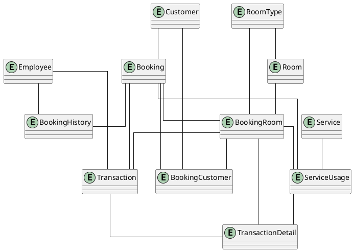
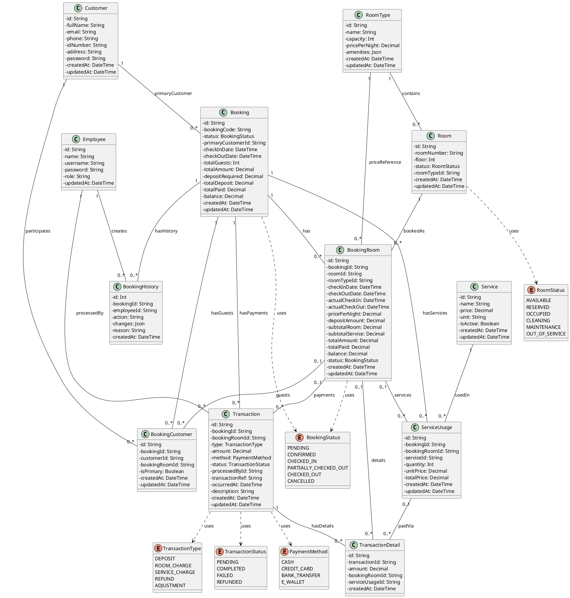
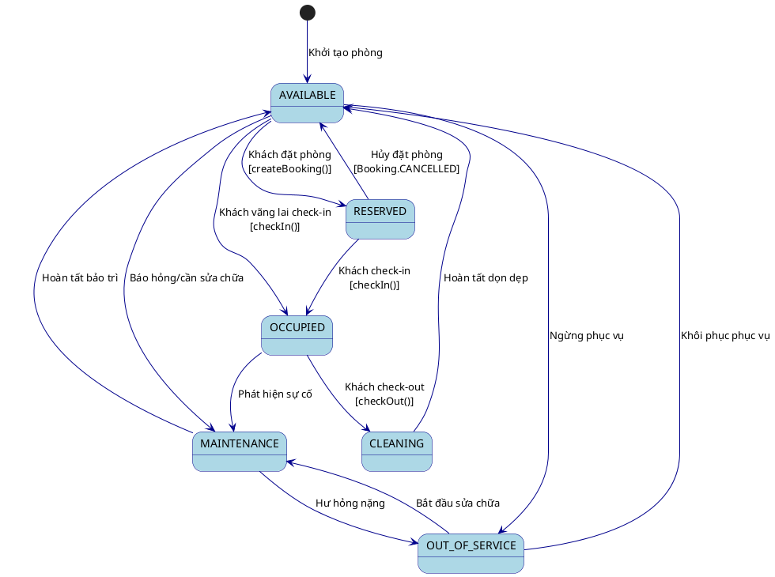
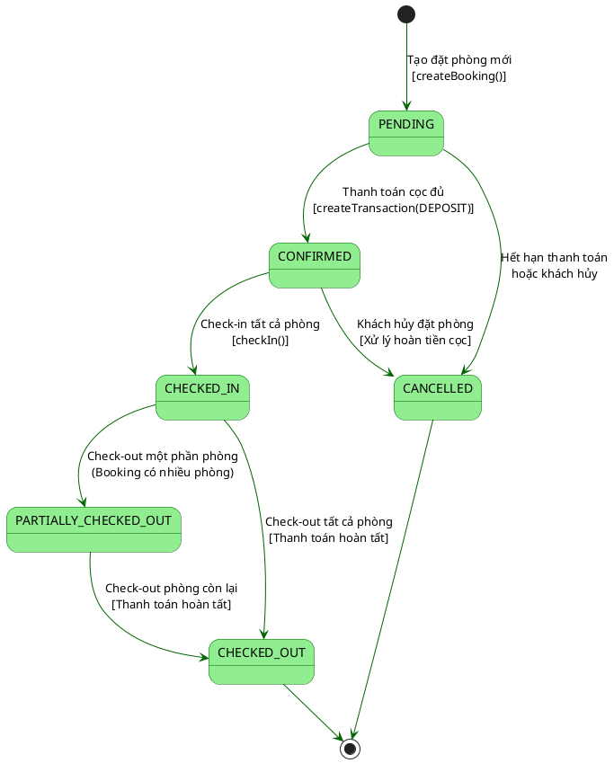
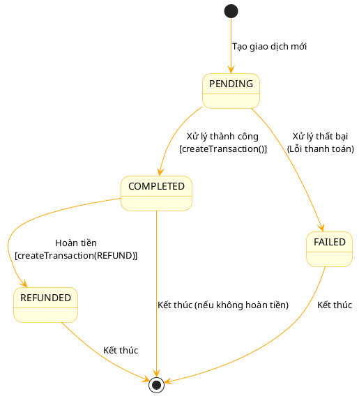

# 1. **Class diagram (Mức phân tích)**

## 1.1. **Danh sách các lớp thực thể liên quan**

Employee

Customer

RoomType

Room

Booking

BookingRoom

BookingCustomer

Transaction

TransactionDetail

Service

ServiceUsage

BookingHistory

## 1.2. **Conceptual model**

## 1.3 **Class diagram (analysis level)**

## 1.4 **Danh sách các lớp và các mối quan hệ**

| STT | Class             | Type (Entity/Boundary/Control) | Ghi chú                                 |
| :-- | :---------------- | :----------------------------- | :-------------------------------------- |
| 1   | Employee          | Entity                         | Quản lý thông tin nhân viên khách sạn   |
| 2   | Customer          | Entity                         | Quản lý thông tin khách hàng            |
| 3   | RoomType          | Entity                         | Quản lý loại phòng và giá               |
| 4   | Room              | Entity                         | Quản lý thông tin phòng                 |
| 5   | Booking           | Control                        | Quản lý đặt phòng và tổng hợp tài chính |
| 6   | BookingRoom       | Control                        | Chi tiết phòng trong một đặt phòng      |
| 7   | BookingCustomer   | Control                        | Liên kết khách hàng với đặt phòng/phòng |
| 8   | Transaction       | Control                        | Quản lý giao dịch thanh toán            |
| 9   | TransactionDetail | Control                        | Chi tiết phân bổ thanh toán             |
| 10  | Service           | Entity                         | Quản lý dịch vụ khách sạn               |
| 11  | ServiceUsage      | Control                        | Ghi nhận việc sử dụng dịch vụ           |
| 12  | BookingHistory    | Control                        | Ghi nhận lịch sử thay đổi đặt phòng     |
| 13  | BookingStatus     | Entity (Enum)                  | Trạng thái đặt phòng                    |
| 14  | RoomStatus        | Entity (Enum)                  | Trạng thái phòng                        |
| 15  | TransactionStatus | Entity (Enum)                  | Trạng thái giao dịch                    |
| 16  | PaymentMethod     | Entity (Enum)                  | Phương thức thanh toán                  |
| 17  | TransactionType   | Entity (Enum)                  | Loại giao dịch                          |

## 1.5 **Chi tiết các lớp**

### **Lớp Employee (Entity)**

**Kế thừa:** Không

**Thuộc tính:**

| STT | Tên thuộc tính | Loại     | Ràng buộc           | Ý nghĩa/ghi chú                      |
| :-- | :------------- | :------- | :------------------ | :----------------------------------- |
| 1   | id             | String   | private, \<\<PK\>\> | Mã định danh nhân viên (CUID)        |
| 2   | name           | String   | private             | Họ tên nhân viên                     |
| 3   | username       | String   | private, unique     | Tên đăng nhập                        |
| 4   | password       | String   | private             | Mật khẩu đã mã hóa                   |
| 5   | role           | String   | private             | Vai trò (ADMIN, RECEPTIONIST, STAFF) |
| 6   | updatedAt      | DateTime | private             | Thời điểm cập nhật cuối              |

**Trách nhiệm (Methods):**

| STT | Tên phương thức      | Mô tả                                 |
| :-- | :------------------- | :------------------------------------ |
| 1   | createEmployee()     | Tạo nhân viên mới                     |
| 2   | updateEmployeeInfo() | Cập nhật thông tin nhân viên          |
| 3   | deleteEmployee()     | Xóa nhân viên                         |
| 4   | getEmployeeById()    | Lấy thông tin nhân viên theo ID       |
| 5   | getAllEmployees()    | Lấy danh sách nhân viên có phân trang |

### **Lớp Customer (Entity)**

**Kế thừa:** Không

**Thuộc tính:**

| STT | Tên thuộc tính | Loại     | Ràng buộc           | Ý nghĩa/ghi chú                   |
| :-- | :------------- | :------- | :------------------ | :-------------------------------- |
| 1   | id             | String   | private, \<\<PK\>\> | Mã định danh khách hàng (CUID)    |
| 2   | fullName       | String   | private             | Họ tên đầy đủ                     |
| 3   | email          | String   | private, optional   | Email liên lạc                    |
| 4   | phone          | String   | private, unique     | Số điện thoại (dùng để đăng nhập) |
| 5   | idNumber       | String   | private, optional   | CMND/CCCD                         |
| 6   | address        | String   | private, optional   | Địa chỉ                           |
| 7   | password       | String   | private             | Mật khẩu đã mã hóa                |
| 8   | createdAt      | DateTime | private             | Thời điểm tạo                     |
| 9   | updatedAt      | DateTime | private             | Thời điểm cập nhật cuối           |

**Trách nhiệm (Methods):**

| STT | Tên phương thức      | Mô tả                                  |
| :-- | :------------------- | :------------------------------------- |
| 1   | createCustomer()     | Đăng ký khách hàng mới                 |
| 2   | updateCustomerInfo() | Cập nhật thông tin khách hàng          |
| 3   | getCustomerById()    | Lấy thông tin khách hàng theo ID       |
| 4   | getCustomerByPhone() | Tìm khách hàng theo số điện thoại      |
| 5   | getAllCustomers()    | Lấy danh sách khách hàng có phân trang |

### **Lớp RoomType (Entity)**

**Kế thừa:** Không

**Thuộc tính:**

| STT | Tên thuộc tính | Loại     | Ràng buộc           | Ý nghĩa/ghi chú                       |
| :-- | :------------- | :------- | :------------------ | :------------------------------------ |
| 1   | id             | String   | private, \<\<PK\>\> | Mã định danh loại phòng (CUID)        |
| 2   | name           | String   | private             | Tên loại phòng (VD: Standard, Deluxe) |
| 3   | capacity       | Int      | private             | Sức chứa tối đa (số người)            |
| 4   | pricePerNight  | Decimal  | private             | Giá phòng mỗi đêm                     |
| 5   | amenities      | Json     | private, optional   | Danh sách tiện nghi (JSON)            |
| 6   | createdAt      | DateTime | private             | Thời điểm tạo                         |
| 7   | updatedAt      | DateTime | private             | Thời điểm cập nhật cuối               |

**Trách nhiệm (Methods):**

| STT | Tên phương thức   | Mô tả                                  |
| :-- | :---------------- | :------------------------------------- |
| 1   | createRoomType()  | Tạo loại phòng mới                     |
| 2   | updateRoomType()  | Cập nhật thông tin loại phòng          |
| 3   | deleteRoomType()  | Xóa loại phòng                         |
| 4   | getRoomTypeById() | Lấy thông tin loại phòng theo ID       |
| 5   | getAllRoomTypes() | Lấy danh sách loại phòng có phân trang |

### **Lớp Room (Entity)**

**Kế thừa:** Không

**Thuộc tính:**

| STT | Tên thuộc tính | Loại       | Ràng buộc           | Ý nghĩa/ghi chú           |
| :-- | :------------- | :--------- | :------------------ | :------------------------ |
| 1   | id             | String     | private, \<\<PK\>\> | Mã định danh phòng (CUID) |
| 2   | roomNumber     | String     | private, unique     | Số phòng                  |
| 3   | floor          | Int        | private             | Tầng                      |
| 4   | status         | RoomStatus | private             | Trạng thái phòng (Enum)   |
| 5   | roomTypeId     | String     | private, \<\<FK\>\> | Mã loại phòng             |
| 6   | createdAt      | DateTime   | private             | Thời điểm tạo             |
| 7   | updatedAt      | DateTime   | private             | Thời điểm cập nhật cuối   |

**Trách nhiệm (Methods):**

| STT | Tên phương thức    | Mô tả                             |
| :-- | :----------------- | :-------------------------------- |
| 1   | createRoom()       | Tạo phòng mới                     |
| 2   | updateRoom()       | Cập nhật thông tin phòng          |
| 3   | updateRoomStatus() | Cập nhật trạng thái phòng         |
| 4   | deleteRoom()       | Xóa phòng                         |
| 5   | getRoomById()      | Lấy thông tin phòng theo ID       |
| 6   | getAllRooms()      | Lấy danh sách phòng có phân trang |

### **Lớp Booking (Control)**

**Kế thừa:** Không

**Thuộc tính:**

| STT | Tên thuộc tính    | Loại          | Ràng buộc           | Ý nghĩa/ghi chú               |
| :-- | :---------------- | :------------ | :------------------ | :---------------------------- |
| 1   | id                | String        | private, \<\<PK\>\> | Mã định danh đặt phòng (CUID) |
| 2   | bookingCode       | String        | private, unique     | Mã đặt phòng hiển thị         |
| 3   | status            | BookingStatus | private             | Trạng thái đặt phòng (Enum)   |
| 4   | primaryCustomerId | String        | private, \<\<FK\>\> | Mã khách hàng chính           |
| 5   | checkInDate       | DateTime      | private             | Ngày nhận phòng dự kiến       |
| 6   | checkOutDate      | DateTime      | private             | Ngày trả phòng dự kiến        |
| 7   | totalGuests       | Int           | private             | Tổng số khách                 |
| 8   | totalAmount       | Decimal       | private             | Tổng tiền                     |
| 9   | depositRequired   | Decimal       | private             | Tiền cọc yêu cầu              |
| 10  | totalDeposit      | Decimal       | private             | Tổng tiền cọc đã nhận         |
| 11  | totalPaid         | Decimal       | private             | Tổng tiền đã thanh toán       |
| 12  | balance           | Decimal       | private             | Số dư còn lại                 |
| 13  | createdAt         | DateTime      | private             | Thời điểm tạo                 |
| 14  | updatedAt         | DateTime      | private             | Thời điểm cập nhật cuối       |

**Trách nhiệm (Methods):**

| STT | Tên phương thức       | Mô tả                                       |
| :-- | :-------------------- | :------------------------------------------ |
| 1   | createBooking()       | Tạo đặt phòng mới với phân bổ phòng tự động |
| 2   | checkIn()             | Thực hiện nhận phòng cho khách              |
| 3   | createTransaction()   | Tạo giao dịch thanh toán                    |
| 4   | getBookingById()      | Lấy chi tiết đặt phòng                      |
| 5   | validateTransaction() | Kiểm tra tính hợp lệ của giao dịch          |

### **Lớp BookingRoom (Control)**

**Kế thừa:** Không

**Thuộc tính:**

| STT | Tên thuộc tính  | Loại          | Ràng buộc           | Ý nghĩa/ghi chú         |
| :-- | :-------------- | :------------ | :------------------ | :---------------------- |
| 1   | id              | String        | private, \<\<PK\>\> | Mã định danh (CUID)     |
| 2   | bookingId       | String        | private, \<\<FK\>\> | Mã đặt phòng            |
| 3   | roomId          | String        | private, \<\<FK\>\> | Mã phòng                |
| 4   | roomTypeId      | String        | private, \<\<FK\>\> | Mã loại phòng           |
| 5   | checkInDate     | DateTime      | private             | Ngày nhận phòng dự kiến |
| 6   | checkOutDate    | DateTime      | private             | Ngày trả phòng dự kiến  |
| 7   | actualCheckIn   | DateTime      | private, optional   | Ngày nhận phòng thực tế |
| 8   | actualCheckOut  | DateTime      | private, optional   | Ngày trả phòng thực tế  |
| 9   | pricePerNight   | Decimal       | private             | Giá phòng mỗi đêm       |
| 10  | depositAmount   | Decimal       | private             | Tiền cọc cho phòng này  |
| 11  | subtotalRoom    | Decimal       | private             | Tổng tiền phòng         |
| 12  | subtotalService | Decimal       | private             | Tổng tiền dịch vụ       |
| 13  | totalAmount     | Decimal       | private             | Tổng tiền               |
| 14  | totalPaid       | Decimal       | private             | Đã thanh toán           |
| 15  | balance         | Decimal       | private             | Số dư                   |
| 16  | status          | BookingStatus | private             | Trạng thái (Enum)       |

**Trách nhiệm (Methods):**

| STT | Tên phương thức      | Mô tả                         |
| :-- | :------------------- | :---------------------------- |
| 1   | updateCheckInTime()  | Ghi nhận thời gian nhận phòng |
| 2   | updateCheckOutTime() | Ghi nhận thời gian trả phòng  |
| 3   | updateStatus()       | Cập nhật trạng thái           |

### **Lớp BookingCustomer (Control)**

**Kế thừa:** Không (Lớp liên kết cho Booking, Customer và BookingRoom)

**Thuộc tính:**

| STT | Tên thuộc tính | Loại    | Ràng buộc                | Ý nghĩa/ghi chú           |
| :-- | :------------- | :------ | :----------------------- | :------------------------ |
| 1   | id             | String  | private, \<\<PK\>\>      | Mã định danh (CUID)       |
| 2   | bookingId      | String  | private, \<\<FK\>\>      | Mã đặt phòng              |
| 3   | customerId     | String  | private, \<\<FK\>\>      | Mã khách hàng             |
| 4   | bookingRoomId  | String  | private, \<\<FK\>\>, opt | Mã phòng trong đặt phòng  |
| 5   | isPrimary      | Boolean | private                  | Có phải khách chính không |

**Trách nhiệm (Methods):**

| STT | Tên phương thức     | Mô tả                      |
| :-- | :------------------ | :------------------------- |
| 1   | addGuestToBooking() | Thêm khách vào đặt phòng   |
| 2   | assignGuestToRoom() | Gán khách vào phòng cụ thể |

### **Lớp Transaction (Control)**

**Kế thừa:** Không

**Thuộc tính:**

| STT | Tên thuộc tính | Loại              | Ràng buộc                | Ý nghĩa/ghi chú                      |
| :-- | :------------- | :---------------- | :----------------------- | :----------------------------------- |
| 1   | id             | String            | private, \<\<PK\>\>      | Mã định danh giao dịch (CUID)        |
| 2   | bookingId      | String            | private, \<\<FK\>\>      | Mã đặt phòng                         |
| 3   | bookingRoomId  | String            | private, \<\<FK\>\>, opt | Mã phòng (nếu thanh toán theo phòng) |
| 4   | type           | TransactionType   | private                  | Loại giao dịch (Enum)                |
| 5   | amount         | Decimal           | private                  | Số tiền                              |
| 6   | method         | PaymentMethod     | private                  | Phương thức thanh toán (Enum)        |
| 7   | status         | TransactionStatus | private                  | Trạng thái giao dịch (Enum)          |
| 8   | processedById  | String            | private, \<\<FK\>\>, opt | Nhân viên xử lý                      |
| 9   | transactionRef | String            | private, optional        | Mã tham chiếu giao dịch              |
| 10  | occurredAt     | DateTime          | private                  | Thời điểm giao dịch                  |
| 11  | description    | String            | private, optional        | Mô tả giao dịch                      |

**Trách nhiệm (Methods):**

| STT | Tên phương thức     | Mô tả                        |
| :-- | :------------------ | :--------------------------- |
| 1   | createTransaction() | Tạo giao dịch thanh toán mới |
| 2   | processDeposit()    | Xử lý tiền cọc               |
| 3   | processRefund()     | Xử lý hoàn tiền              |

### **Lớp TransactionDetail (Control)**

**Kế thừa:** Không

**Thuộc tính:**

| STT | Tên thuộc tính | Loại    | Ràng buộc                | Ý nghĩa/ghi chú                      |
| :-- | :------------- | :------ | :----------------------- | :----------------------------------- |
| 1   | id             | String  | private, \<\<PK\>\>      | Mã định danh (CUID)                  |
| 2   | transactionId  | String  | private, \<\<FK\>\>      | Mã giao dịch                         |
| 3   | amount         | Decimal | private                  | Số tiền phân bổ                      |
| 4   | bookingRoomId  | String  | private, \<\<FK\>\>, opt | Mã phòng (nếu thanh toán tiền phòng) |
| 5   | serviceUsageId | String  | private, \<\<FK\>\>, opt | Mã sử dụng dịch vụ                   |

**Trách nhiệm (Methods):**

| STT | Tên phương thức   | Mô tả                             |
| :-- | :---------------- | :-------------------------------- |
| 1   | allocatePayment() | Phân bổ thanh toán cho từng khoản |

### **Lớp Service (Entity)**

**Kế thừa:** Không

**Thuộc tính:**

| STT | Tên thuộc tính | Loại     | Ràng buộc           | Ý nghĩa/ghi chú               |
| :-- | :------------- | :------- | :------------------ | :---------------------------- |
| 1   | id             | String   | private, \<\<PK\>\> | Mã định danh dịch vụ (CUID)   |
| 2   | name           | String   | private             | Tên dịch vụ                   |
| 3   | price          | Decimal  | private             | Giá dịch vụ                   |
| 4   | unit           | String   | private             | Đơn vị tính (mặc định: "lần") |
| 5   | isActive       | Boolean  | private             | Trạng thái hoạt động          |
| 6   | createdAt      | DateTime | private             | Thời điểm tạo                 |
| 7   | updatedAt      | DateTime | private             | Thời điểm cập nhật cuối       |

**Trách nhiệm (Methods):**

| STT | Tên phương thức  | Mô tả                               |
| :-- | :--------------- | :---------------------------------- |
| 1   | createService()  | Tạo dịch vụ mới                     |
| 2   | updateService()  | Cập nhật thông tin dịch vụ          |
| 3   | deleteService()  | Xóa dịch vụ                         |
| 4   | getServiceById() | Lấy thông tin dịch vụ theo ID       |
| 5   | getAllServices() | Lấy danh sách dịch vụ có phân trang |

### **Lớp ServiceUsage (Control)**

**Kế thừa:** Không

**Thuộc tính:**

| STT | Tên thuộc tính | Loại    | Ràng buộc                | Ý nghĩa/ghi chú          |
| :-- | :------------- | :------ | :----------------------- | :----------------------- |
| 1   | id             | String  | private, \<\<PK\>\>      | Mã định danh (CUID)      |
| 2   | bookingId      | String  | private, \<\<FK\>\>      | Mã đặt phòng             |
| 3   | bookingRoomId  | String  | private, \<\<FK\>\>, opt | Mã phòng trong đặt phòng |
| 4   | serviceId      | String  | private, \<\<FK\>\>      | Mã dịch vụ               |
| 5   | quantity       | Int     | private                  | Số lượng                 |
| 6   | unitPrice      | Decimal | private                  | Đơn giá                  |
| 7   | totalPrice     | Decimal | private                  | Thành tiền               |

**Trách nhiệm (Methods):**

| STT | Tên phương thức       | Mô tả                      |
| :-- | :-------------------- | :------------------------- |
| 1   | addServiceToBooking() | Thêm dịch vụ cho đặt phòng |
| 2   | updateQuantity()      | Cập nhật số lượng          |

### **Lớp BookingHistory (Control)**

**Kế thừa:** Không

**Thuộc tính:**

| STT | Tên thuộc tính | Loại     | Ràng buộc                | Ý nghĩa/ghi chú                      |
| :-- | :------------- | :------- | :----------------------- | :----------------------------------- |
| 1   | id             | Int      | private, \<\<PK\>\>      | Mã định danh (Auto Increment)        |
| 2   | bookingId      | String   | private, \<\<FK\>\>      | Mã đặt phòng                         |
| 3   | employeeId     | String   | private, \<\<FK\>\>, opt | Nhân viên thực hiện                  |
| 4   | action         | String   | private                  | Hành động (CHECK_IN, CHECK_OUT, ...) |
| 5   | changes        | Json     | private, optional        | Chi tiết thay đổi                    |
| 6   | reason         | String   | private, optional        | Lý do                                |
| 7   | createdAt      | DateTime | private                  | Thời điểm ghi nhận                   |

**Trách nhiệm (Methods):**

| STT | Tên phương thức     | Mô tả                          |
| :-- | :------------------ | :----------------------------- |
| 1   | recordAction()      | Ghi nhận hành động vào lịch sử |
| 2   | getBookingHistory() | Lấy lịch sử của một đặt phòng  |

### **Lớp RoomStatus (Entity - Enum)**

**Thuộc tính:**

- AVAILABLE - Phòng trống, sẵn sàng cho thuê
- RESERVED - Đã được đặt trước
- OCCUPIED - Đang có khách ở
- CLEANING - Đang dọn dẹp
- MAINTENANCE - Đang bảo trì
- OUT_OF_SERVICE - Ngừng phục vụ

### **Lớp BookingStatus (Entity - Enum)**

**Thuộc tính:**

- PENDING - Chờ xác nhận (chưa đặt cọc)
- CONFIRMED - Đã xác nhận (đã đặt cọc đủ)
- CHECKED_IN - Đã nhận phòng
- PARTIALLY_CHECKED_OUT - Trả phòng một phần
- CHECKED_OUT - Đã trả phòng hoàn toàn
- CANCELLED - Đã hủy

### **Lớp TransactionType (Entity - Enum)**

**Thuộc tính:**

- DEPOSIT - Tiền cọc
- ROOM_CHARGE - Thanh toán tiền phòng
- SERVICE_CHARGE - Thanh toán dịch vụ
- REFUND - Hoàn tiền
- ADJUSTMENT - Điều chỉnh số dư

### **Lớp TransactionStatus (Entity - Enum)**

**Thuộc tính:**

- PENDING - Chờ xử lý
- COMPLETED - Hoàn thành
- FAILED - Thất bại
- REFUNDED - Đã hoàn tiền

### **Lớp PaymentMethod (Entity - Enum)**

**Thuộc tính:**

- CASH - Tiền mặt
- CREDIT_CARD - Thẻ tín dụng
- BANK_TRANSFER - Chuyển khoản ngân hàng
- E_WALLET - Ví điện tử

# 2. **Sơ đồ trạng thái**

## **2.1 Sơ đồ trạng thái cho lớp Room (Phòng)**

**Danh sách các trạng thái:**

1. **AVAILABLE (Trống):** Phòng đang trống và sẵn sàng để cho khách đặt hoặc thuê.
2. **RESERVED (Đã đặt):** Phòng đã được khách hàng đặt trước nhưng chưa đến nhận phòng.
3. **OCCUPIED (Đang sử dụng):** Khách hàng đã nhận phòng và đang trong thời gian lưu trú.
4. **CLEANING (Đang dọn dẹp):** Khách đã trả phòng, phòng cần được dọn dẹp trước khi khách mới có thể nhận.
5. **MAINTENANCE (Bảo trì):** Phòng đang trong quá trình sửa chữa hoặc bảo trì.
6. **OUT_OF_SERVICE (Ngừng phục vụ):** Phòng không khả dụng để cho thuê.

**Bảng mô tả các biến cố và hành động:**

| Trạng thái bắt đầu | Biến cố (Event)         | Hành động (Action)                                    | Trạng thái kết thúc |
| :----------------- | :---------------------- | :---------------------------------------------------- | :------------------ |
| (Mới)              | Tạo phòng mới           | Hệ thống khởi tạo Room với status AVAILABLE           | AVAILABLE           |
| AVAILABLE          | Khách đặt phòng         | Tạo Booking, BookingRoom với status PENDING           | RESERVED            |
| AVAILABLE          | Khách vãng lai check-in | Tạo Booking và thực hiện checkIn() trực tiếp          | OCCUPIED            |
| AVAILABLE          | Báo hỏng/cần sửa chữa   | Cập nhật room.status = MAINTENANCE                    | MAINTENANCE         |
| RESERVED           | Khách check-in          | Cập nhật actualCheckIn, booking.status = CHECKED_IN   | OCCUPIED            |
| RESERVED           | Khách hủy đặt phòng     | Cập nhật booking.status = CANCELLED, giải phóng phòng | AVAILABLE           |
| OCCUPIED           | Khách check-out         | Ghi nhận actualCheckOut, tạo Transaction thanh toán   | CLEANING            |
| CLEANING           | Nhân viên dọn xong      | Cập nhật room.status = AVAILABLE                      | AVAILABLE           |
| MAINTENANCE        | Sửa chữa hoàn tất       | Cập nhật room.status = AVAILABLE                      | AVAILABLE           |

## **2.2 Sơ đồ trạng thái cho lớp Booking (Đặt phòng)**

Lớp **Booking** quản lý vòng đời của một yêu cầu đặt phòng từ lúc được tạo cho đến khi hoàn tất hoặc bị hủy.

**Danh sách các trạng thái:**

1. **PENDING (Chờ xác nhận):** Đặt phòng đã được tạo nhưng đang chờ thanh toán tiền cọc.
2. **CONFIRMED (Đã xác nhận):** Đặt phòng đã được xác nhận sau khi thanh toán đủ tiền cọc yêu cầu.
3. **CHECKED_IN (Đã nhận phòng):** Khách hàng đã hoàn tất thủ tục check-in và nhận phòng.
4. **PARTIALLY_CHECKED_OUT (Trả phòng một phần):** Một số phòng trong booking đã được trả, còn phòng khác đang sử dụng.
5. **CHECKED_OUT (Đã trả phòng):** Khách hàng đã trả tất cả phòng và hoàn tất thanh toán.
6. **CANCELLED (Đã hủy):** Đặt phòng đã bị hủy bởi khách hàng hoặc hệ thống.

**Bảng mô tả các biến cố và hành động:**

| Trạng thái bắt đầu    | Biến cố (Event)                             | Hành động (Action)                                                     | Trạng thái kết thúc   |
| :-------------------- | :------------------------------------------ | :--------------------------------------------------------------------- | :-------------------- |
| (Mới)                 | Khách tạo yêu cầu đặt phòng                 | createBooking() - Tạo Booking, BookingRoom, cập nhật Room.status       | PENDING               |
| PENDING               | Thanh toán cọc đủ (>= depositRequired)      | createTransaction(DEPOSIT) - Cập nhật totalDeposit, totalPaid, balance | CONFIRMED             |
| PENDING               | Hết hạn thanh toán (15 phút) hoặc khách hủy | Cập nhật booking.status = CANCELLED, Room.status = AVAILABLE           | CANCELLED             |
| CONFIRMED             | Khách hàng check-in                         | checkIn() - Ghi nhận actualCheckIn, Room.status = OCCUPIED             | CHECKED_IN            |
| CONFIRMED             | Khách hủy đặt phòng                         | Xử lý hoàn tiền cọc (nếu có), giải phóng phòng                         | CANCELLED             |
| CHECKED_IN            | Check-out một phần (booking nhiều phòng)    | Cập nhật BookingRoom.status = CHECKED_OUT cho phòng được trả           | PARTIALLY_CHECKED_OUT |
| CHECKED_IN            | Check-out tất cả phòng                      | Thanh toán balance, cập nhật tất cả BookingRoom.status = CHECKED_OUT   | CHECKED_OUT           |
| PARTIALLY_CHECKED_OUT | Check-out các phòng còn lại                 | Thanh toán balance còn lại, hoàn tất booking                           | CHECKED_OUT           |

## **2.3 Sơ đồ trạng thái cho lớp Transaction (Giao dịch)**

Lớp **Transaction** thể hiện quy trình xử lý các giao dịch tài chính trong hệ thống.

**Danh sách các trạng thái:**

1. **PENDING (Chờ xử lý):** Giao dịch đã được tạo nhưng chưa xử lý xong.
2. **COMPLETED (Hoàn thành):** Giao dịch đã được xử lý thành công.
3. **FAILED (Thất bại):** Giao dịch thất bại do lỗi.
4. **REFUNDED (Đã hoàn tiền):** Giao dịch đã được hoàn tiền.

**Bảng mô tả các biến cố và hành động:**

| Trạng thái bắt đầu | Biến cố (Event)             | Hành động (Action)                                        | Trạng thái kết thúc |
| :----------------- | :-------------------------- | :-------------------------------------------------------- | :------------------ |
| (Mới)              | Tạo giao dịch               | Khởi tạo Transaction với status PENDING                   | PENDING             |
| PENDING            | Xử lý thanh toán thành công | Cập nhật Booking (totalPaid, balance), status = COMPLETED | COMPLETED           |
| PENDING            | Xử lý thất bại              | Ghi nhận lỗi, status = FAILED                             | FAILED              |
| COMPLETED          | Yêu cầu hoàn tiền           | Tạo Transaction mới với type = REFUND, cập nhật Booking   | REFUNDED            |
