# Tài liệu Kiến trúc Hệ thống

# Chương 4

## 4.1. Giới thiệu

**RoomMaster Backend** là một máy chủ API RESTful phục vụ cho hệ thống quản lý khách sạn/phòng nghỉ. Hệ thống được xây dựng trên nền tảng **Node.js** với ngôn ngữ **TypeScript**, sử dụng framework **Express** và **Prisma ORM** để tương tác với cơ sở dữ liệu.

Ứng dụng tuân theo **kiến trúc phân tầng (Layered Architecture)** kết hợp với **hệ thống Dependency Injection (DI)** tùy chỉnh, lấy cảm hứng từ các pattern của NestJS, giúp mã nguồn dễ bảo trì, mở rộng và kiểm thử.

## 4.2. Các tính năng chính

| Tính năng                 | Mô tả chi tiết                                                                |
| ------------------------- | ----------------------------------------------------------------------------- |
| **Xác thực đa đối tượng** | Hỗ trợ đăng nhập cho cả Khách hàng (Customer) và Nhân viên (Employee) với JWT |
| **Quản lý đặt phòng**     | Tạo, xác nhận, hủy booking với tự động phân bổ phòng                          |
| **Check-in/Check-out**    | Quản lý quá trình nhận/trả phòng với theo dõi trạng thái chi tiết             |
| **Giao dịch tài chính**   | Quản lý tiền đặt cọc, thanh toán, hoàn tiền                                   |
| **Sử dụng dịch vụ**       | Theo dõi các dịch vụ khách hàng sử dụng (spa, giặt ủi, minibar...)            |
| **Lịch sử hoạt động**     | Ghi nhận đầy đủ lịch sử thay đổi booking (audit trail)                        |

---

## 4.3. Công nghệ sử dụng

### 4.3.1. Bảng tổng hợp công nghệ

| Danh mục            | Công nghệ         | Mô tả                                                  |
| ------------------- | ----------------- | ------------------------------------------------------ |
| **Runtime**         | Node.js           | Môi trường chạy JavaScript phía server                 |
| **Ngôn ngữ**        | TypeScript        | JavaScript với kiểu dữ liệu tĩnh, tăng độ an toàn code |
| **Framework**       | Express.js        | Framework web nhẹ, linh hoạt cho Node.js               |
| **ORM**             | Prisma            | ORM thế hệ mới với type-safe và auto-generated queries |
| **Database**        | PostgreSQL        | Hệ quản trị CSDL quan hệ mạnh mẽ, hỗ trợ JSON          |
| **Xác thực**        | Passport.js + JWT | Xác thực người dùng với JSON Web Token                 |
| **Validation**      | Joi               | Thư viện validate dữ liệu đầu vào mạnh mẽ              |
| **Tài liệu API**    | Swagger (OpenAPI) | Tự động sinh tài liệu API tương tác                    |
| **Logging**         | Winston + Morgan  | Ghi log ứng dụng và HTTP request                       |
| **Process Manager** | PM2               | Quản lý process Node.js trong production               |
| **Container**       | Docker            | Đóng gói và triển khai ứng dụng                        |

### 4.3.2. Lý do lựa chọn

- **TypeScript**: Giúp phát hiện lỗi sớm trong quá trình phát triển, hỗ trợ IDE tốt hơn với auto-complete và refactoring
- **Prisma**: Cung cấp type-safety cho database queries, migrations dễ quản lý, schema định nghĩa rõ ràng
- **Express**: Đơn giản, cộng đồng lớn, nhiều middleware có sẵn
- **PostgreSQL**: Hỗ trợ tốt cho dữ liệu quan hệ phức tạp, JSON fields, và transactions

---

## 4.4. Kiến trúc phân tầng

### 4.4.1. Tổng quan kiến trúc

Ứng dụng được thiết kế theo **kiến trúc 5 tầng**, mỗi tầng có trách nhiệm riêng biệt:

```
┌─────────────────────────────────────────────────────────────┐
│                     ROUTES LAYER                            │
│  Định nghĩa endpoint, tài liệu Swagger, gắn middleware      │
├─────────────────────────────────────────────────────────────┤
│                   MIDDLEWARE LAYER                          │
│  Xác thực, Validation, Rate Limiting, Xử lý lỗi, XSS        │
├─────────────────────────────────────────────────────────────┤
│                   CONTROLLER LAYER                          │
│  Xử lý HTTP request, định dạng response                     │
├─────────────────────────────────────────────────────────────┤
│                    SERVICE LAYER                            │
│  Logic nghiệp vụ, tương tác database qua Prisma             │
├─────────────────────────────────────────────────────────────┤
│                    DATA LAYER                               │
│  Prisma ORM, PostgreSQL Database                            │
└─────────────────────────────────────────────────────────────┘
```

### 4.4.2. Chi tiết từng tầng

| Tầng           | Thư mục            | Trách nhiệm                                                                  | Ví dụ                                |
| -------------- | ------------------ | ---------------------------------------------------------------------------- | ------------------------------------ |
| **Routes**     | `src/routes/`      | Định nghĩa các API endpoint, gắn middleware vào route, viết tài liệu Swagger | `auth.route.ts`, `booking.route.ts`  |
| **Middleware** | `src/middlewares/` | Xử lý các concern xuyên suốt: xác thực, validation, xử lý lỗi, bảo mật       | `auth.ts`, `validate.ts`, `error.ts` |
| **Controller** | `src/controllers/` | Nhận HTTP request, gọi service tương ứng, format và trả về response          | `auth.controller.ts`                 |
| **Service**    | `src/services/`    | Chứa toàn bộ logic nghiệp vụ, thao tác database, áp dụng business rules      | `booking.service.ts`                 |
| **Data**       | `prisma/`          | Định nghĩa schema database, quản lý migrations, Prisma Client                | `schema.prisma`                      |

### 4.4.3. Nguyên tắc thiết kế

1. **Separation of Concerns**: Mỗi tầng chỉ làm một việc, không xử lý logic của tầng khác
2. **Dependency Direction**: Tầng trên phụ thuộc tầng dưới, không ngược lại
3. **Single Responsibility**: Mỗi file/class chỉ có một lý do để thay đổi
4. **Interface Segregation**: Controller không biết cách service truy vấn database

---

## 4.5. Vòng đời xử lý Request

### 4.5.1. Các bước xử lý

Một request điển hình sẽ đi qua các giai đoạn sau:

| Bước | Vị trí                            | Mô tả chi tiết                                                                     |
| ---- | --------------------------------- | ---------------------------------------------------------------------------------- |
| 1    | `src/app.ts`                      | Express nhận HTTP request từ client                                                |
| 2    | Global Middlewares                | Chạy qua helmet (bảo mật), cors, body parsing, morgan (logging)                    |
| 3    | `src/routes/v1/`                  | Khớp route với URL pattern                                                         |
| 4    | Route Middlewares                 | Chạy `authCustomer()`/`authEmployee()` để xác thực, `validate()` để kiểm tra input |
| 5    | `src/controllers/`                | Controller method xử lý request                                                    |
| 6    | `src/services/`                   | Service method thực thi logic nghiệp vụ                                            |
| 7    | Prisma                            | Thực hiện truy vấn database                                                        |
| 8    | `responseWrapper`                 | Format response chuẩn `{ success: true, data: {...} }`                             |
| 9    | `errorConverter` + `errorHandler` | Bắt và xử lý lỗi (nếu có)                                                          |

### 4.5.2. Luồng xử lý thành công

```
Client Request → Express → Global MW → Route Match → Auth MW → Validate MW
    → Controller → Service → Prisma → Database
    ← Data ← Processed Data ← JSON Response ← Client
```

### 4.5.3. Luồng xử lý lỗi

```
Bất kỳ tầng nào throw Error → errorConverter (chuyển thành ApiError)
    → errorHandler (log + format response) → Client nhận { code, message }
```

---

## 4.6. Hệ thống Dependency Injection

### 4.6.1. Tổng quan

Ứng dụng sử dụng **DI Container tùy chỉnh** (`src/core/container.ts`) cung cấp tính năng dependency injection tương tự NestJS cho ứng dụng Express.

**Lợi ích của DI:**

- **Loose coupling**: Các class không phụ thuộc trực tiếp vào nhau
- **Dễ test**: Có thể mock dependencies khi unit test
- **Tái sử dụng**: Services được khởi tạo một lần và dùng chung
- **Quản lý lifecycle**: Container quản lý việc khởi tạo và cache instances

### 4.6.2. Các thành phần

| Thành phần     | File                     | Mục đích                                            |
| -------------- | ------------------------ | --------------------------------------------------- |
| **Container**  | `src/core/container.ts`  | Singleton container quản lý providers và instances  |
| **Decorators** | `src/core/decorators.ts` | Các decorator `@Injectable()` và `@Inject()`        |
| **Bootstrap**  | `src/core/bootstrap.ts`  | Đăng ký tất cả services khi khởi động ứng dụng      |
| **Tokens**     | `src/core/container.ts`  | Các Symbol dùng để định danh dependency (type-safe) |

### 4.6.3. Các cách đăng ký

```typescript
// 1. Value provider - Đăng ký một instance có sẵn (VD: PrismaClient)
container.registerValue(TOKENS.PrismaClient, prisma);

// 2. Factory provider - Đăng ký service với dependencies
container.registerFactory(
  TOKENS.AuthService, // Token định danh
  (...args) => new AuthService(args[0], args[1], args[2], args[3]), // Factory function
  [TOKENS.PrismaClient, TOKENS.TokenService, TOKENS.CustomerService, TOKENS.EmployeeService] // Dependencies
);
```

### 4.6.4. Cách sử dụng (Resolution)

```typescript
// Trong routes, resolve dependencies từ container
const authService = container.resolve<AuthService>(TOKENS.AuthService);
const controller = new SomeController(authService);
```

### 4.6.5. Biểu đồ phụ thuộc Services

```
PrismaClient (Gốc - không có dependency)
    │
    ├── TokenService         (cần PrismaClient)
    ├── CustomerService      (cần PrismaClient)
    ├── EmployeeService      (cần PrismaClient)
    ├── BookingService       (cần PrismaClient)
    ├── RoomService          (cần PrismaClient)
    ├── RoomTypeService      (cần PrismaClient)
    ├── ServiceService       (cần PrismaClient)
    └── TransactionService   (cần PrismaClient)

AuthService (cần nhiều dependencies)
    ├── PrismaClient
    ├── TokenService
    ├── CustomerService
    └── EmployeeService
```

---

## 4.7. Xác thực và Phân quyền

### 4.7.1. Cấu trúc JWT Token

Hệ thống sử dụng **JWT (JSON Web Token)** để xác thực người dùng. Mỗi token chứa các thông tin:

```typescript
{
  sub: string; // ID người dùng (customer hoặc employee)
  userType: 'customer' | 'employee'; // Loại người dùng
  type: 'ACCESS' | 'REFRESH' | 'RESET_PASSWORD'; // Loại token
  iat: number; // Thời điểm tạo (issued at)
  exp: number; // Thời điểm hết hạn (expiration)
}
```

### 4.7.2. Các loại Token

| Loại Token         | Thời hạn | Mục đích                                                          |
| ------------------ | -------- | ----------------------------------------------------------------- |
| **ACCESS**         | 30 phút  | Dùng để gọi API, gửi trong header `Authorization: Bearer <token>` |
| **REFRESH**        | 30 ngày  | Dùng để lấy access token mới khi hết hạn                          |
| **RESET_PASSWORD** | 10 phút  | Dùng cho chức năng đặt lại mật khẩu                               |

### 4.7.3. Luồng xác thực

1. **Đăng nhập** → Validate credentials → Sinh cặp access + refresh tokens
2. **Gọi API bảo vệ** → Trích xuất JWT từ header `Authorization: Bearer <token>`
3. **Passport xác minh** → Kiểm tra chữ ký token, xác định userType
4. **Middleware kiểm tra** → Đảm bảo userType khớp với route requirement
5. **Gắn user vào request** → `req.customer` hoặc `req.employee`

### 4.7.4. Xác thực hai loại người dùng

Hệ thống hỗ trợ **hai loại người dùng riêng biệt** với routes và middleware khác nhau:

| Loại User    | Prefix Routes   | Middleware       | Property trong Request |
| ------------ | --------------- | ---------------- | ---------------------- |
| **Customer** | `/v1/customer/` | `authCustomer()` | `req.customer`         |
| **Employee** | `/v1/employee/` | `authEmployee()` | `req.employee`         |

### 4.7.5. Phân quyền (Authorization)

Sau khi xác thực, hệ thống kiểm tra quyền của user:

- **Customer**: Chỉ được truy cập dữ liệu của chính mình
- **Employee**: Phân quyền theo role (Admin, Receptionist, Housekeeping...)
  - **Admin**: Toàn quyền trên hệ thống
  - **Receptionist**: Quản lý booking, check-in/out, giao dịch
  - **Housekeeping**: Cập nhật trạng thái phòng (cleaning)

---

## 4.8. Cơ sở dữ liệu

### 4.8.1. Tổng quan các Entity

| Entity                | Mô tả                                                   | Quan hệ chính                               |
| --------------------- | ------------------------------------------------------- | ------------------------------------------- |
| **Employee**          | Nhân viên khách sạn (Admin, Receptionist, Housekeeping) | → Transactions, BookingHistory              |
| **Customer**          | Khách hàng đặt phòng                                    | → Bookings, BookingCustomers                |
| **RoomType**          | Loại phòng với giá và tiện nghi                         | → Rooms, BookingRooms                       |
| **Room**              | Phòng vật lý trong khách sạn                            | → BookingRooms                              |
| **Booking**           | Bản ghi đặt phòng                                       | → BookingRooms, Transactions, ServiceUsages |
| **BookingRoom**       | Phân bổ phòng trong booking                             | → Transactions, ServiceUsages               |
| **BookingCustomer**   | Gán khách vào booking/phòng                             | M:N Customer ↔ Booking                      |
| **Transaction**       | Bản ghi giao dịch thanh toán                            | → TransactionDetails                        |
| **TransactionDetail** | Chi tiết từng khoản trong giao dịch                     | → BookingRoom, ServiceUsage                 |
| **Service**           | Dịch vụ khách sạn (spa, giặt ủi...)                     | → ServiceUsages                             |
| **ServiceUsage**      | Bản ghi sử dụng dịch vụ                                 | → TransactionDetails                        |
| **BookingHistory**    | Log kiểm toán (audit log)                               | → Booking, Employee                         |
| **Activity**          | Log hoạt động hệ thống                                  | Metadata JSON                               |

## 4.9. Xử lý lỗi

### 4.9.1. Luồng xử lý lỗi

```
Bất kỳ tầng nào throw ApiError hoặc Error
                    ↓
        errorConverter middleware
  (Chuyển đổi thành ApiError nếu chưa phải)
                    ↓
        errorHandler middleware
  (Format response, log lỗi ở dev, ẩn stack ở prod)
                    ↓
    JSON response: { code, message, [stack] }
```

### 4.9.2. Lớp ApiError

```typescript
class ApiError extends Error {
  statusCode: number; // HTTP status code (400, 401, 403, 404, 500...)
  isOperational: boolean; // true = lỗi mong đợi, false = lỗi lập trình
}

// Ví dụ sử dụng
throw new ApiError(httpStatus.NOT_FOUND, 'Không tìm thấy booking');
throw new ApiError(httpStatus.UNAUTHORIZED, 'Token không hợp lệ');
throw new ApiError(httpStatus.BAD_REQUEST, 'Dữ liệu không hợp lệ');
```

### 4.9.3. Phân loại lỗi

| Loại lỗi                 | isOperational | Xử lý                             |
| ------------------------ | ------------- | --------------------------------- |
| **Validation error**     | true          | Trả về 400 với message chi tiết   |
| **Authentication error** | true          | Trả về 401                        |
| **Authorization error**  | true          | Trả về 403                        |
| **Not found**            | true          | Trả về 404                        |
| **Business logic error** | true          | Trả về 400/409 tùy context        |
| **Database error**       | false         | Trả về 500, log chi tiết          |
| **Unexpected error**     | false         | Trả về 500, không expose chi tiết |

### 4.9.4. Response format

**Development:**

```json
{
  "code": 400,
  "message": "Phòng đã được đặt trong khoảng thời gian này",
  "stack": "Error: Phòng đã được đặt...\n    at BookingService.create..."
}
```

**Production:**

```json
{
  "code": 400,
  "message": "Phòng đã được đặt trong khoảng thời gian này"
}
```

---

## 4.10. Mô hình hóa kiến trúc

### 4.10.1 Kiến trúc tổng quan (High-Level Architecture)

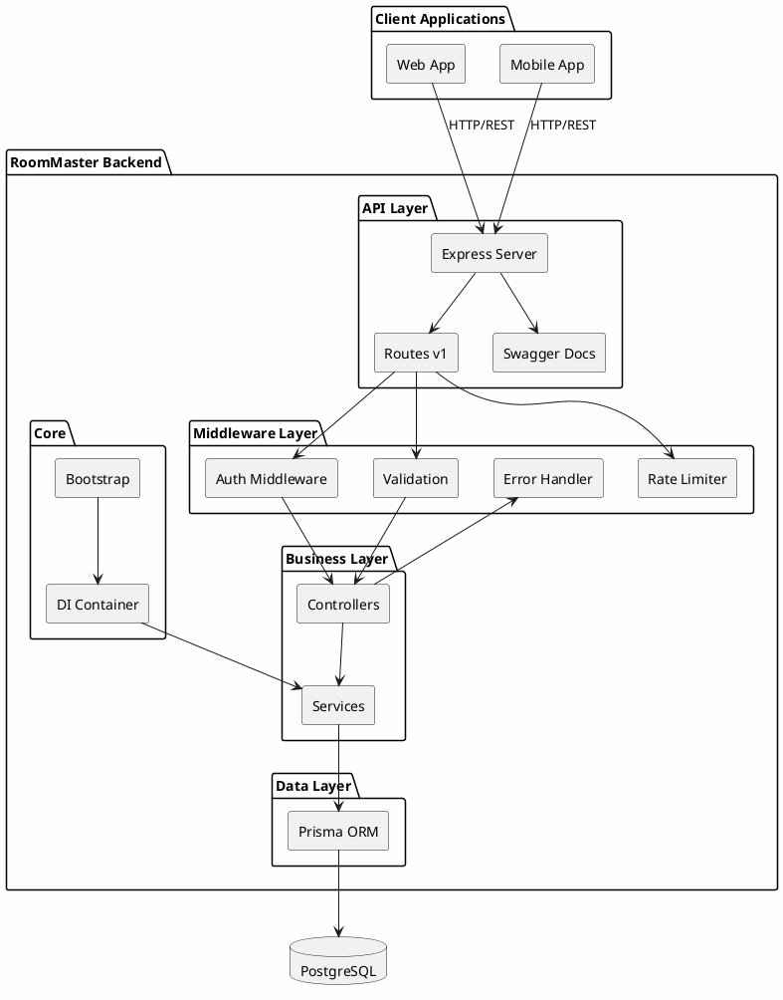

### 4.10.2. Vòng đời Request (Request Lifecycle Sequence)

Sơ đồ tuần tự này minh họa chi tiết các bước xử lý một HTTP request từ client đến database và ngược lại.

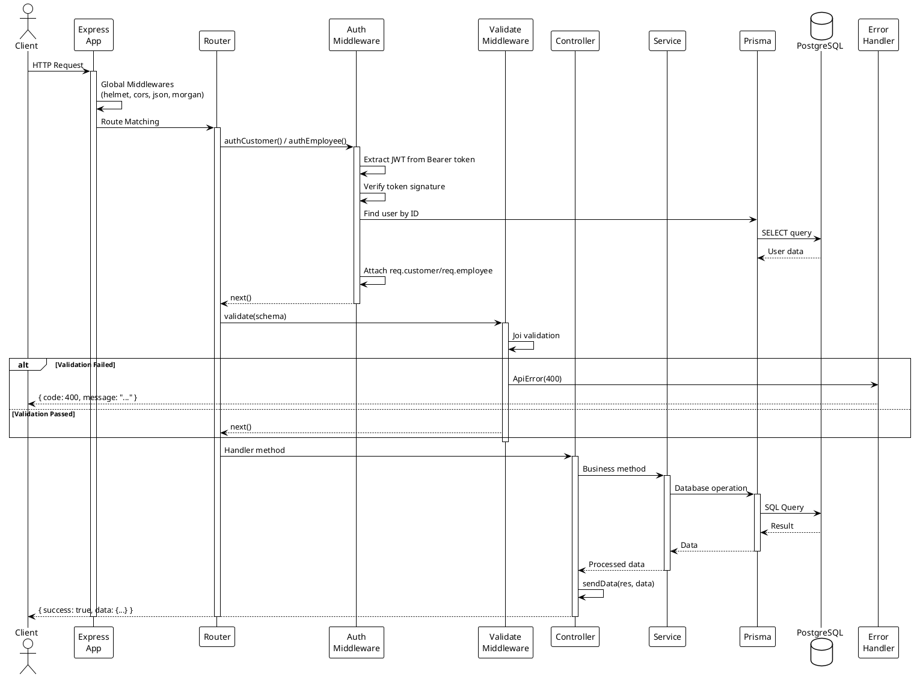

### 4.10.3. Dependency Injection Container

Sơ đồ này thể hiện cấu trúc của DI Container và cách các services được đăng ký, quản lý.

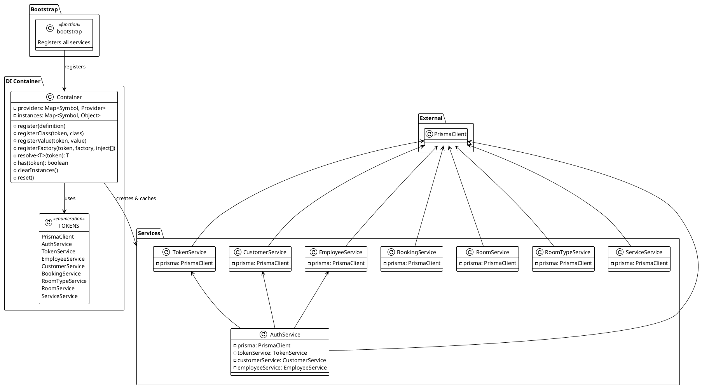

### 4.10.4. Sơ đồ quan hệ thực thể (Entity Relationship Diagram)

Sơ đồ ERD chi tiết các bảng trong database và mối quan hệ giữa chúng.

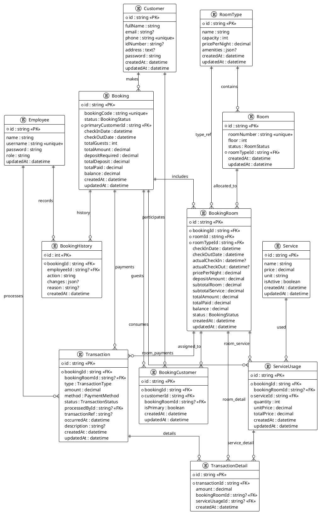

### 4.10.5. Luồng xác thực (Authentication Flow)

Sơ đồ chi tiết quá trình đăng nhập và xác thực người dùng (Customer/Employee).

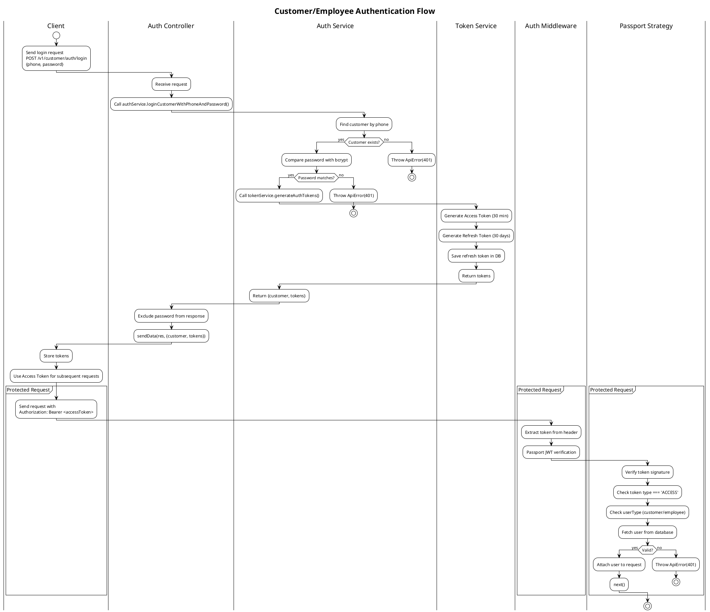

### 4.10.6. Máy trạng thái Booking (Booking State Machine)

Sơ đồ thể hiện các trạng thái của một Booking và điều kiện chuyển đổi giữa chúng.

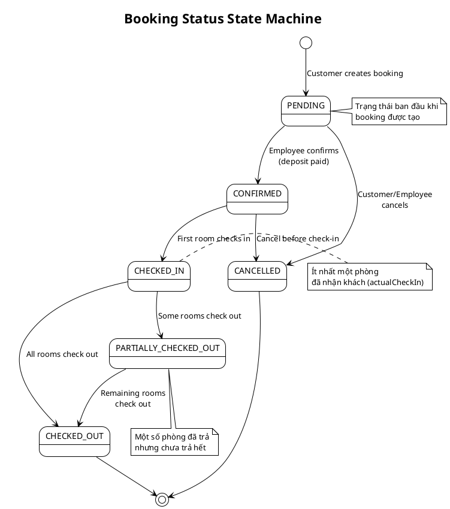

### 4.10.7. Máy trạng thái Room (Room Status State Machine)

Sơ đồ thể hiện các trạng thái của phòng và điều kiện chuyển đổi.

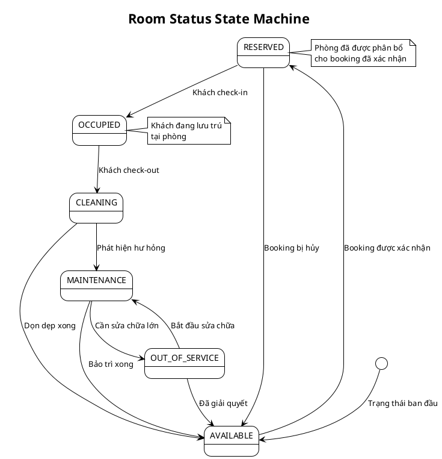

### 4.10.8. Kiến trúc Component (Component Architecture)

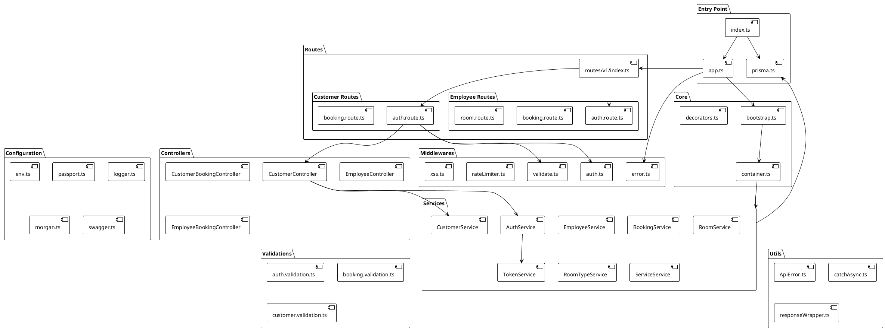

### 4.10.9. Phụ thuộc Package (Package Dependencies)

Sơ đồ thể hiện các thư viện npm được sử dụng trong dự án.

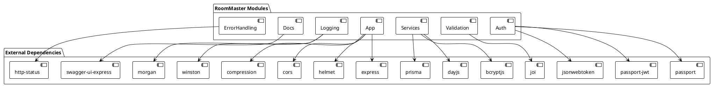

---

## 4.11. Cấu trúc thư mục

### 4.11.1. Tổng quan cấu trúc

```
src/
├── index.ts              # Entry point - khởi động server
├── app.ts                # Cấu hình Express app
├── prisma.ts             # Prisma client instance
│
├── config/               # Các module cấu hình
│   ├── env.ts            # Biến môi trường
│   ├── passport.ts       # JWT strategy cho Passport
│   ├── logger.ts         # Cấu hình Winston logger
│   ├── morgan.ts         # Logging HTTP request
│   ├── roles.ts          # Định nghĩa roles và permissions
│   └── swagger.ts        # Cấu hình Swagger UI
│
├── core/                 # DI & bootstrapping
│   ├── container.ts      # DI container & tokens
│   ├── bootstrap.ts      # Đăng ký tất cả services
│   ├── decorators.ts     # @Injectable, @Inject
│   └── index.ts          # Barrel export
│
├── routes/v1/            # Định nghĩa API routes
│   ├── index.ts          # Router chính, gộp tất cả routes
│   ├── customer/         # Routes cho khách hàng
│   │   ├── auth.route.ts
│   │   └── booking.route.ts
│   └── employee/         # Routes cho nhân viên
│       ├── auth.route.ts
│       ├── booking.route.ts
│       ├── room.route.ts
│       └── ...
│
├── middlewares/          # Express middlewares
│   ├── auth.ts           # authCustomer, authEmployee
│   ├── validate.ts       # Joi validation middleware
│   ├── error.ts          # Error converter & handler
│   ├── rateLimiter.ts    # Giới hạn request rate
│   └── xss.ts            # Bảo vệ XSS
│
├── controllers/          # Request handlers
│   ├── customer/         # Controllers cho customer
│   │   ├── auth.controller.ts
│   │   └── booking.controller.ts
│   └── employee/         # Controllers cho employee
│       ├── auth.controller.ts
│       ├── booking.controller.ts
│       └── ...
│
├── services/             # Business logic
│   ├── auth.service.ts       # Xác thực người dùng
│   ├── token.service.ts      # Quản lý JWT tokens
│   ├── customer.service.ts   # Quản lý khách hàng
│   ├── employee.service.ts   # Quản lý nhân viên
│   ├── booking.service.ts    # Logic đặt phòng
│   ├── room.service.ts       # Quản lý phòng
│   ├── roomType.service.ts   # Quản lý loại phòng
│   ├── service.service.ts    # Quản lý dịch vụ
│   ├── transaction.service.ts # Quản lý giao dịch
│   └── activity.service.ts   # Log hoạt động
│
├── validations/          # Joi schemas cho validation
│   ├── auth.validation.ts
│   ├── booking.validation.ts
│   ├── customer.validation.ts
│   └── ...
│
├── utils/                # Utility functions
│   ├── ApiError.ts       # Class lỗi tùy chỉnh
│   ├── catchAsync.ts     # Wrapper bắt lỗi async
│   ├── responseWrapper.ts # Format response chuẩn
│   └── ...
│
└── types/                # TypeScript type declarations
    ├── express.d.ts      # Extend Express types
    └── ...
```

### 4.11.2. Mô tả chi tiết các thư mục

| Thư mục          | Mô tả                                                             | Files quan trọng                    |
| ---------------- | ----------------------------------------------------------------- | ----------------------------------- |
| **config/**      | Chứa tất cả cấu hình ứng dụng. Mỗi file cấu hình một aspect riêng | `env.ts` - đọc biến môi trường      |
| **core/**        | Hệ thống DI core của ứng dụng                                     | `container.ts` - DI container chính |
| **routes/**      | Định nghĩa endpoints, gắn middleware, viết Swagger docs           | Tách riêng customer/employee        |
| **middlewares/** | Xử lý cross-cutting concerns trước/sau controller                 | `auth.ts` - xác thực JWT            |
| **controllers/** | Nhận request, gọi service, trả response                           | Tách riêng theo loại user           |
| **services/**    | Toàn bộ business logic, không biết về HTTP                        | `booking.service.ts` - core logic   |
| **validations/** | Joi schemas validate input                                        | Một file cho mỗi domain             |
| **utils/**       | Helper functions dùng chung                                       | `ApiError.ts` - standard errors     |
| **types/**       | TypeScript declarations                                           | Extend Express Request type         |

---

## 4.12. Sơ đồ Use Case

### 4.12.1. Use Case: Quản lý Đặt phòng (Booking Management)

Sơ đồ này mô tả các chức năng liên quan đến việc đặt phòng trong hệ thống.

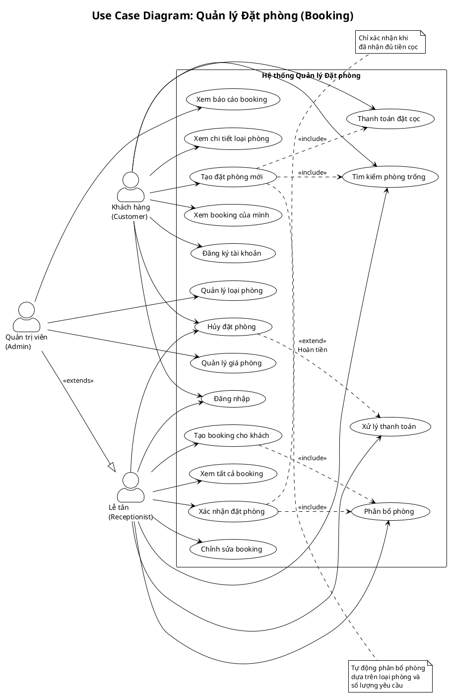

**Mô tả chi tiết các Use Case:**

| Use Case               | Actor                 | Mô tả                                                                        | Precondition                 |
| ---------------------- | --------------------- | ---------------------------------------------------------------------------- | ---------------------------- |
| **Tạo đặt phòng mới**  | Customer              | Khách hàng chọn loại phòng, ngày check-in/out, số lượng khách và tạo booking | Đã đăng nhập, có phòng trống |
| **Xác nhận đặt phòng** | Receptionist          | Lễ tân xác nhận booking sau khi khách đặt cọc                                | Booking ở trạng thái PENDING |
| **Hủy đặt phòng**      | Customer/Receptionist | Hủy booking, hoàn tiền nếu đủ điều kiện                                      | Booking chưa check-in        |
| **Phân bổ phòng**      | Receptionist          | Gán phòng cụ thể cho booking                                                 | Booking đã được xác nhận     |

---

### 4.12.2. Use Case: Check-in

Sơ đồ này mô tả quy trình nhận phòng của khách hàng.

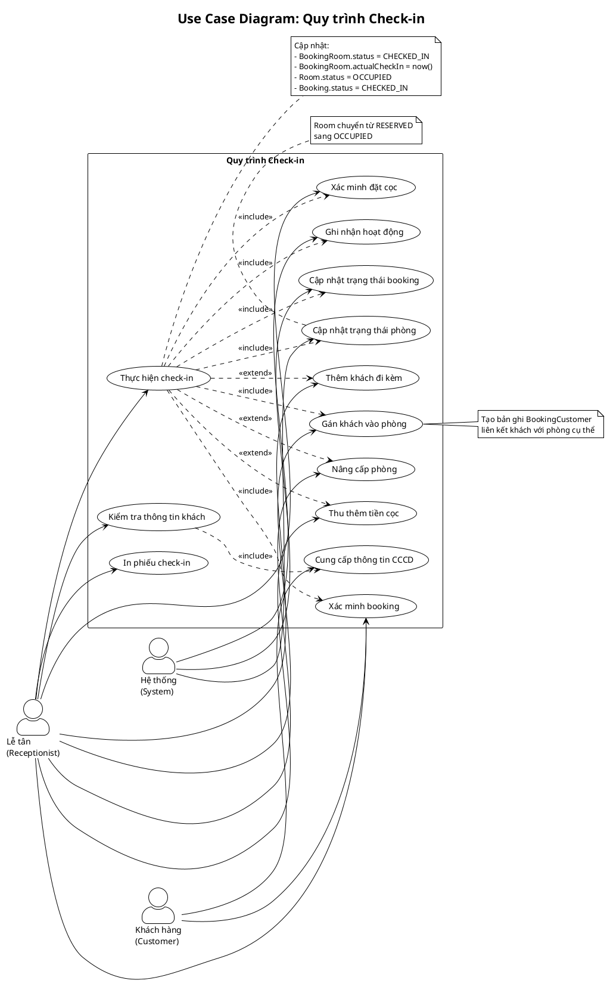

**Luồng xử lý Check-in:**

| Bước | Thực hiện bởi | Mô tả                                   | Trạng thái sau           |
| ---- | ------------- | --------------------------------------- | ------------------------ |
| 1    | Receptionist  | Tìm booking theo mã hoặc SĐT khách      | -                        |
| 2    | Receptionist  | Xác minh booking ở trạng thái CONFIRMED | -                        |
| 3    | Customer      | Cung cấp CCCD/CMND để xác minh          | -                        |
| 4    | Receptionist  | Kiểm tra tiền cọc đã đủ chưa            | -                        |
| 5    | Receptionist  | Gán khách vào từng phòng cụ thể         | BookingCustomer created  |
| 6    | Receptionist  | Thực hiện check-in                      | BookingRoom = CHECKED_IN |
| 7    | System        | Cập nhật trạng thái phòng               | Room = OCCUPIED          |
| 8    | System        | Cập nhật trạng thái booking             | Booking = CHECKED_IN     |
| 9    | System        | Ghi log hoạt động                       | Activity created         |

---

### 4.12.3. Use Case: Check-out

Sơ đồ này mô tả quy trình trả phòng của khách hàng.

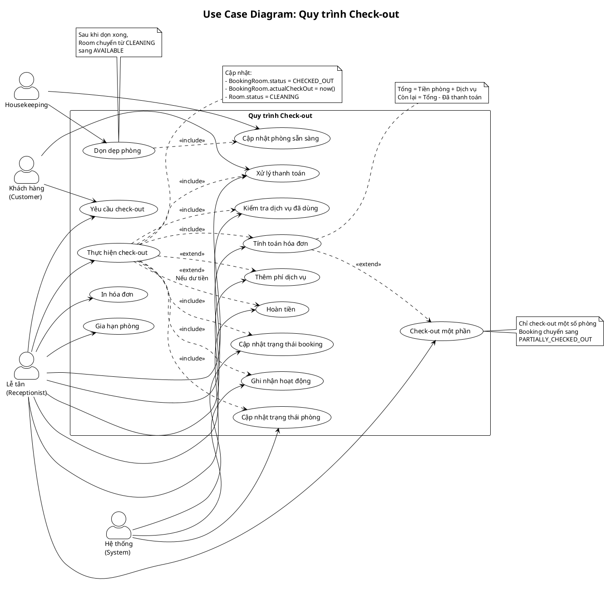

**Luồng xử lý Check-out:**

| Bước | Thực hiện bởi         | Mô tả                                             | Trạng thái sau                                   |
| ---- | --------------------- | ------------------------------------------------- | ------------------------------------------------ |
| 1    | Customer/Receptionist | Yêu cầu check-out                                 | -                                                |
| 2    | Receptionist          | Kiểm tra dịch vụ đã sử dụng (minibar, giặt ủi...) | -                                                |
| 3    | System                | Tính toán tổng hóa đơn                            | -                                                |
| 4    | Customer              | Thanh toán số tiền còn lại                        | Transaction created                              |
| 5    | Receptionist          | Thực hiện check-out                               | BookingRoom = CHECKED_OUT                        |
| 6    | System                | Cập nhật phòng sang cleaning                      | Room = CLEANING                                  |
| 7    | System                | Cập nhật trạng thái booking                       | Booking = CHECKED_OUT hoặc PARTIALLY_CHECKED_OUT |
| 8    | Housekeeping          | Dọn dẹp phòng                                     | -                                                |
| 9    | Housekeeping          | Đánh dấu phòng sẵn sàng                           | Room = AVAILABLE                                 |

---

### 4.12.4. Use Case: Quản lý Người dùng (User Management)

Sơ đồ này mô tả các chức năng quản lý người dùng trong hệ thống.

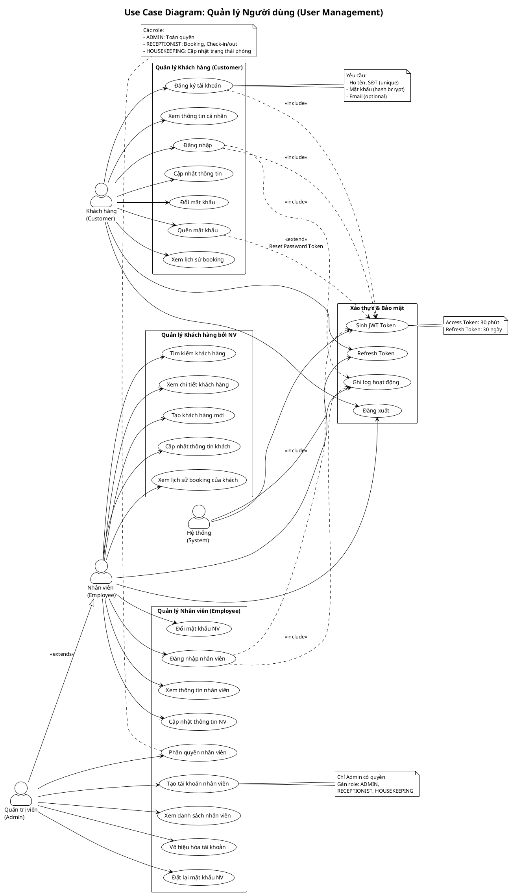

**Mô tả chi tiết các Use Case Quản lý Người dùng:**

| Use Case              | Actor             | Mô tả                                 | Ghi chú                           |
| --------------------- | ----------------- | ------------------------------------- | --------------------------------- |
| **Đăng ký tài khoản** | Customer          | Tạo tài khoản mới với SĐT và mật khẩu | SĐT phải unique                   |
| **Đăng nhập**         | Customer/Employee | Xác thực và nhận JWT tokens           | Phân biệt customer/employee       |
| **Tạo nhân viên**     | Admin             | Tạo tài khoản nhân viên mới           | Gán role phù hợp                  |
| **Phân quyền**        | Admin             | Thay đổi role của nhân viên           | Admin, Receptionist, Housekeeping |
| **Đổi mật khẩu**      | Customer/Employee | Thay đổi mật khẩu đăng nhập           | Yêu cầu mật khẩu cũ               |
| **Quên mật khẩu**     | Customer          | Nhận email reset password             | Token có hiệu lực 10 phút         |

**Ma trận phân quyền:**

| Chức năng                  | Customer | Receptionist | Housekeeping | Admin |
| -------------------------- | :------: | :----------: | :----------: | :---: |
| Đăng ký/Đăng nhập          |    ✅    |      ✅      |      ✅      |  ✅   |
| Xem/Sửa thông tin cá nhân  |    ✅    |      ✅      |      ✅      |  ✅   |
| Tạo booking                |    ✅    |      ✅      |      ❌      |  ✅   |
| Quản lý booking            |    ❌    |      ✅      |      ❌      |  ✅   |
| Check-in/Check-out         |    ❌    |      ✅      |      ❌      |  ✅   |
| Quản lý khách hàng         |    ❌    |      ✅      |      ❌      |  ✅   |
| Cập nhật trạng thái phòng  |    ❌    |      ✅      |      ✅      |  ✅   |
| Quản lý nhân viên          |    ❌    |      ❌      |      ❌      |  ✅   |
| Quản lý loại phòng/dịch vụ |    ❌    |      ❌      |      ❌      |  ✅   |
| Xem báo cáo                |    ❌    |      ❌      |      ❌      |  ✅   |

---

## 4.13. Tổng kết

### 4.13.1. Lý do chọn kiến trúc

| Đặc điểm                       | Mô tả                                                             | Lợi ích                                 |
| ------------------------------ | ----------------------------------------------------------------- | --------------------------------------- |
| **Custom DI Container**        | Hệ thống dependency injection tự xây dựng, lấy cảm hứng từ NestJS | Services decoupled, dễ test, dễ mở rộng |
| **Xác thực kép**               | Hỗ trợ cả Customer và Employee với JWT riêng biệt                 | Bảo mật cao, phân quyền rõ ràng         |
| **Hệ thống Booking toàn diện** | Quản lý đặt phòng, phân bổ phòng, giao dịch, lịch sử              | Đáp ứng đầy đủ nghiệp vụ khách sạn      |
| **RESTful API chuẩn**          | Tuân thủ best practices với Swagger docs                          | Dễ tích hợp, dễ sử dụng                 |
| **Xử lý lỗi tập trung**        | Một điểm duy nhất xử lý tất cả lỗi                                | Consistent error responses              |
| **Production-ready**           | Logging, security headers, rate limiting                          | Sẵn sàng triển khai production          |

### 4.13.2. Nguyên tắc thiết kế đã áp dụng

1. **Separation of Concerns**: Mỗi layer/module có trách nhiệm rõ ràng
2. **Single Responsibility**: Mỗi class/function làm một việc
3. **Dependency Inversion**: High-level modules không phụ thuộc low-level modules
4. **DRY (Don't Repeat Yourself)**: Tái sử dụng code qua services và utilities
5. **KISS (Keep It Simple)**: Giữ code đơn giản, dễ hiểu

### 4.13.3. Hướng mở rộng

- **Thêm domain mới**: Tạo service, controller, routes mới theo pattern có sẵn
- **Thêm tính năng**: Business logic nằm trong services, không ảnh hưởng layers khác
- **Scale horizontal**: Stateless design, có thể chạy nhiều instances
- **Đổi database**: Chỉ cần thay đổi Prisma schema và migrations
- **Thêm authentication provider**: Mở rộng Passport strategies

_Tài liệu này được cập nhật lần cuối: Tháng 12, 2025_
