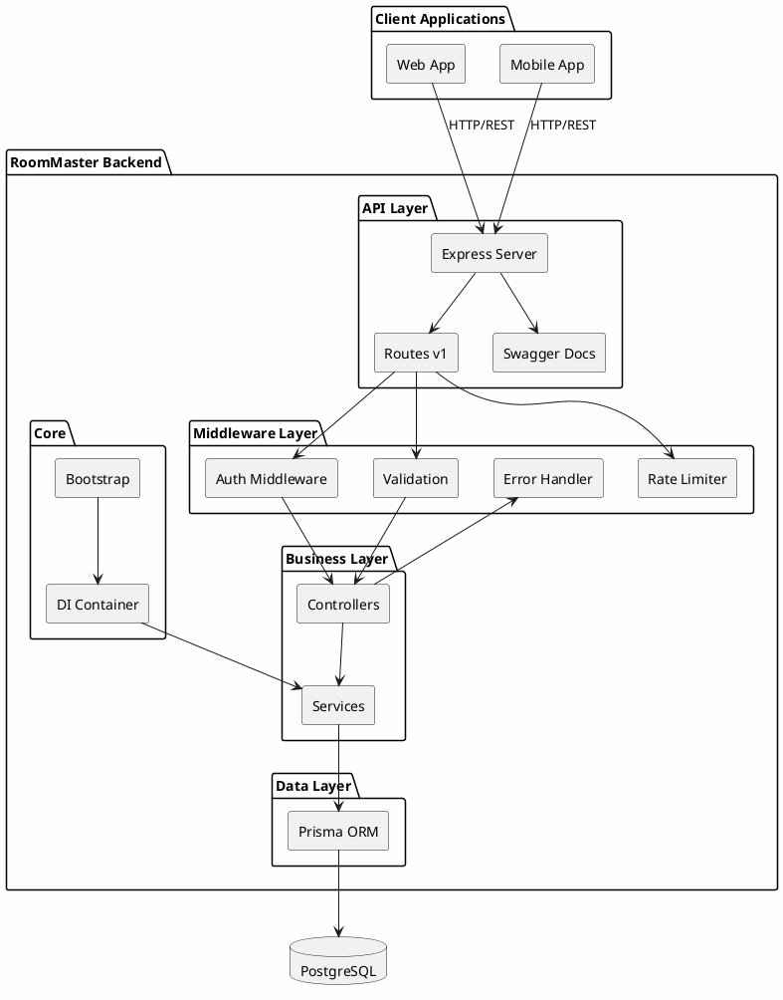
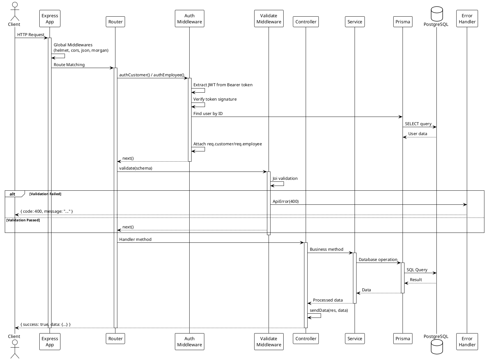
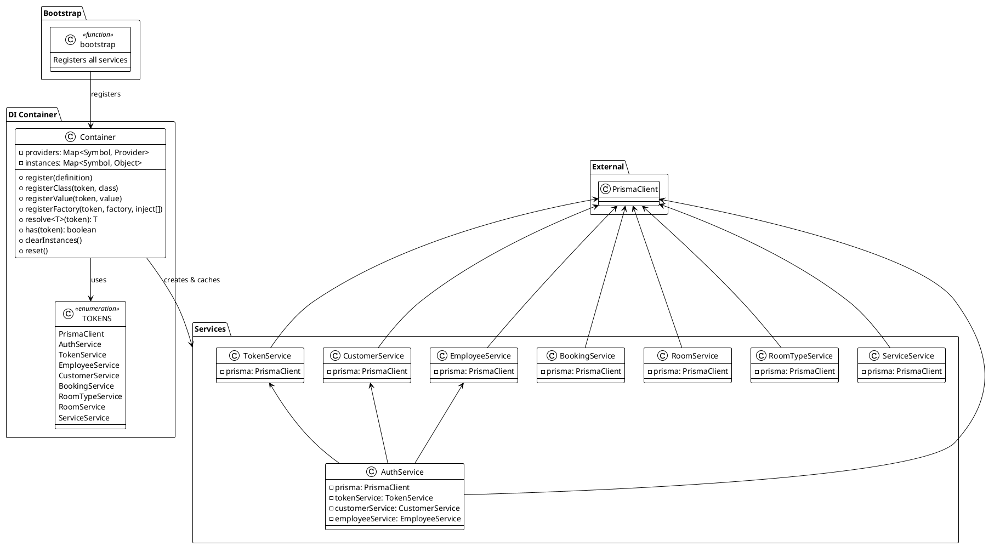
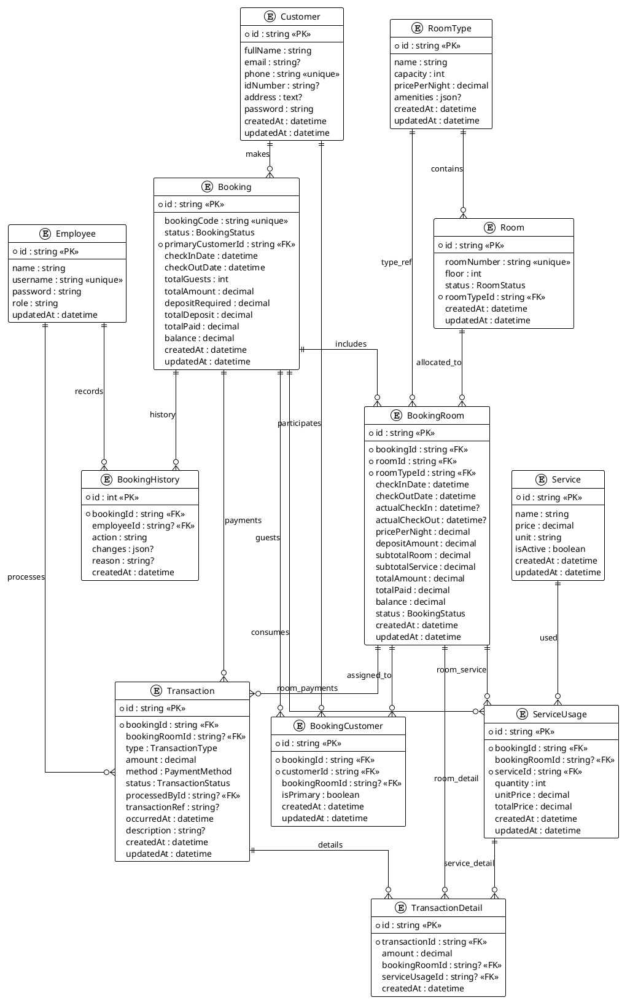
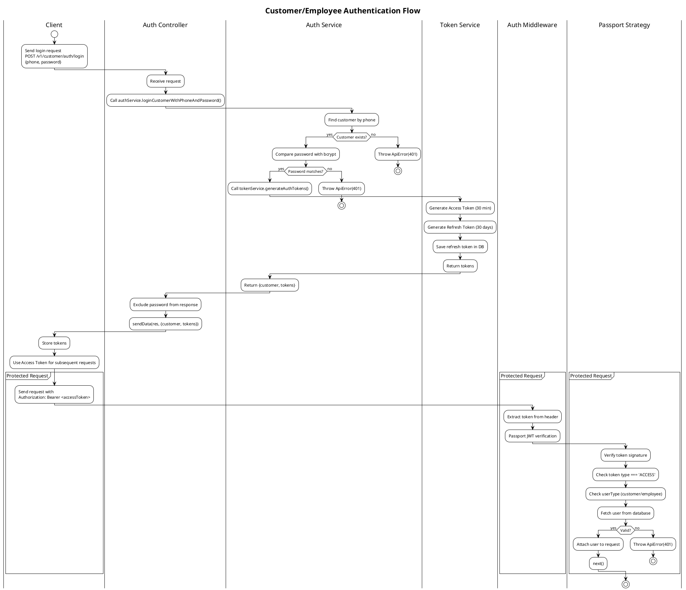
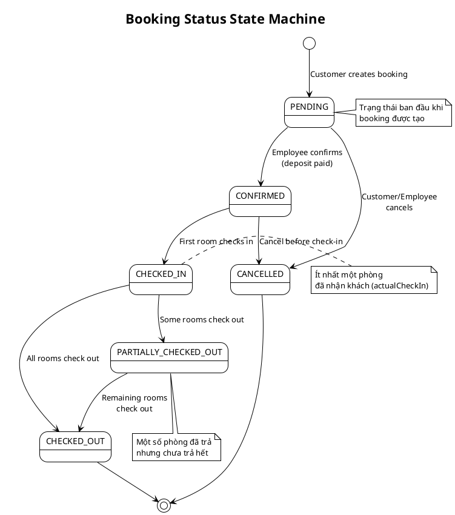
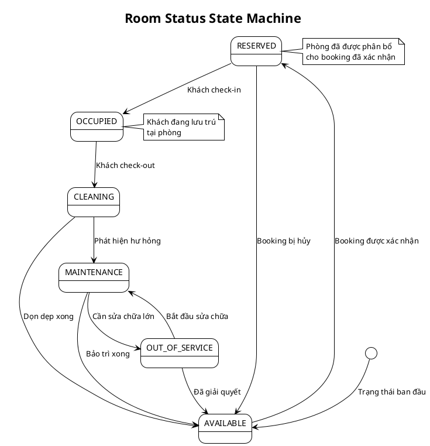
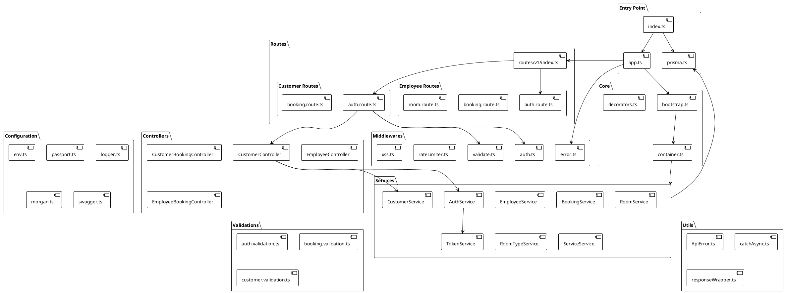
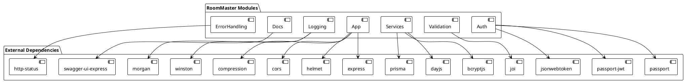

# Tài liệu Kiến trúc Hệ thống

# Chương 4

## 4.1. Giới thiệu

**RoomMaster Backend** là một máy chủ API RESTful, được xây dựng trên nền tảng **Node.js** với ngôn ngữ **TypeScript**, sử dụng framework **Express** và **Prisma ORM** để tương tác với cơ sở dữ liệu.

Ứng dụng tuân theo **kiến trúc phân tầng (Layered Architecture)** kết hợp với **hệ thống Dependency Injection (DI)** tùy chỉnh, lấy cảm hứng từ các pattern của NestJS, giúp mã nguồn dễ bảo trì, mở rộng và kiểm thử.

## 4.2. Các tính năng chính

| Tính năng                 | Mô tả chi tiết                                                                |
| ------------------------- | ----------------------------------------------------------------------------- |
| **Xác thực đa đối tượng** | Hỗ trợ đăng nhập cho cả Khách hàng (Customer) và Nhân viên (Employee) với JWT |
| **Quản lý đặt phòng**     | Tạo, xác nhận, hủy booking với tự động phân bổ phòng                          |
| **Check-in/Check-out**    | Quản lý quá trình nhận/trả phòng với theo dõi trạng thái chi tiết             |
| **Giao dịch tài chính**   | Quản lý tiền đặt cọc, thanh toán, hoàn tiền với transaction details           |
| **Sử dụng dịch vụ**       | Theo dõi các dịch vụ khách hàng sử dụng (spa, giặt ủi, minibar...)            |
| **Lịch sử hoạt động**     | Ghi nhận đầy đủ lịch sử thay đổi booking (audit trail)                        |
| **Hệ thống xếp hạng VIP** | Phân hạng khách hàng dựa trên chi tiêu tích lũy với ưu đãi theo từng rank     |
| **Định giá động**         | Điều chỉnh giá phòng theo thời gian, sự kiện, mùa vụ với priority-based rules |
| **Quản lý khuyến mãi**    | Tạo, áp dụng mã giảm giá theo phạm vi (phòng/dịch vụ) với giới hạn số lượng   |
| **Phân quyền CASL**       | Kiểm soát truy cập dựa trên Role-Permission với CASL Ability                  |
| **Quản lý hình ảnh**      | Upload và quản lý ảnh phòng/dịch vụ/khách hàng qua Cloudinary                 |
| **Email automation**      | Gửi email xác thực, thông báo booking với template engine Handlebars          |
| **Hệ thống báo cáo**      | Báo cáo phòng trống, doanh thu, khách hàng, nhân viên, dịch vụ                |

---

## 4.3. Công nghệ sử dụng

### 4.3.1. Bảng tổng hợp công nghệ

| Danh mục            | Công nghệ               | Mô tả                                                    |
| ------------------- | ----------------------- | -------------------------------------------------------- |
| **Runtime**         | Node.js                 | Môi trường chạy JavaScript phía server                   |
| **Ngôn ngữ**        | TypeScript              | JavaScript với kiểu dữ liệu tĩnh, tăng độ an toàn code   |
| **Framework**       | Express.js              | Framework web nhẹ, linh hoạt cho Node.js                 |
| **ORM**             | Prisma                  | ORM thế hệ mới với type-safe và auto-generated queries   |
| **Database**        | PostgreSQL              | Hệ quản trị CSDL quan hệ mạnh mẽ, hỗ trợ JSON            |
| **Xác thực**        | Passport.js + JWT       | Xác thực người dùng với JSON Web Token                   |
| **Phân quyền**      | CASL                    | Authorization framework với ability-based access control |
| **Validation**      | Joi                     | Thư viện validate dữ liệu đầu vào mạnh mẽ                |
| **Tài liệu API**    | Swagger (OpenAPI)       | Tự động sinh tài liệu API tương tác                      |
| **Logging**         | Winston + Morgan        | Ghi log ứng dụng và HTTP request                         |
| **Email**           | Nodemailer + Handlebars | Gửi email với template engine                            |
| **File Upload**     | Multer + Cloudinary     | Upload và lưu trữ ảnh trên cloud                         |
| **Date/Time**       | Day.js + RRule          | Xử lý ngày tháng và recurring events                     |
| **Process Manager** | PM2                     | Quản lý process Node.js trong production                 |
| **Container**       | Docker                  | Đóng gói và triển khai ứng dụng                          |

### 4.3.2. Lý do lựa chọn

## Ứng dụng được phát triển bằng ngôn ngữ Typescript, được hỗ trợ rộng rãi với nhiều APIs, IDE; sử dụng Prisma để quản lý migrations và schema. Framework Express được tích hợp sẵn nhiều middleware thuận tiện cho quá trình phát triển, đồng thời tương thích tốt với PostgreSQL để quản lý transactions và các logic dữ liệu phức tạp.

## 4.4. Kiến trúc phân tầng

### 4.4.1. Tổng quan kiến trúc

Ứng dụng được thiết kế theo **kiến trúc 5 tầng**, mỗi tầng có trách nhiệm riêng biệt:

```
┌─────────────────────────────────────────────────────────────┐
│                     ROUTES LAYER                            │
│  Định nghĩa endpoint, tài liệu Swagger, gắn middleware      │
├─────────────────────────────────────────────────────────────┤
│                   MIDDLEWARE LAYER                          │
│  Xác thực, Validation, Rate Limiting, Xử lý lỗi, XSS        │
├─────────────────────────────────────────────────────────────┤
│                   CONTROLLER LAYER                          │
│  Xử lý HTTP request, định dạng response                     │
├─────────────────────────────────────────────────────────────┤
│                    SERVICE LAYER                            │
│  Logic nghiệp vụ, tương tác database qua Prisma             │
├─────────────────────────────────────────────────────────────┤
│                    DATA LAYER                               │
│  Prisma ORM, PostgreSQL Database                            │
└─────────────────────────────────────────────────────────────┘
```

### 4.4.2. Chi tiết từng tầng

| Tầng           | Thư mục            | Trách nhiệm                                                                  | Ví dụ                                                      |
| -------------- | ------------------ | ---------------------------------------------------------------------------- | ---------------------------------------------------------- |
| **Routes**     | `src/routes/`      | Định nghĩa các API endpoint, gắn middleware vào route, viết tài liệu Swagger | `auth.route.ts`, `booking.route.ts`                        |
| **Middleware** | `src/middlewares/` | Xử lý các concern xuyên suốt: xác thực, validation, xử lý lỗi, bảo mật, CASL | `auth.ts`, `validate.ts`, `error.ts`, `casl.middleware.ts` |
| **Controller** | `src/controllers/` | Nhận HTTP request, gọi service tương ứng, format và trả về response          | `auth.controller.ts`, `employee.booking.controller.ts`     |
| **Service**    | `src/services/`    | Chứa toàn bộ logic nghiệp vụ, thao tác database, áp dụng business rules      | `booking.service.ts`, `pricing-calculator.service.ts`      |
| **Data**       | `prisma/`          | Định nghĩa schema database, quản lý migrations, Prisma Client                | `schema.prisma`                                            |

### 4.4.3. Nguyên tắc thiết kế

1. **Separation of Concerns**: Mỗi tầng chỉ làm một việc, không xử lý logic của tầng khác
2. **Dependency Direction**: Tầng trên phụ thuộc tầng dưới, không ngược lại
3. **Single Responsibility**: Mỗi file/class chỉ có một lý do để thay đổi
4. **Interface Segregation**: Controller không biết cách service truy vấn database

---

## 4.5. Vòng đời xử lý Request

### 4.5.1. Các bước xử lý

Một request điển hình sẽ đi qua các giai đoạn sau:

| Bước | Vị trí                            | Mô tả chi tiết                                                                     |
| ---- | --------------------------------- | ---------------------------------------------------------------------------------- |
| 1    | `src/app.ts`                      | Express nhận HTTP request từ client                                                |
| 2    | Global Middlewares                | Chạy qua helmet (bảo mật), cors, body parsing, morgan (logging)                    |
| 3    | `src/routes/v1/`                  | Khớp route với URL pattern                                                         |
| 4    | Route Middlewares                 | Chạy `authCustomer()`/`authEmployee()` để xác thực, `validate()` để kiểm tra input |
| 5    | `src/controllers/`                | Controller method xử lý request                                                    |
| 6    | `src/services/`                   | Service method thực thi logic nghiệp vụ                                            |
| 7    | Prisma                            | Thực hiện truy vấn database                                                        |
| 8    | `responseWrapper`                 | Format response chuẩn `{ success: true, data: {...} }`                             |
| 9    | `errorConverter` + `errorHandler` | Bắt và xử lý lỗi (nếu có)                                                          |

### 4.5.2. Luồng xử lý thành công

```
Client Request → Express → Global MW → Route Match → Auth MW → Validate MW
    → Controller → Service → Prisma → Database
    ← Data ← Processed Data ← JSON Response ← Client
```

### 4.5.3. Luồng xử lý lỗi

```
Bất kỳ tầng nào throw Error → errorConverter (chuyển thành ApiError)
    → errorHandler (log + format response) → Client nhận { code, message }
```

---

## 4.6. Hệ thống Dependency Injection

### 4.6.1. Tổng quan

Ứng dụng sử dụng **DI Container tùy chỉnh** (`src/core/container.ts`) cung cấp tính năng dependency injection tương tự NestJS cho ứng dụng Express.

**Lợi ích của DI:**

- **Loose coupling**: Các class không phụ thuộc trực tiếp vào nhau
- **Dễ test**: Có thể mock dependencies khi unit test
- **Tái sử dụng**: Services được khởi tạo một lần và dùng chung
- **Quản lý lifecycle**: Container quản lý việc khởi tạo và cache instances

### 4.6.2. Các thành phần

| Thành phần     | File                     | Mục đích                                            |
| -------------- | ------------------------ | --------------------------------------------------- |
| **Container**  | `src/core/container.ts`  | Singleton container quản lý providers và instances  |
| **Decorators** | `src/core/decorators.ts` | Các decorator `@Injectable()` và `@Inject()`        |
| **Bootstrap**  | `src/core/bootstrap.ts`  | Đăng ký tất cả services khi khởi động ứng dụng      |
| **Tokens**     | `src/core/container.ts`  | Các Symbol dùng để định danh dependency (type-safe) |

### 4.6.3. Các cách đăng ký

```typescript
// 1. Value provider - Đăng ký một instance có sẵn (VD: PrismaClient)
container.registerValue(TOKENS.PrismaClient, prisma);

// 2. Factory provider - Đăng ký service với dependencies
container.registerFactory(
  TOKENS.AuthService, // Token định danh
  (...args) => new AuthService(args[0], args[1], args[2], args[3]), // Factory function
  [TOKENS.PrismaClient, TOKENS.TokenService, TOKENS.CustomerService, TOKENS.EmployeeService] // Dependencies
);
```

### 4.6.4. Cách sử dụng (Resolution)

```typescript
// Trong routes, resolve dependencies từ container
const authService = container.resolve<AuthService>(TOKENS.AuthService);
const controller = new SomeController(authService);
```

### 4.6.5. Biểu đồ phụ thuộc Services

```
PrismaClient (Gốc - không có dependency)
    │
    ├── TokenService
    ├── CustomerService
    ├── EmployeeService
    ├── RoomService
    ├── RoomTypeService
    ├── RoomTagService
    ├── ServiceService
    ├── ActivityService
    ├── AppSettingService
    ├── CaslService
    ├── PricingRuleService
    ├── PricingCalculatorService
    ├── CustomerRankService
    ├── ImageService
    ├── RoleService
    ├── PermissionService
    └── Report Services (Room, Customer, Employee, Service, Revenue)

TemplateService (không có dependency)
    └── EmailService (cần TemplateService, PrismaClient)

BookingService (complex dependencies)
    ├── PrismaClient
    ├── TransactionService
    ├── ActivityService
    ├── AppSettingService
    ├── EmailService
    └── RoomService

AuthService (cần nhiều dependencies)
    ├── PrismaClient
    ├── TokenService
    ├── CustomerService
    └── EmployeeService
```

    ├── TokenService
    ├── CustomerService
    └── EmployeeService

````

---

## 4.7. Xác thực và Phân quyền

### 4.7.1. Cấu trúc JWT Token

Hệ thống sử dụng **JWT (JSON Web Token)** để xác thực người dùng. Mỗi token chứa các thông tin:

```typescript
{
  sub: string; // ID người dùng (customer hoặc employee)
  userType: 'customer' | 'employee'; // Loại người dùng
  type: 'ACCESS' | 'REFRESH' | 'RESET_PASSWORD'; // Loại token
  iat: number; // Thời điểm tạo (issued at)
  exp: number; // Thời điểm hết hạn (expiration)
}
````

### 4.7.2. Các loại Token

| Loại Token         | Thời hạn | Mục đích                                                          |
| ------------------ | -------- | ----------------------------------------------------------------- |
| **ACCESS**         | 30 phút  | Dùng để gọi API, gửi trong header `Authorization: Bearer <token>` |
| **REFRESH**        | 30 ngày  | Dùng để lấy access token mới khi hết hạn                          |
| **RESET_PASSWORD** | 10 phút  | Dùng cho chức năng đặt lại mật khẩu                               |

### 4.7.3. Luồng xác thực

1. **Đăng nhập** → Validate credentials → Sinh cặp access + refresh tokens
2. **Gọi API bảo vệ** → Trích xuất JWT từ header `Authorization: Bearer <token>`
3. **Passport xác minh** → Kiểm tra chữ ký token, xác định userType
4. **Middleware kiểm tra** → Đảm bảo userType khớp với route requirement
5. **Gắn user vào request** → `req.customer` hoặc `req.employee`

### 4.7.4. Xác thực hai loại người dùng

Hệ thống hỗ trợ **hai loại người dùng riêng biệt** với routes và middleware khác nhau:

| Loại User    | Prefix Routes   | Middleware       | Property trong Request |
| ------------ | --------------- | ---------------- | ---------------------- |
| **Customer** | `/v1/customer/` | `authCustomer()` | `req.customer`         |
| **Employee** | `/v1/employee/` | `authEmployee()` | `req.employee`         |

### 4.7.5. Phân quyền (Authorization)

Sau khi xác thực, hệ thống kiểm tra quyền của user:

- **Customer**: Chỉ được truy cập dữ liệu của chính mình, xem promotion, xem rank
- **Employee**: Phân quyền động dựa trên **Role-Permission model** với **CASL**
  - Mỗi Employee có một Role (VD: Admin, Receptionist, Housekeeping)
  - Mỗi Role có nhiều Permissions (screen access hoặc action permissions)
  - CASL middleware kiểm tra ability của user trước khi cho phép truy cập
  - Permission types:
    - **SCREEN**: Quyền truy cập màn hình (VD: `screen:booking`, `screen:employee`)
    - **ACTION**: Quyền thực hiện hành động (VD: `booking:create`, `room:update`, `transaction:delete`)
  - CaslService build Ability từ permissions và kiểm tra theo subject và action

---

## 4.8. Cơ sở dữ liệu

### 4.8.1. Tổng quan các Entity

| Entity                | Mô tả                                               | Quan hệ chính                               |
| --------------------- | --------------------------------------------------- | ------------------------------------------- |
| **Employee**          | Nhân viên khách sạn với role-based permissions      | → Transactions, Activities, Role            |
| **Customer**          | Khách hàng đặt phòng với rank và email verification | → Bookings, BookingCustomers, CustomerRank  |
| **RoomType**          | Loại phòng với giá cơ bản và multiple images        | → Rooms, BookingRooms, RoomTypeImages       |
| **Room**              | Phòng vật lý với trạng thái và multiple images      | → BookingRooms, RoomImages                  |
| **Booking**           | Bản ghi đặt phòng với pricing và deposit            | → BookingRooms, Transactions, ServiceUsages |
| **BookingRoom**       | Phân bổ phòng với dynamic pricing tracking          | → Transactions, ServiceUsages, PricingRule  |
| **BookingCustomer**   | Gán khách vào booking/phòng                         | M:N Customer ↔ Booking                      |
| **Transaction**       | Bản ghi giao dịch với promotion support             | → TransactionDetails, UsedPromotions        |
| **TransactionDetail** | Chi tiết từng khoản trong giao dịch                 | → BookingRoom, ServiceUsage                 |
| **Service**           | Dịch vụ khách sạn với multiple images               | → ServiceUsages, ServiceImages              |
| **ServiceUsage**      | Bản ghi sử dụng dịch vụ với custom pricing          | → TransactionDetails, Activities            |
| **Activity**          | Log hoạt động hệ thống với metadata                 | → Employee, Customer, BookingRoom           |
| **Promotion**         | Mã khuyến mãi với scope và limit                    | → CustomerPromotions, UsedPromotions        |
| **CustomerPromotion** | Promotion đã claim của khách hàng                   | → Customer, Promotion                       |
| **CustomerRank**      | Hạng VIP của khách hàng (Đồng, Bạc, Vàng...)        | → Customers                                 |
| **PricingRule**       | Quy tắc điều chỉnh giá động theo thời gian/sự kiện  | → BookingRooms, CalendarEvent               |
| **CalendarEvent**     | Sự kiện lịch (Tết, Hè, Blackpink...) với recurring  | → PricingRules                              |
| **Role**              | Vai trò nhân viên với permissions                   | → Employees, RolePermissions                |
| **Permission**        | Quyền hạn CASL (screen/action based)                | → RolePermissions                           |
| **AppSetting**        | Cấu hình hệ thống (JSON values)                     | Key-value store                             |

## 4.9. Xử lý lỗi

### 4.9.1. Luồng xử lý lỗi

```
Bất kỳ tầng nào throw ApiError hoặc Error
                    ↓
        errorConverter middleware
  (Chuyển đổi thành ApiError nếu chưa phải)
                    ↓
        errorHandler middleware
  (Format response, log lỗi ở dev, ẩn stack ở prod)
                    ↓
    JSON response: { code, message, [stack] }
```

### 4.9.2. Lớp ApiError

```typescript
class ApiError extends Error {
  statusCode: number; // HTTP status code (400, 401, 403, 404, 500...)
  isOperational: boolean; // true = lỗi mong đợi, false = lỗi lập trình
}

// Ví dụ sử dụng
throw new ApiError(httpStatus.NOT_FOUND, 'Không tìm thấy booking');
throw new ApiError(httpStatus.UNAUTHORIZED, 'Token không hợp lệ');
throw new ApiError(httpStatus.BAD_REQUEST, 'Dữ liệu không hợp lệ');
```

### 4.9.3. Phân loại lỗi

| Loại lỗi                 | isOperational | Xử lý                             |
| ------------------------ | ------------- | --------------------------------- |
| **Validation error**     | true          | Trả về 400 với message chi tiết   |
| **Authentication error** | true          | Trả về 401                        |
| **Authorization error**  | true          | Trả về 403                        |
| **Not found**            | true          | Trả về 404                        |
| **Business logic error** | true          | Trả về 400/409 tùy context        |
| **Database error**       | false         | Trả về 500, log chi tiết          |
| **Unexpected error**     | false         | Trả về 500, không expose chi tiết |

### 4.9.4. Response format

**Development:**

```json
{
  "code": 400,
  "message": "Phòng đã được đặt trong khoảng thời gian này",
  "stack": "Error: Phòng đã được đặt...\n    at BookingService.create..."
}
```

**Production:**

```json
{
  "code": 400,
  "message": "Phòng đã được đặt trong khoảng thời gian này"
}
```

---

## 4.10. Mô hình hóa kiến trúc

### 4.10.1 Kiến trúc tổng quan (High-Level Architecture)



### 4.10.2. Vòng đời Request (Request Lifecycle Sequence)

Sơ đồ minh họa chi tiết các bước xử lý một HTTP request từ client đến database.



### 4.10.3. Dependency Injection Container

Sơ đồ này thể hiện cấu trúc của DI Container và cách các services được đăng ký, quản lý.



### 4.10.4. Sơ đồ quan hệ thực thể (Entity Relationship Diagram)

Sơ đồ ERD chi tiết các bảng trong database và mối quan hệ giữa chúng.



### 4.10.5. Luồng xác thực (Authentication Flow)

Sơ đồ chi tiết quá trình đăng nhập và xác thực người dùng (Customer/Employee).



### 4.10.6. Máy trạng thái Booking (Booking State Machine)

Sơ đồ thể hiện các trạng thái của một Booking và điều kiện chuyển đổi giữa chúng.



### 4.10.7. Máy trạng thái Room (Room Status State Machine)

Sơ đồ thể hiện các trạng thái của phòng và điều kiện chuyển đổi.



### 4.10.8. Kiến trúc Component (Component Architecture)



### 4.10.9. Phụ thuộc Package (Package Dependencies)

Sơ đồ thể hiện các thư viện npm được sử dụng trong dự án.



---

## 4.11. Cấu trúc thư mục

| Thư mục          | Mô tả                                                             | Files quan trọng                    |
| ---------------- | ----------------------------------------------------------------- | ----------------------------------- |
| **config/**      | Chứa tất cả cấu hình ứng dụng. Mỗi file cấu hình một aspect riêng | `env.ts` - đọc biến môi trường      |
| **core/**        | Hệ thống DI core của ứng dụng                                     | `container.ts` - DI container chính |
| **routes/**      | Định nghĩa endpoints, gắn middleware, viết Swagger docs           | Tách riêng customer/employee        |
| **middlewares/** | Xử lý cross-cutting concerns trước/sau controller                 | `auth.ts` - xác thực JWT            |
| **controllers/** | Nhận request, gọi service, trả response                           | Tách riêng theo loại user           |
| **services/**    | Toàn bộ business logic, không biết về HTTP                        | `booking.service.ts` - core logic   |
| **validations/** | Joi schemas validate input                                        | Một file cho mỗi domain             |
| **utils/**       | Helper functions dùng chung                                       | `ApiError.ts` - standard errors     |
| **types/**       | TypeScript declarations                                           | Extend Express Request type         |

---

## 4.12. Tổng kết

### 4.12.1. Lý do chọn kiến trúc

| Đặc điểm                       | Mô tả                                                             | Lợi ích                                 |
| ------------------------------ | ----------------------------------------------------------------- | --------------------------------------- |
| **Custom DI Container**        | Hệ thống dependency injection tự xây dựng, lấy cảm hứng từ NestJS | Services decoupled, dễ test, dễ mở rộng |
| **Xác thực kép**               | Hỗ trợ cả Customer và Employee với JWT riêng biệt                 | Bảo mật cao, phân quyền rõ ràng         |
| **Hệ thống Booking toàn diện** | Quản lý đặt phòng, phân bổ phòng, giao dịch, lịch sử              | Đáp ứng đầy đủ nghiệp vụ khách sạn      |
| **RESTful API chuẩn**          | Tuân thủ best practices với Swagger docs                          | Dễ tích hợp, dễ sử dụng                 |
| **Xử lý lỗi tập trung**        | Một điểm duy nhất xử lý tất cả lỗi                                | Consistent error responses              |
| **Production-ready**           | Logging, security headers, rate limiting                          | Sẵn sàng triển khai production          |

### 4.12.2. Nguyên tắc thiết kế đã áp dụng

1. **Separation of Concerns**: Mỗi layer/module có trách nhiệm rõ ràng
2. **Single Responsibility**: Mỗi class/function làm một việc
3. **Dependency Inversion**: High-level modules không phụ thuộc low-level modules
4. **DRY (Don't Repeat Yourself)**: Tái sử dụng code qua services và utilities
5. **KISS (Keep It Simple)**: Giữ code đơn giản, dễ hiểu

### 4.12.3. Hướng mở rộng

- **Thêm domain mới**: Tạo service, controller, routes mới theo pattern có sẵn
- **Thêm tính năng**: Business logic nằm trong services, không ảnh hưởng layers khác
- **Scale horizontal**: Stateless design, có thể chạy nhiều instances
- **Đổi database**: Chỉ cần thay đổi Prisma schema và migrations
- **Thêm authentication provider**: Mở rộng Passport strategies

_Tài liệu này được cập nhật lần cuối: Tháng 12, 2025_
