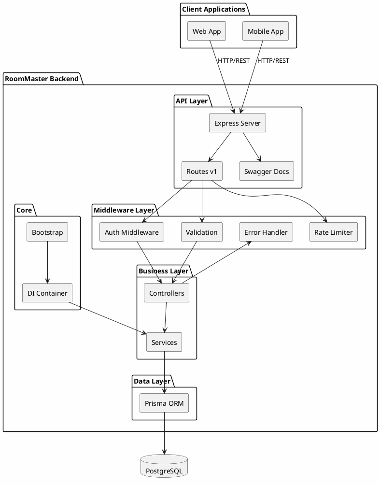
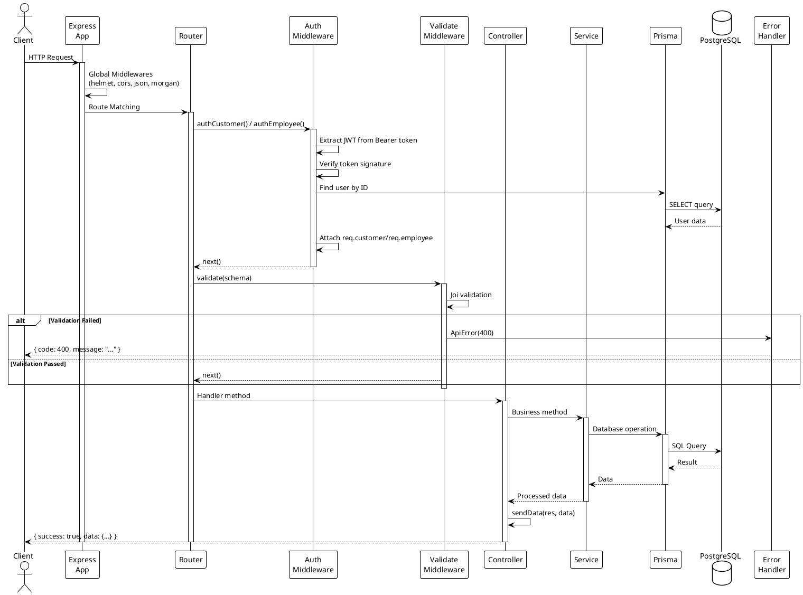
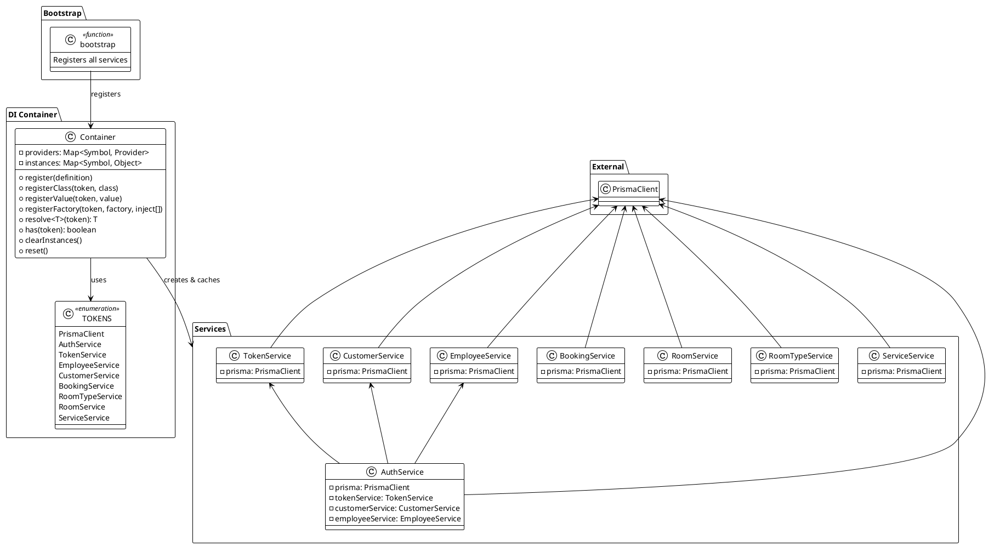
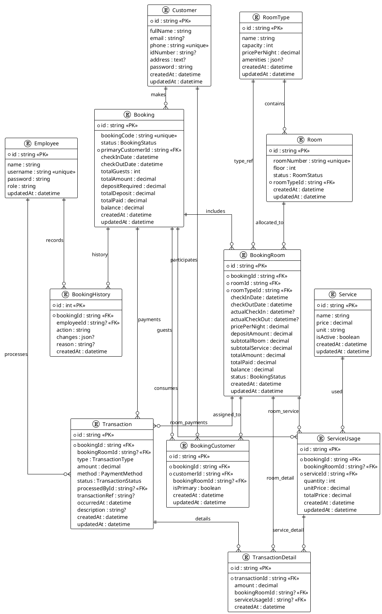
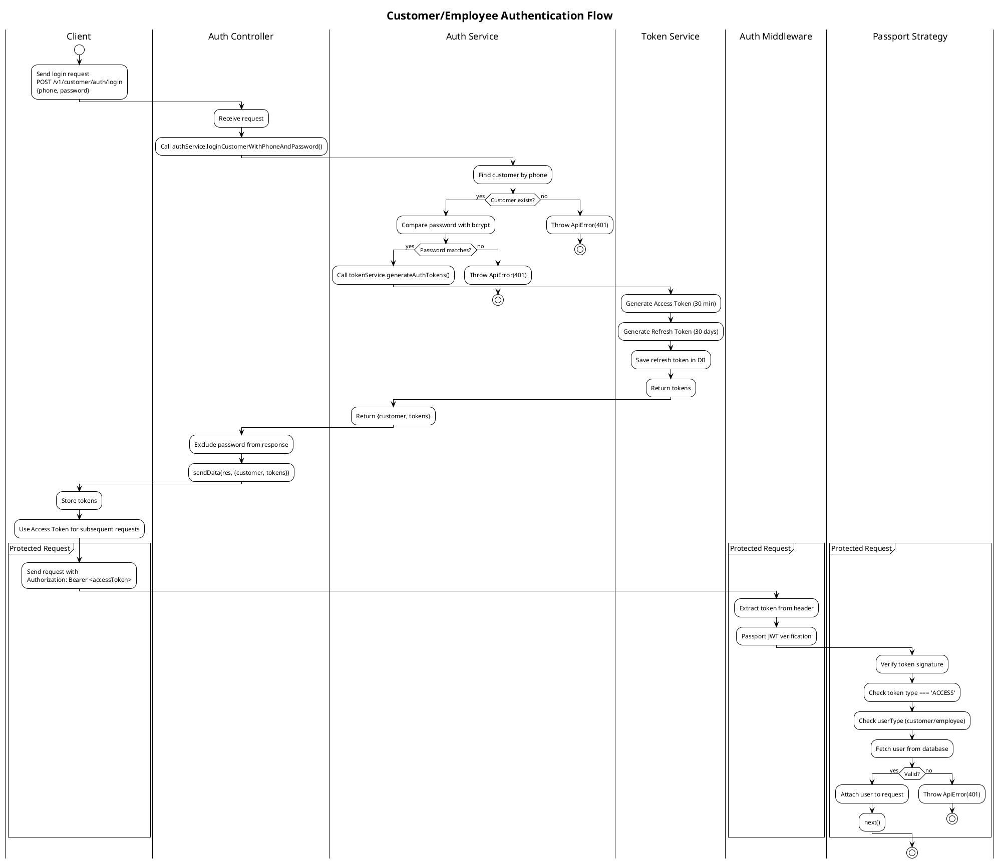
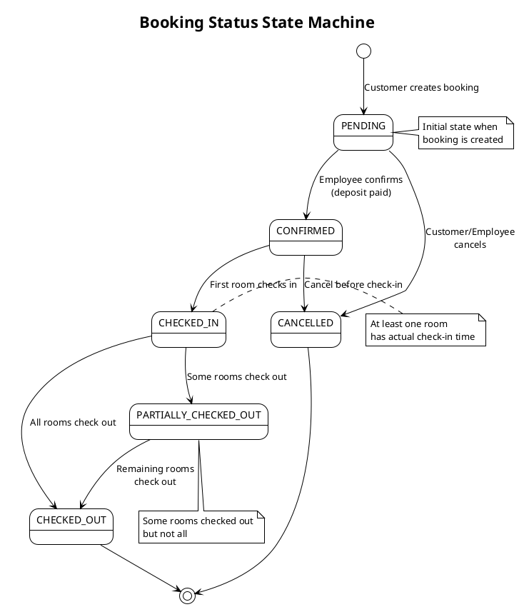
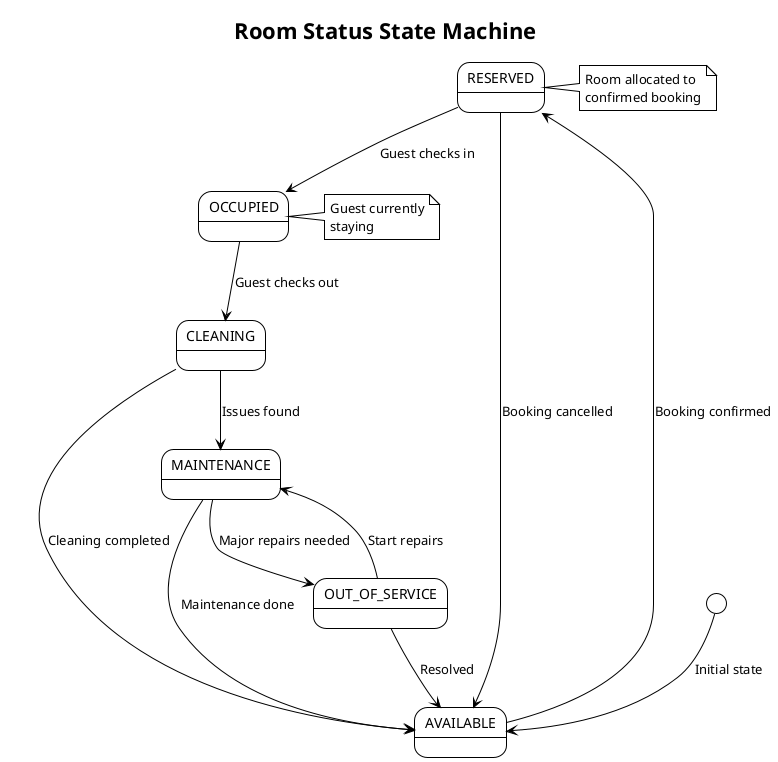
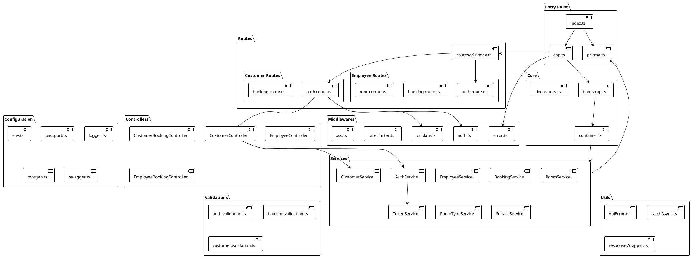
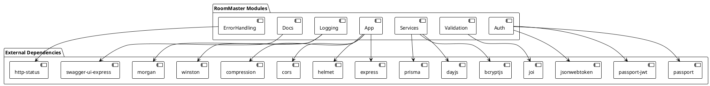

# RoomMaster Backend - Architecture Documentation

## Table of Contents

- [Overview](#overview)
- [Technology Stack](#technology-stack)
- [Architecture Layers](#architecture-layers)
- [Request Lifecycle](#request-lifecycle)
- [Dependency Injection System](#dependency-injection-system)
- [Authentication & Authorization](#authentication--authorization)
- [Database Schema](#database-schema)
- [Error Handling](#error-handling)
- [PlantUML Diagrams](#plantuml-diagrams)

---

## Overview

RoomMaster Backend is a RESTful API server for a hotel/room management system built with **Node.js**, **TypeScript**, **Express**, and **Prisma ORM**. The application follows a **layered architecture** with a custom **Dependency Injection (DI)** container inspired by NestJS patterns.

### Key Features

- Multi-tenant authentication (Customer & Employee)
- Room booking with automatic allocation
- Check-in/Check-out management
- Financial transactions & deposits
- Service usage tracking
- Booking history audit trail

---

## Technology Stack

| Category | Technology |
|----------|------------|
| Runtime | Node.js |
| Language | TypeScript |
| Framework | Express.js |
| ORM | Prisma |
| Database | PostgreSQL |
| Authentication | Passport.js + JWT |
| Validation | Joi |
| Documentation | Swagger (OpenAPI) |
| Logging | Winston + Morgan |
| Process Manager | PM2 |
| Containerization | Docker |

---

## Architecture Layers

The application follows a **4-layer architecture**:

```
┌─────────────────────────────────────────────────────────────┐
│                      ROUTES LAYER                           │
│  (Route definitions, Swagger docs, Middleware binding)      │
├─────────────────────────────────────────────────────────────┤
│                   MIDDLEWARE LAYER                          │
│  (Auth, Validation, Rate Limiting, Error Handling, XSS)     │
├─────────────────────────────────────────────────────────────┤
│                   CONTROLLER LAYER                          │
│  (Request handling, Response formatting)                    │
├─────────────────────────────────────────────────────────────┤
│                    SERVICE LAYER                            │
│  (Business logic, Database operations via Prisma)           │
├─────────────────────────────────────────────────────────────┤
│                    DATA LAYER                               │
│  (Prisma ORM, PostgreSQL)                                   │
└─────────────────────────────────────────────────────────────┘
```

### Layer Responsibilities

| Layer | Directory | Responsibility |
|-------|-----------|----------------|
| **Routes** | `src/routes/` | Define API endpoints, attach middlewares, Swagger documentation |
| **Middleware** | `src/middlewares/` | Cross-cutting concerns: auth, validation, error handling |
| **Controller** | `src/controllers/` | Handle HTTP requests, delegate to services, format responses |
| **Service** | `src/services/` | Business logic, database operations, domain rules |
| **Data** | `prisma/` | Schema definition, migrations, Prisma Client |

---

## Request Lifecycle

A typical request flows through the following stages:

1. **Express receives request** → `src/app.ts`
2. **Global middlewares** → helmet, cors, body parsing, morgan
3. **Route matching** → `src/routes/v1/`
4. **Route-specific middlewares** → auth, validate
5. **Controller method** → `src/controllers/`
6. **Service method** → `src/services/`
7. **Prisma query** → Database
8. **Response formatting** → `responseWrapper`
9. **Error handling** → `errorConverter` + `errorHandler`

---

## Dependency Injection System

### Overview

The application uses a **custom DI container** (`src/core/container.ts`) that provides NestJS-like dependency injection for Express applications.

### Components

| Component | File | Purpose |
|-----------|------|---------|
| Container | `src/core/container.ts` | Singleton container managing providers & instances |
| Decorators | `src/core/decorators.ts` | `@Injectable()` and `@Inject()` markers |
| Bootstrap | `src/core/bootstrap.ts` | Registers all services at application startup |
| Tokens | `src/core/container.ts` | Type-safe symbols for dependency resolution |

### Registration Types

```typescript
// Value provider (e.g., PrismaClient instance)
container.registerValue(TOKENS.PrismaClient, prisma);

// Factory provider (services with dependencies)
container.registerFactory(
  TOKENS.AuthService,
  (...args) => new AuthService(args[0], args[1], args[2], args[3]),
  [TOKENS.PrismaClient, TOKENS.TokenService, TOKENS.CustomerService, TOKENS.EmployeeService]
);
```

### Resolution

```typescript
// In routes, manually resolve dependencies
const authService = container.resolve<AuthService>(TOKENS.AuthService);
const controller = new SomeController(authService);
```

### Service Dependency Graph

```
PrismaClient
    ├── TokenService
    ├── CustomerService
    ├── EmployeeService
    ├── BookingService
    ├── RoomService
    ├── RoomTypeService
    ├── ServiceService
    └── AuthService
            ├── TokenService
            ├── CustomerService
            └── EmployeeService
```

---

## Authentication & Authorization

### JWT Token Structure

```typescript
{
  sub: string;          // User ID (customer or employee)
  userType: 'customer' | 'employee';
  type: 'ACCESS' | 'REFRESH' | 'RESET_PASSWORD';
  iat: number;          // Issued at
  exp: number;          // Expiration
}
```

### Authentication Flow

1. **Login** → Validate credentials → Generate access + refresh tokens
2. **Protected routes** → Extract JWT from `Authorization: Bearer <token>`
3. **Passport verification** → Validate token, identify userType
4. **Middleware check** → Verify userType matches route requirement
5. **Attach user** → `req.customer` or `req.employee`

### Two-Type Authentication

| User Type | Routes Prefix | Middleware | Request Property |
|-----------|---------------|------------|------------------|
| Customer | `/v1/customer/` | `authCustomer()` | `req.customer` |
| Employee | `/v1/employee/` | `authEmployee()` | `req.employee` |

---

## Database Schema

### Entity Relationship Summary

| Entity | Description | Key Relations |
|--------|-------------|---------------|
| **Employee** | Staff members (Admin, Receptionist, Housekeeping) | → Transactions, BookingHistory |
| **Customer** | Hotel guests | → Bookings, BookingCustomers |
| **RoomType** | Room categories with pricing | → Rooms, BookingRooms |
| **Room** | Physical rooms | → BookingRooms |
| **Booking** | Reservation record | → BookingRooms, Transactions, ServiceUsages |
| **BookingRoom** | Room allocation within booking | → Transactions, ServiceUsages |
| **BookingCustomer** | Guest assignment to booking/room | M:N Customer ↔ Booking |
| **Transaction** | Payment record | → TransactionDetails |
| **Service** | Hotel services (spa, laundry, etc.) | → ServiceUsages |
| **ServiceUsage** | Service consumption record | → TransactionDetails |
| **BookingHistory** | Audit log | → Booking, Employee |

### Key Enums

```prisma
enum BookingStatus {
  PENDING, CONFIRMED, CHECKED_IN, 
  PARTIALLY_CHECKED_OUT, CHECKED_OUT, CANCELLED
}

enum RoomStatus {
  AVAILABLE, RESERVED, OCCUPIED, 
  CLEANING, MAINTENANCE, OUT_OF_SERVICE
}

enum TransactionType {
  DEPOSIT, ROOM_CHARGE, SERVICE_CHARGE, REFUND, ADJUSTMENT
}
```

---

## Error Handling

### Error Flow

```
Controller throws ApiError
        ↓
errorConverter middleware
  (Convert to ApiError if not already)
        ↓
errorHandler middleware
  (Format response, log in dev, hide stack in prod)
        ↓
JSON response: { code, message, [stack] }
```

### ApiError Class

```typescript
class ApiError extends Error {
  statusCode: number;
  isOperational: boolean;  // true = expected error, false = programming error
}
```

---

## PlantUML Diagrams

### 1. High-Level Architecture



### 2. Request Lifecycle Sequence



### 3. Dependency Injection Container



### 4. Database Entity Relationship Diagram



### 5. Authentication Flow



### 6. Booking Flow State Machine



### 7. Room Status State Machine



### 8. Component Architecture



### 9. Package/Module Dependencies



---

## File Structure Reference

```
src/
├── index.ts              # Application entry point
├── app.ts                # Express app configuration
├── prisma.ts             # Prisma client instance
│
├── config/               # Configuration modules
│   ├── env.ts            # Environment variables
│   ├── passport.ts       # JWT strategy
│   ├── logger.ts         # Winston logger
│   ├── morgan.ts         # HTTP request logging
│   ├── roles.ts          # Role definitions
│   └── swagger.ts        # Swagger configuration
│
├── core/                 # DI & bootstrapping
│   ├── container.ts      # DI container & tokens
│   ├── bootstrap.ts      # Service registration
│   ├── decorators.ts     # @Injectable, @Inject
│   └── index.ts          # Barrel export
│
├── routes/v1/            # API route definitions
│   ├── index.ts          # Main router
│   ├── customer/         # Customer-facing routes
│   └── employee/         # Employee-facing routes
│
├── middlewares/          # Express middlewares
│   ├── auth.ts           # authCustomer, authEmployee
│   ├── validate.ts       # Joi validation
│   ├── error.ts          # Error handling
│   ├── rateLimiter.ts    # Rate limiting
│   └── xss.ts            # XSS sanitization
│
├── controllers/          # Request handlers
│   ├── customer/         # Customer controllers
│   └── employee/         # Employee controllers
│
├── services/             # Business logic
│   ├── auth.service.ts
│   ├── token.service.ts
│   ├── customer.service.ts
│   ├── employee.service.ts
│   ├── booking.service.ts
│   ├── room.service.ts
│   ├── roomType.service.ts
│   └── service.service.ts
│
├── validations/          # Joi schemas
├── utils/                # Utility functions
└── types/                # TypeScript declarations
```

---

## Summary

RoomMaster Backend implements a clean, layered architecture with:

- **Custom DI Container** for decoupled, testable services
- **Dual authentication** for customers and employees
- **Comprehensive booking system** with room allocation, transactions, and history
- **RESTful API design** with Swagger documentation
- **Centralized error handling** and validation
- **Production-ready features** (logging, security headers, rate limiting)

The architecture allows for easy extension and maintenance while keeping business logic separated from HTTP concerns.
