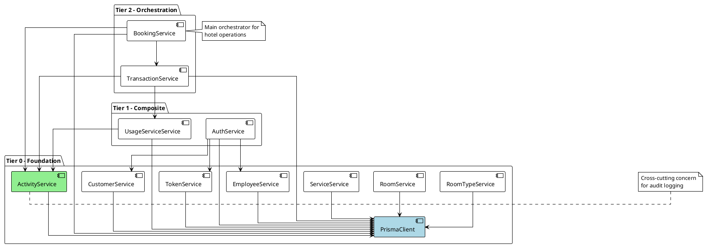
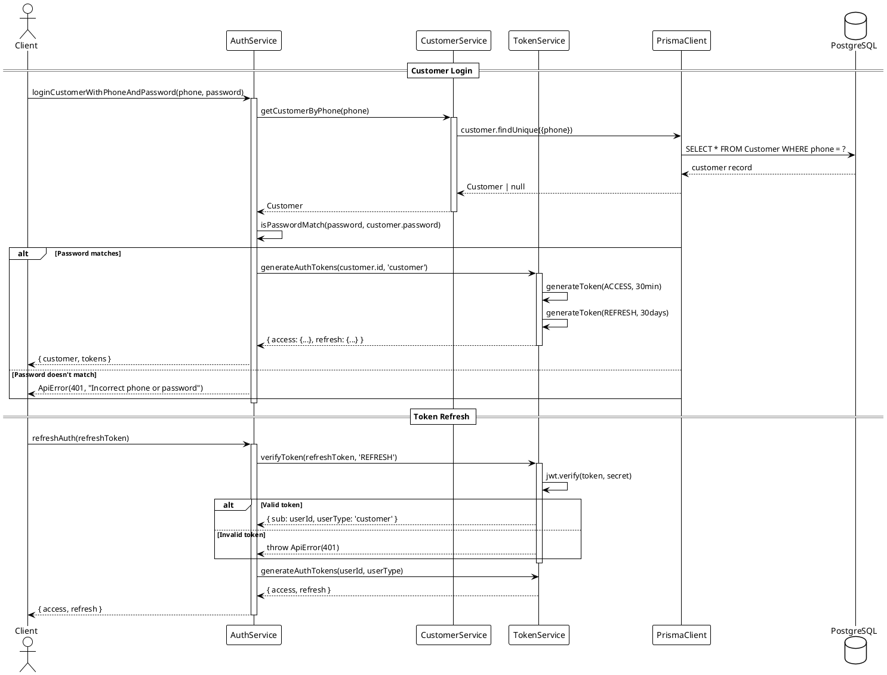
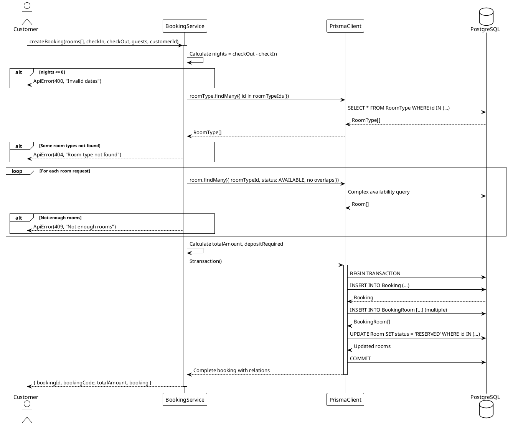
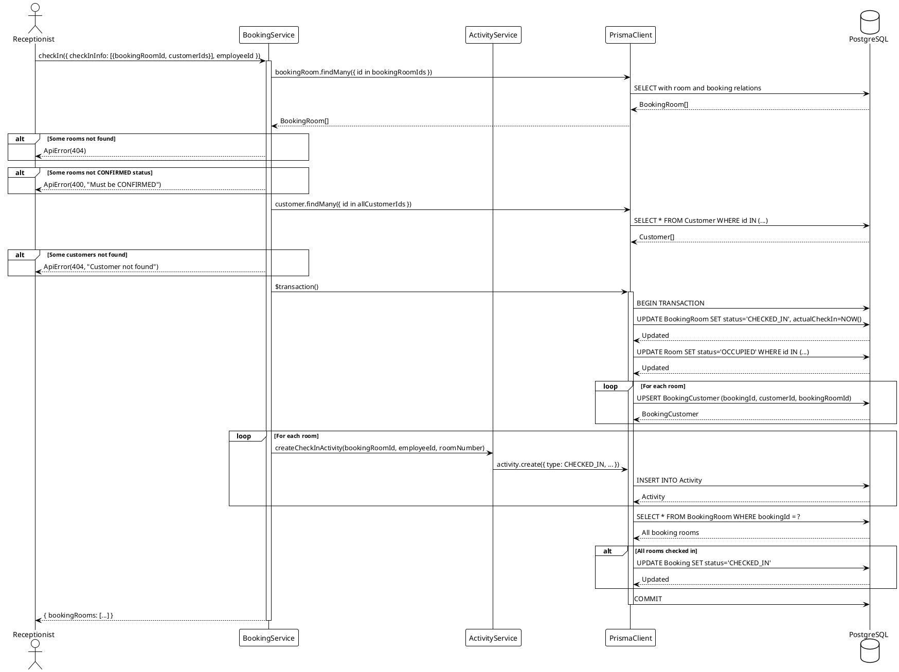
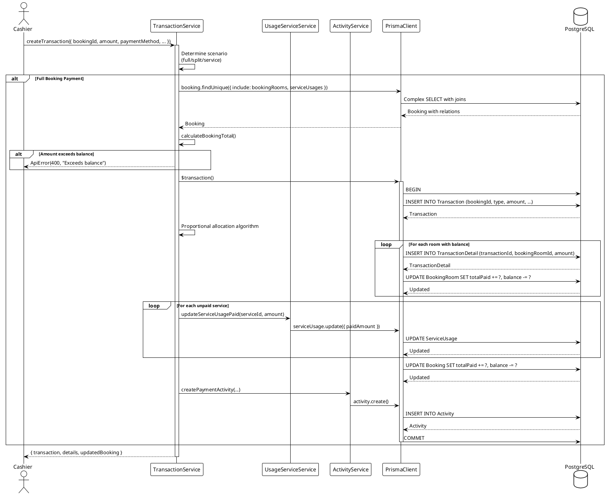
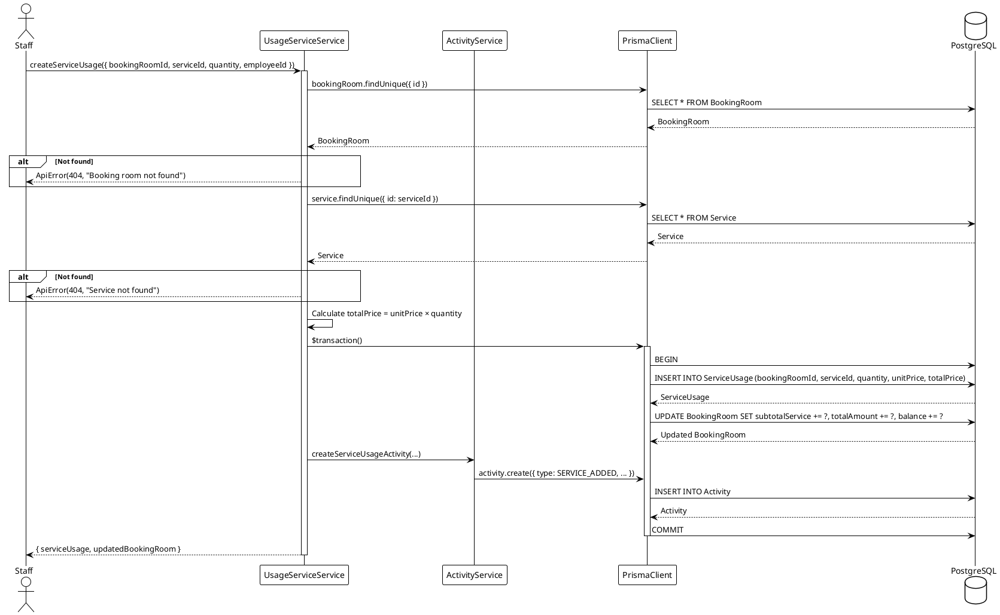
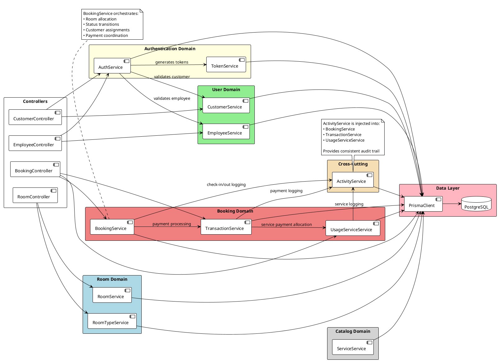

# RoomMaster Backend - Service Interactions

This document provides a detailed analysis of how services interact with each other in the RoomMaster backend application.

---

## Table of Contents

- [Overview](#overview)
- [Service Inventory](#service-inventory)
- [Dependency Graph](#dependency-graph)
- [Service Categories](#service-categories)
- [Detailed Service Interactions](#detailed-service-interactions)
- [Data Flow Patterns](#data-flow-patterns)
- [PlantUML Diagrams](#plantuml-diagrams)

---

## Overview

The RoomMaster backend uses **11 services** organized in a layered dependency structure. Services are registered in the DI container during application bootstrap and follow these principles:

1. **Single Responsibility** - Each service handles one domain
2. **Dependency Injection** - Services receive dependencies via constructor
3. **Database Isolation** - All Prisma access goes through services
4. **Cross-Cutting Concerns** - Activity logging is injected where needed

---

## Service Inventory

| Service | Purpose | Dependencies |
|---------|---------|--------------|
| `PrismaClient` | Database access layer | None (external) |
| `TokenService` | JWT token generation/verification | PrismaClient |
| `CustomerService` | Customer CRUD operations | PrismaClient |
| `EmployeeService` | Employee CRUD operations | PrismaClient |
| `RoomTypeService` | Room type management | PrismaClient |
| `RoomService` | Room management | PrismaClient |
| `ServiceService` | Hotel services (spa, laundry) | PrismaClient |
| `ActivityService` | Activity/audit logging | PrismaClient |
| `AuthService` | Authentication orchestration | PrismaClient, TokenService, CustomerService, EmployeeService |
| `UsageServiceService` | Service usage tracking | PrismaClient, ActivityService |
| `TransactionService` | Payment processing | PrismaClient, ActivityService, UsageServiceService |
| `BookingService` | Booking lifecycle management | PrismaClient, TransactionService, ActivityService |

---

## Dependency Graph

```
                    ┌─────────────────┐
                    │  PrismaClient   │
                    │   (Database)    │
                    └────────┬────────┘
                             │
        ┌────────────────────┼────────────────────┐
        │                    │                    │
        ▼                    ▼                    ▼
┌───────────────┐   ┌───────────────┐   ┌───────────────┐
│ TokenService  │   │ActivityService│   │ Basic CRUD    │
│               │   │  (Logging)    │   │   Services    │
└───────┬───────┘   └───────┬───────┘   └───────────────┘
        │                   │           │ CustomerService
        │                   │           │ EmployeeService
        │                   │           │ RoomService
        │                   │           │ RoomTypeService
        │                   │           │ ServiceService
        │                   │
        │           ┌───────┴───────────────┐
        │           │                       │
        │           ▼                       ▼
        │   ┌───────────────┐       ┌───────────────┐
        │   │UsageService   │       │TransactionSvc │
        │   │   Service     │◄──────│               │
        │   └───────────────┘       └───────┬───────┘
        │                                   │
        │                           ┌───────┴───────┐
        │                           │               │
        ▼                           ▼               │
┌───────────────┐           ┌───────────────┐       │
│  AuthService  │           │BookingService │◄──────┘
│               │           │               │
└───────────────┘           └───────────────┘
        │
        ├──► CustomerService
        ├──► EmployeeService
        └──► TokenService
```

---

## Service Categories

### 1. Foundation Services (Tier 0)
Services with no dependencies except PrismaClient.

| Service | Methods | Description |
|---------|---------|-------------|
| **TokenService** | `generateToken`, `verifyToken`, `generateAuthTokens`, `generateResetPasswordToken` | Stateless JWT operations |
| **CustomerService** | `createCustomer`, `getCustomerById`, `getCustomerByPhone`, `updateCustomer`, `deleteCustomer` | Customer entity management |
| **EmployeeService** | `createEmployee`, `getEmployeeById`, `getEmployeeByUsername`, `updateEmployee`, `deleteEmployee` | Employee entity management |
| **RoomTypeService** | `createRoomType`, `getAllRoomTypes`, `getRoomTypeById`, `updateRoomType`, `deleteRoomType` | Room type catalog |
| **RoomService** | `createRoom`, `getAllRooms`, `getRoomById`, `updateRoom`, `deleteRoom` | Physical room inventory |
| **ServiceService** | `createService`, `getAllServices`, `getServiceById`, `updateService`, `deleteService` | Hotel service catalog |
| **ActivityService** | `createActivity`, `createCheckInActivity`, `createCheckOutActivity`, `createServiceUsageActivity` | Audit trail logging |

### 2. Composite Services (Tier 1)
Services that depend on Tier 0 services.

| Service | Dependencies | Description |
|---------|--------------|-------------|
| **AuthService** | TokenService, CustomerService, EmployeeService | Orchestrates login, logout, password reset |
| **UsageServiceService** | ActivityService | Tracks hotel service consumption |

### 3. Orchestration Services (Tier 2)
Services that coordinate complex business operations.

| Service | Dependencies | Description |
|---------|--------------|-------------|
| **TransactionService** | ActivityService, UsageServiceService | Handles all payment scenarios |
| **BookingService** | TransactionService, ActivityService | Manages booking lifecycle |

---

## Detailed Service Interactions

### AuthService Interactions

```
AuthService
    │
    ├─► CustomerService.getCustomerByPhone()
    │       └─► Prisma.customer.findUnique()
    │
    ├─► EmployeeService.getEmployeeByUsername()
    │       └─► Prisma.employee.findUnique()
    │
    ├─► TokenService.generateAuthTokens()
    │       ├─► generateToken(ACCESS)
    │       └─► generateToken(REFRESH)
    │
    ├─► TokenService.verifyToken()
    │       └─► jwt.verify()
    │
    └─► TokenService.generateResetPasswordToken()
            └─► Prisma.[customer|employee].findUnique()
```

**Key Operations:**
- `loginCustomerWithPhoneAndPassword()` → CustomerService → TokenService
- `loginEmployeeWithUsernameAndPassword()` → EmployeeService → TokenService
- `refreshAuth()` → TokenService.verifyToken() → TokenService.generateAuthTokens()
- `resetPassword()` → TokenService.verifyToken() → Prisma update

---

### BookingService Interactions

```
BookingService
    │
    ├─► createBooking()
    │       ├─► Prisma.roomType.findMany()
    │       ├─► Prisma.room.findMany() [available rooms]
    │       ├─► Prisma.$transaction()
    │       │       ├─► Prisma.booking.create()
    │       │       └─► Prisma.room.updateMany() [→ RESERVED]
    │       └─► Return booking with allocated rooms
    │
    ├─► checkIn()
    │       ├─► Prisma.bookingRoom.findMany()
    │       ├─► Prisma.customer.findMany() [verify guests]
    │       ├─► Prisma.$transaction()
    │       │       ├─► Prisma.bookingRoom.updateMany() [→ CHECKED_IN]
    │       │       ├─► Prisma.room.updateMany() [→ OCCUPIED]
    │       │       ├─► Prisma.bookingCustomer.upsert() [guest assignment]
    │       │       ├─► ActivityService.createCheckInActivity()
    │       │       └─► Prisma.booking.update() [status if all checked in]
    │       └─► Return updated booking rooms
    │
    └─► checkOut()
            ├─► Prisma.bookingRoom.findMany()
            ├─► Prisma.$transaction()
            │       ├─► Prisma.bookingRoom.updateMany() [→ CHECKED_OUT]
            │       ├─► Prisma.room.updateMany() [→ AVAILABLE]
            │       ├─► ActivityService.createCheckOutActivity()
            │       └─► Prisma.booking.update() [status if all checked out]
            └─► Return updated booking rooms
```

**Key Operations:**
- `createBooking()` → Room allocation with conflict detection
- `checkIn()` → ActivityService for audit logging
- `checkOut()` → ActivityService for audit logging

---

### TransactionService Interactions

```
TransactionService
    │
    ├─► createTransaction() [Router]
    │       ├─► processGuestServicePayment()
    │       ├─► processBookingServicePayment()
    │       ├─► processSplitRoomPayment()
    │       └─► processFullBookingPayment()
    │
    ├─► processFullBookingPayment()
    │       ├─► Prisma.booking.findUnique() [with rooms & services]
    │       ├─► calculateBookingTotal()
    │       ├─► Prisma.$transaction()
    │       │       ├─► Prisma.transaction.create()
    │       │       ├─► Prisma.transactionDetail.createMany() [allocations]
    │       │       ├─► Prisma.bookingRoom.update() [totalPaid, balance]
    │       │       ├─► UsageServiceService.updateServiceUsagePaid()
    │       │       ├─► Prisma.booking.update() [totals]
    │       │       └─► ActivityService.createPaymentActivity()
    │       └─► Return transaction with details
    │
    └─► processSplitRoomPayment()
            ├─► Prisma.bookingRoom.findMany()
            ├─► Prisma.$transaction()
            │       ├─► Create transaction
            │       ├─► Create details for selected rooms only
            │       └─► Update room balances
            └─► Return transaction
```

**Key Operations:**
- `processFullBookingPayment()` → UsageServiceService, ActivityService
- `processSplitRoomPayment()` → ActivityService
- All scenarios update financial balances atomically

---

### UsageServiceService Interactions

```
UsageServiceService
    │
    ├─► createServiceUsage()
    │       ├─► Validate booking/bookingRoom (if provided)
    │       ├─► Prisma.service.findUnique() [get price]
    │       ├─► Prisma.$transaction()
    │       │       ├─► Prisma.serviceUsage.create()
    │       │       ├─► Prisma.bookingRoom.update() [subtotalService]
    │       │       └─► ActivityService.createServiceUsageActivity()
    │       └─► Return service usage
    │
    ├─► updateServiceUsagePaid() [called by TransactionService]
    │       ├─► Prisma.serviceUsage.update() [paidAmount]
    │       └─► Check if fully paid
    │
    └─► cancelServiceUsage()
            ├─► Prisma.serviceUsage.update() [status → CANCELLED]
            ├─► Prisma.bookingRoom.update() [subtotalService]
            └─► ActivityService.createActivity()
```

**Key Operations:**
- `createServiceUsage()` → ActivityService
- `updateServiceUsagePaid()` → Called BY TransactionService (inverse dependency)

---

## Data Flow Patterns

### Pattern 1: Authentication Flow

```
┌────────┐     ┌─────────────┐     ┌─────────────────┐     ┌──────────────┐
│ Client │────►│AuthService  │────►│CustomerService  │────►│ PrismaClient │
└────────┘     │             │     │getCustomerByPhone│    │              │
               │             │     └─────────────────┘     └──────────────┘
               │             │
               │             │     ┌─────────────────┐
               │             │────►│ TokenService    │
               │             │     │generateAuthTokens│
               └─────────────┘     └─────────────────┘
```

### Pattern 2: Booking with Payment Flow

```
┌────────┐     ┌─────────────┐     ┌──────────────────┐     ┌──────────────┐
│ Client │────►│BookingService│───►│  Prisma Client   │────►│  PostgreSQL  │
└────────┘     │createBooking │    │   (Transaction)  │     │              │
               └─────────────┘     └──────────────────┘     └──────────────┘
                     │
                     ▼
               ┌─────────────┐
               │Transaction  │
               │  Service    │
               │createTxn    │
               └──────┬──────┘
                      │
          ┌───────────┼───────────┐
          ▼           ▼           ▼
    ┌───────────┐ ┌───────────┐ ┌───────────┐
    │Activity   │ │UsageService│ │  Prisma   │
    │Service    │ │  Service   │ │  Client   │
    └───────────┘ └───────────┘ └───────────┘
```

### Pattern 3: Check-In with Activity Logging

```
┌────────┐     ┌─────────────┐
│Employee│────►│BookingService│
│ Client │     │   checkIn   │
└────────┘     └──────┬──────┘
                      │
       ┌──────────────┼──────────────┐
       ▼              ▼              ▼
┌─────────────┐ ┌───────────┐ ┌───────────┐
│ Prisma      │ │Activity   │ │ Update    │
│ Booking     │ │ Service   │ │ Room &    │
│ Customer    │ │createCheck│ │ Booking   │
│ Assignment  │ │InActivity │ │ Status    │
└─────────────┘ └───────────┘ └───────────┘
```

---

## PlantUML Diagrams

### 1. Service Dependency Diagram



### 2. Authentication Sequence Diagram



### 3. Booking Creation Flow



### 4. Check-In Process Flow



### 5. Payment Transaction Flow



### 6. Service Usage Flow



### 7. Complete Service Interaction Map



---

## Summary

### Key Takeaways

1. **Layered Dependencies**: Services follow a strict tier system preventing circular dependencies.

2. **ActivityService as Cross-Cutting Concern**: Injected into multiple services for consistent audit logging.

3. **Transaction Boundaries**: Complex operations use `prisma.$transaction()` for atomicity.

4. **Inverse Dependencies**: `TransactionService` calls into `UsageServiceService`, demonstrating cross-domain coordination.

5. **DI Container Registration Order**: Bootstrap registers Tier 0 first, then Tier 1, finally Tier 2 to satisfy dependencies.

### Service Interaction Patterns

| Pattern | Services Involved | Use Case |
|---------|-------------------|----------|
| **Authentication** | Auth → Token + Customer/Employee | Login, refresh, password reset |
| **Booking Lifecycle** | Booking → Activity | Create, check-in, check-out |
| **Payment Processing** | Transaction → Activity + Usage | Full, split, service payments |
| **Service Tracking** | Usage → Activity | Add/cancel services |
| **Audit Trail** | All → Activity | Consistent logging |
