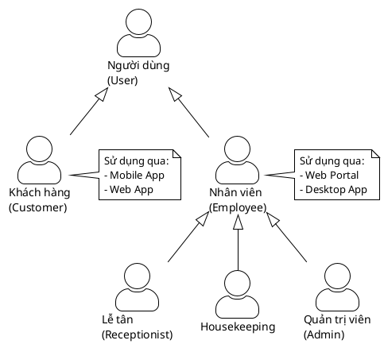
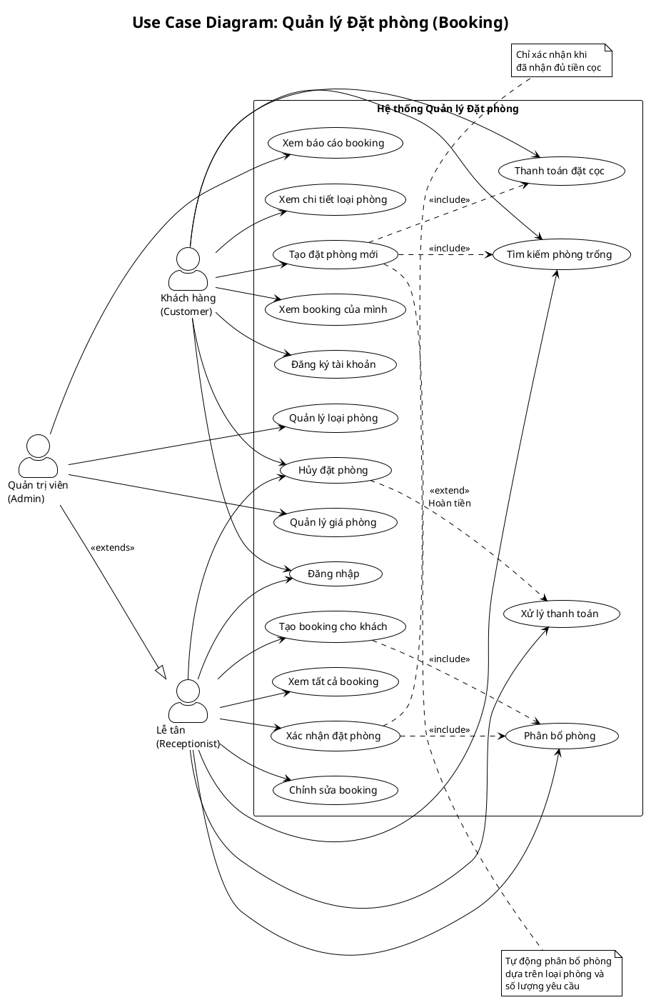
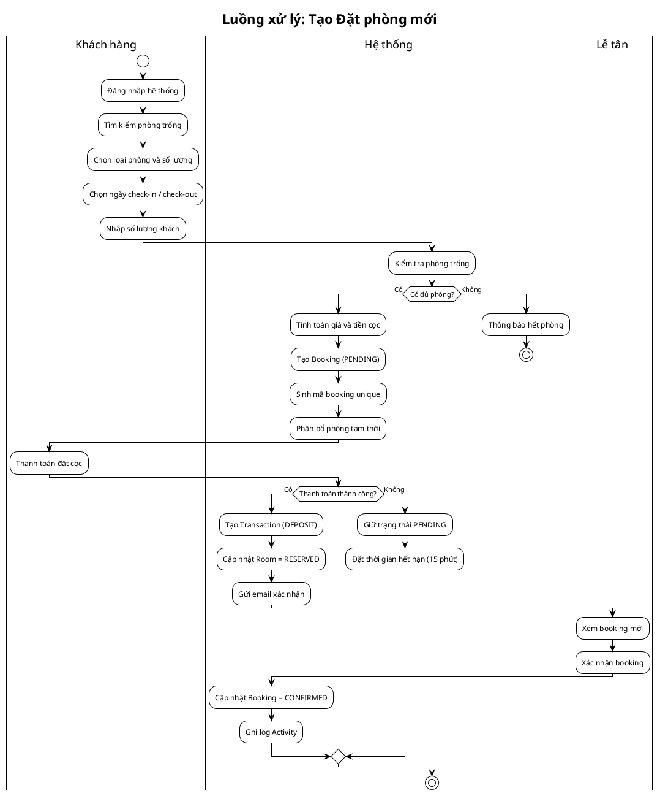
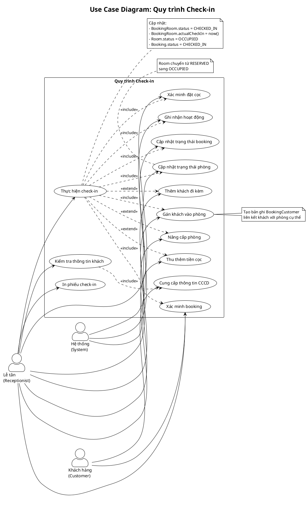
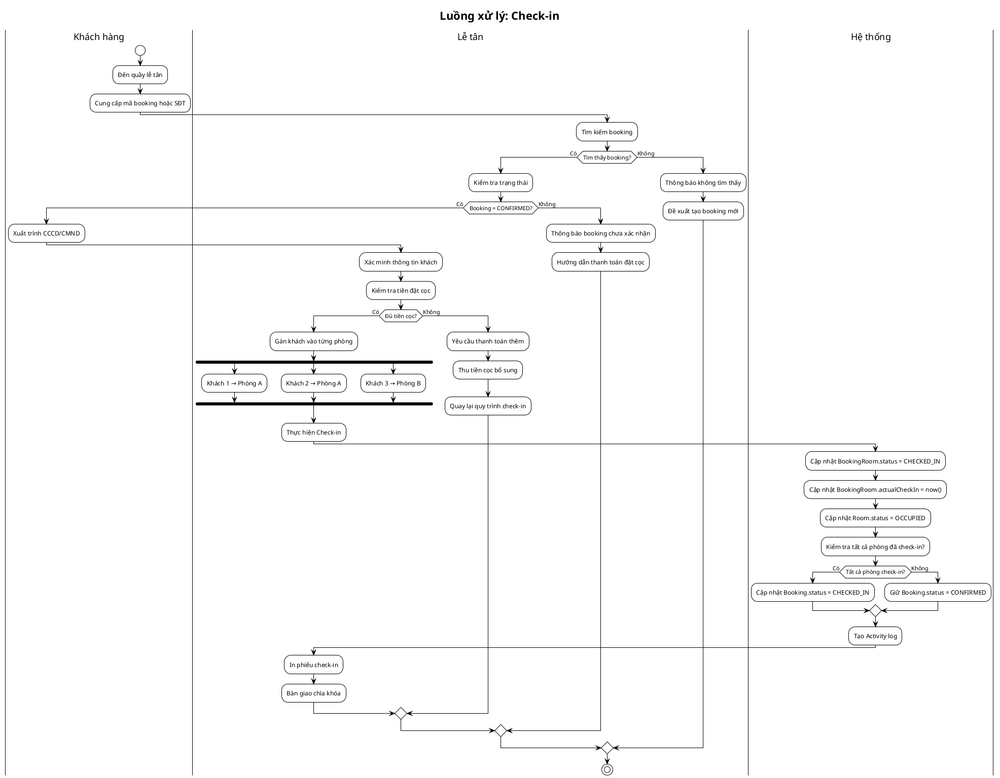
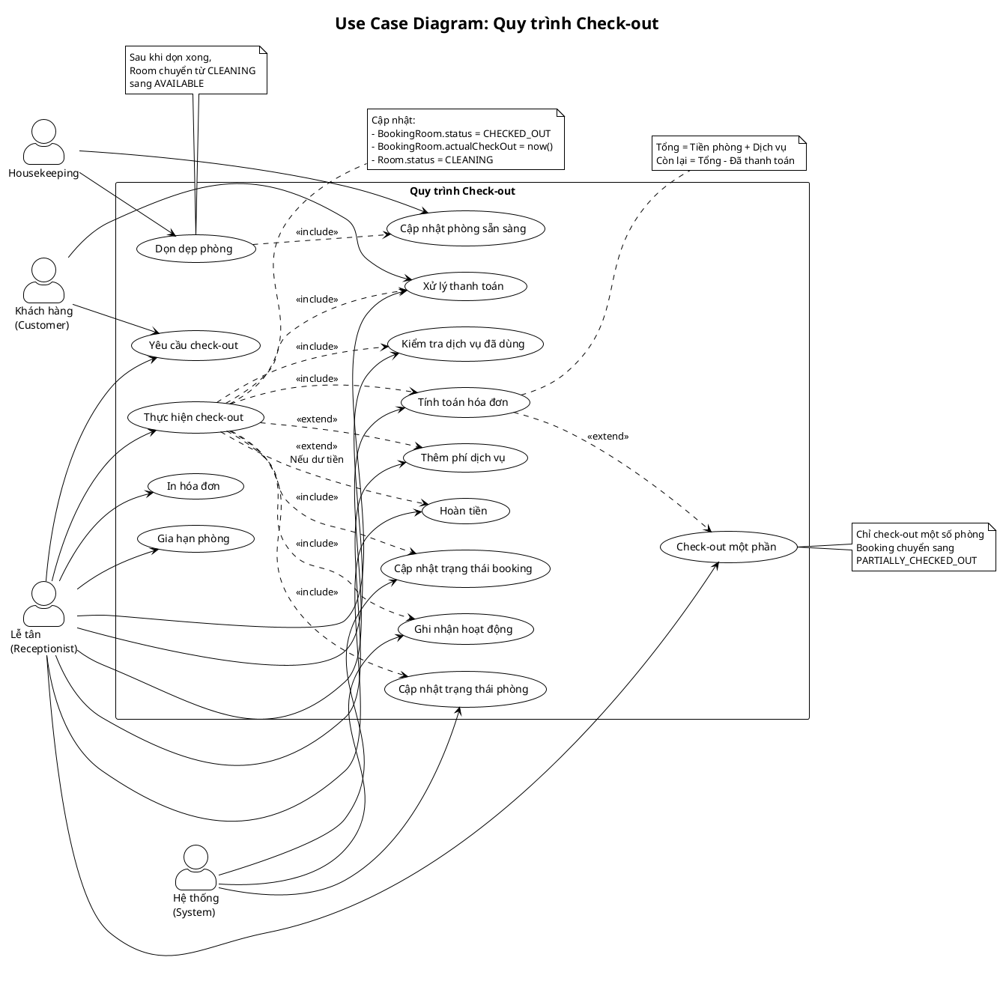
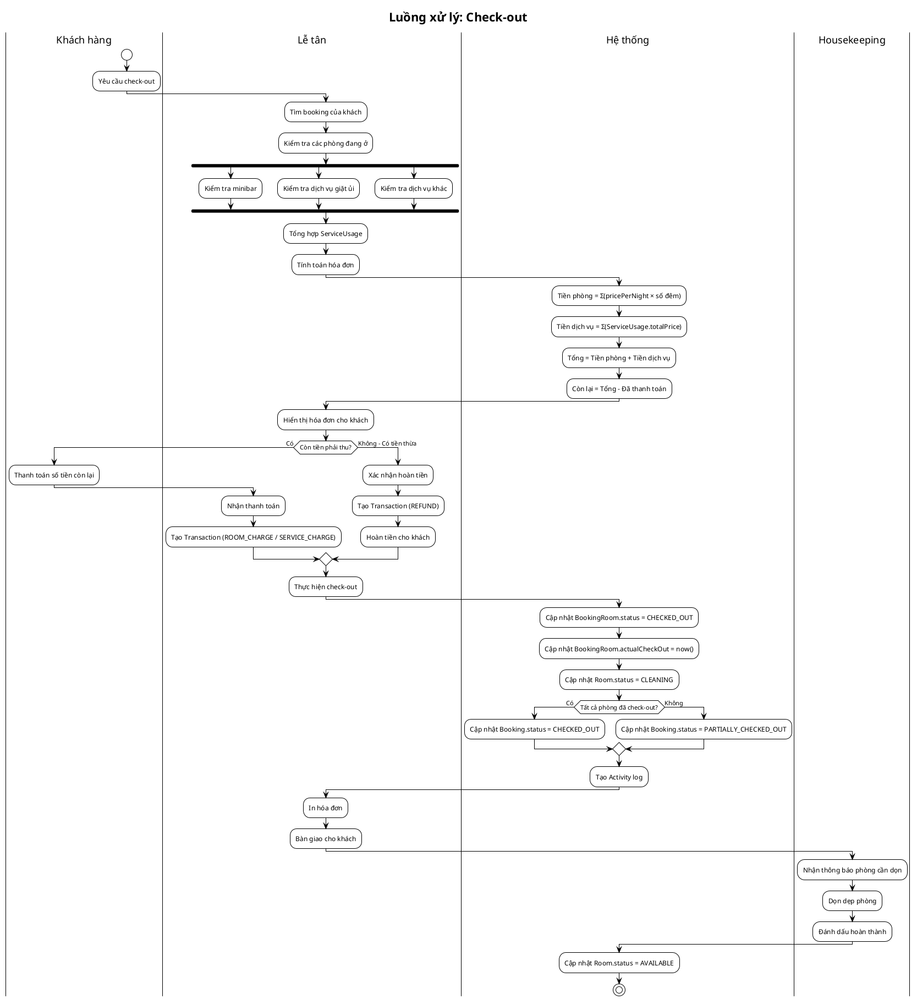
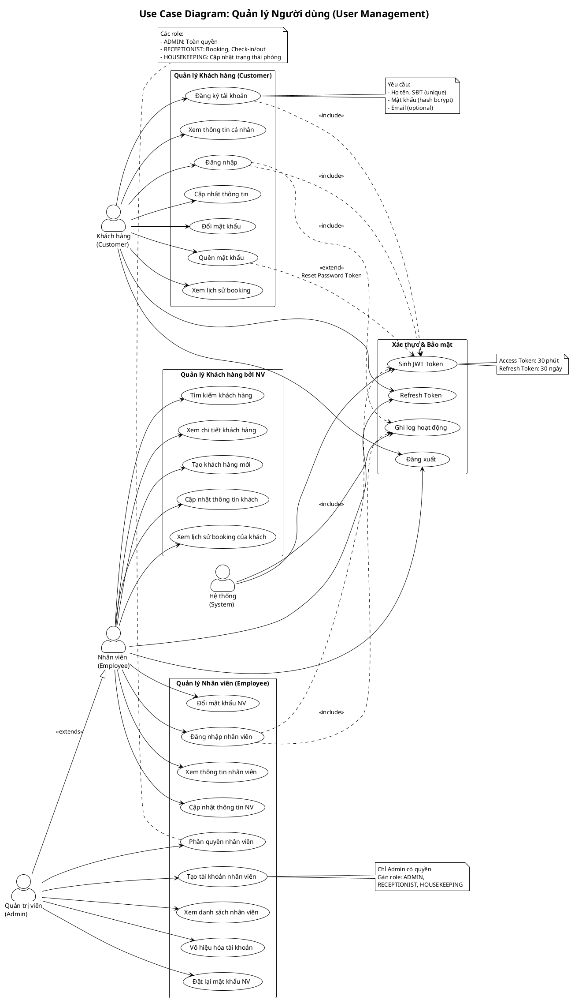

# Chương 2: Sơ đồ Use Case - Hệ thống Quản lý Khách sạn RoomMaster

## 2.1. Giới thiệu

Tài liệu này mô tả các sơ đồ Use Case của hệ thống quản lý khách sạn **RoomMaster**. Các sơ đồ được thiết kế theo chuẩn UML và thể hiện các chức năng chính của hệ thống bao gồm:

- **Quản lý Đặt phòng (Booking)**: Tạo, xác nhận, hủy và quản lý các đặt phòng
- **Check-in**: Quy trình nhận phòng cho khách
- **Check-out**: Quy trình trả phòng và thanh toán
- **Quản lý Người dùng**: Đăng ký, đăng nhập, phân quyền

---

## 2.2. Tổng quan các Actor

### 2.2.1. Danh sách Actor

| Actor                     | Mô tả                                         | Quyền hạn chính                             |
| ------------------------- | --------------------------------------------- | ------------------------------------------- |
| **Khách hàng (Customer)** | Người sử dụng dịch vụ lưu trú tại khách sạn   | Đặt phòng, xem booking, thanh toán          |
| **Lễ tân (Receptionist)** | Nhân viên tiếp tân, xử lý nghiệp vụ hàng ngày | Check-in/out, quản lý booking, thu tiền     |
| **Housekeeping**          | Nhân viên dọn phòng                           | Cập nhật trạng thái phòng                   |
| **Quản trị viên (Admin)** | Người quản lý hệ thống                        | Toàn quyền, quản lý nhân viên               |
| **Hệ thống (System)**     | Actor tự động của hệ thống                    | Cập nhật trạng thái, ghi log, gửi thông báo |

### 2.2.2. Sơ đồ phân cấp Actor



---

## 2.3. Use Case: Quản lý Đặt phòng (Booking)

### 2.3.1. Mô tả tổng quan

Chức năng Quản lý Đặt phòng cho phép khách hàng tạo booking mới, lễ tân xác nhận và quản lý các booking. Hệ thống tự động phân bổ phòng dựa trên loại phòng và tình trạng sẵn có.

### 2.3.2. Sơ đồ Use Case



### 2.3.3. Mô tả chi tiết các Use Case

| ID     | Use Case                    | Actor                  | Mô tả                                                          | Precondition                 | Postcondition                  |
| ------ | --------------------------- | ---------------------- | -------------------------------------------------------------- | ---------------------------- | ------------------------------ |
| UC-B01 | **Tìm kiếm phòng trống**    | Customer, Receptionist | Tìm kiếm phòng theo ngày check-in/out, loại phòng, số khách    | Không                        | Hiển thị danh sách phòng trống |
| UC-B02 | **Xem chi tiết loại phòng** | Customer               | Xem thông tin chi tiết về loại phòng: giá, tiện nghi, hình ảnh | Không                        | Hiển thị thông tin loại phòng  |
| UC-B03 | **Tạo đặt phòng mới**       | Customer               | Chọn loại phòng, ngày, số lượng và tạo booking                 | Đã đăng nhập, có phòng trống | Booking được tạo (PENDING)     |
| UC-B04 | **Thanh toán đặt cọc**      | Customer               | Thanh toán tiền đặt cọc qua các phương thức hỗ trợ             | Có booking PENDING           | Transaction được ghi nhận      |
| UC-B05 | **Xem booking của mình**    | Customer               | Xem danh sách và chi tiết các booking đã tạo                   | Đã đăng nhập                 | Hiển thị danh sách booking     |
| UC-B06 | **Hủy đặt phòng**           | Customer, Receptionist | Hủy booking, hoàn tiền nếu đủ điều kiện                        | Booking chưa check-in        | Booking = CANCELLED            |
| UC-B07 | **Xem tất cả booking**      | Receptionist           | Xem toàn bộ booking trong hệ thống với bộ lọc                  | Đã đăng nhập (Employee)      | Hiển thị danh sách booking     |
| UC-B08 | **Xác nhận đặt phòng**      | Receptionist           | Xác nhận booking sau khi nhận đủ đặt cọc                       | Booking PENDING, đã đặt cọc  | Booking = CONFIRMED            |
| UC-B09 | **Chỉnh sửa booking**       | Receptionist           | Thay đổi thông tin booking: ngày, phòng, số khách              | Booking chưa check-out       | Booking được cập nhật          |
| UC-B10 | **Phân bổ phòng**           | Receptionist           | Gán phòng cụ thể cho booking                                   | Booking CONFIRMED            | BookingRoom được tạo           |
| UC-B11 | **Tạo booking cho khách**   | Receptionist           | Tạo booking thay cho khách (walk-in, điện thoại)               | Có phòng trống               | Booking được tạo               |
| UC-B12 | **Quản lý loại phòng**      | Admin                  | Thêm, sửa, xóa loại phòng                                      | Đăng nhập Admin              | RoomType được cập nhật         |
| UC-B13 | **Quản lý giá phòng**       | Admin                  | Cập nhật giá theo mùa, khuyến mãi                              | Đăng nhập Admin              | Pricing được cập nhật          |

### 2.3.4. Luồng xử lý chính: Tạo Booking



### 2.3.5. Quy tắc nghiệp vụ

| STT | Quy tắc               | Mô tả                                                           |
| --- | --------------------- | --------------------------------------------------------------- |
| 1   | **Thời gian hết hạn** | Booking PENDING sẽ tự động hủy sau 15 phút nếu không thanh toán |
| 2   | **Tiền đặt cọc**      | Tính bằng giá 1 đêm của mỗi phòng được đặt                      |
| 3   | **Hủy miễn phí**      | Hủy trước 24h so với ngày check-in được hoàn 100% tiền cọc      |
| 4   | **Hủy có phí**        | Hủy trong vòng 24h giữ lại 50% tiền cọc                         |
| 5   | **Phân bổ phòng**     | Hệ thống tự động chọn phòng trống theo thứ tự tầng thấp đến cao |

---

## 2.4. Use Case: Check-in

### 2.4.1. Mô tả tổng quan

Quy trình Check-in cho phép lễ tân xác nhận khách đến nhận phòng, kiểm tra giấy tờ tùy thân, gán khách vào phòng cụ thể và cập nhật trạng thái hệ thống.

### 2.4.2. Sơ đồ Use Case



### 2.4.3. Mô tả chi tiết các Use Case

| ID      | Use Case                        | Actor        | Mô tả                                 | Precondition          | Postcondition               |
| ------- | ------------------------------- | ------------ | ------------------------------------- | --------------------- | --------------------------- |
| UC-CI01 | **Xác minh booking**            | Receptionist | Tìm booking theo mã hoặc SĐT khách    | Booking tồn tại       | Hiển thị thông tin booking  |
| UC-CI02 | **Kiểm tra thông tin khách**    | Receptionist | Xác minh CCCD/CMND của khách          | Khách có mặt          | Thông tin được xác nhận     |
| UC-CI03 | **Cung cấp thông tin CCCD**     | Customer     | Cung cấp giấy tờ tùy thân             | Không                 | CCCD được ghi nhận          |
| UC-CI04 | **Xác minh đặt cọc**            | Receptionist | Kiểm tra tiền cọc đã thanh toán       | Booking CONFIRMED     | Xác nhận đủ cọc             |
| UC-CI05 | **Gán khách vào phòng**         | Receptionist | Liên kết khách với phòng cụ thể       | Booking CONFIRMED     | BookingCustomer được tạo    |
| UC-CI06 | **Thêm khách đi kèm**           | Receptionist | Thêm khách đi cùng vào phòng          | Có phòng đã gán       | BookingCustomer được thêm   |
| UC-CI07 | **Thực hiện check-in**          | Receptionist | Xác nhận check-in chính thức          | Tất cả điều kiện đạt  | BookingRoom = CHECKED_IN    |
| UC-CI08 | **Thu thêm tiền cọc**           | Receptionist | Thu thêm tiền nếu cọc chưa đủ         | Cọc < yêu cầu         | Transaction được tạo        |
| UC-CI09 | **Nâng cấp phòng**              | Receptionist | Đổi sang phòng cao cấp hơn            | Có phòng trống        | BookingRoom được cập nhật   |
| UC-CI10 | **Cập nhật trạng thái phòng**   | System       | Tự động cập nhật Room = OCCUPIED      | Check-in thành công   | Room.status = OCCUPIED      |
| UC-CI11 | **Cập nhật trạng thái booking** | System       | Tự động cập nhật Booking = CHECKED_IN | Tất cả phòng check-in | Booking.status = CHECKED_IN |
| UC-CI12 | **Ghi nhận hoạt động**          | System       | Ghi log Activity cho check-in         | Check-in thành công   | Activity được tạo           |
| UC-CI13 | **In phiếu check-in**           | Receptionist | In phiếu xác nhận cho khách           | Check-in thành công   | Phiếu được in               |

### 2.4.4. Luồng xử lý chính: Check-in



### 2.4.5. Bảng chuyển đổi trạng thái

| Trạng thái trước           | Hành động               | Trạng thái sau              | Ghi chú                     |
| -------------------------- | ----------------------- | --------------------------- | --------------------------- |
| **Booking: CONFIRMED**     | Check-in phòng đầu tiên | **Booking: CHECKED_IN**     | Nếu chỉ có 1 phòng          |
| **Booking: CONFIRMED**     | Check-in phòng đầu tiên | **Booking: CONFIRMED**      | Nếu còn phòng chưa check-in |
| **BookingRoom: CONFIRMED** | Thực hiện check-in      | **BookingRoom: CHECKED_IN** | Ghi actualCheckIn           |
| **Room: RESERVED**         | Check-in thành công     | **Room: OCCUPIED**          | Phòng có khách              |

---

## 2.5. Use Case: Check-out

### 2.5.1. Mô tả tổng quan

Quy trình Check-out cho phép lễ tân xử lý trả phòng, tính toán tổng hóa đơn bao gồm tiền phòng và dịch vụ, thu thanh toán và bàn giao phòng cho housekeeping dọn dẹp.

### 2.5.2. Sơ đồ Use Case



### 2.5.3. Mô tả chi tiết các Use Case

| ID      | Use Case                        | Actor                  | Mô tả                             | Precondition             | Postcondition                   |
| ------- | ------------------------------- | ---------------------- | --------------------------------- | ------------------------ | ------------------------------- |
| UC-CO01 | **Yêu cầu check-out**           | Customer, Receptionist | Khách yêu cầu trả phòng           | BookingRoom = CHECKED_IN | Bắt đầu quy trình               |
| UC-CO02 | **Kiểm tra dịch vụ đã dùng**    | Receptionist           | Rà soát các dịch vụ khách sử dụng | Có booking               | Danh sách ServiceUsage          |
| UC-CO03 | **Thêm phí dịch vụ**            | Receptionist           | Thêm phí minibar, giặt ủi...      | Khách sử dụng dịch vụ    | ServiceUsage được tạo           |
| UC-CO04 | **Tính toán hóa đơn**           | Receptionist           | Tổng hợp phí phòng + dịch vụ      | Có booking               | Tổng tiền cần thanh toán        |
| UC-CO05 | **Xử lý thanh toán**            | Receptionist           | Thu tiền còn thiếu từ khách       | Có số tiền cần thu       | Transaction được tạo            |
| UC-CO06 | **Hoàn tiền**                   | Receptionist           | Hoàn lại tiền thừa cho khách      | Khách đã trả dư          | Transaction REFUND              |
| UC-CO07 | **Thực hiện check-out**         | Receptionist           | Xác nhận trả phòng                | Thanh toán đủ            | BookingRoom = CHECKED_OUT       |
| UC-CO08 | **Check-out một phần**          | Receptionist           | Chỉ check-out một số phòng        | Booking nhiều phòng      | Booking = PARTIALLY_CHECKED_OUT |
| UC-CO09 | **Gia hạn phòng**               | Receptionist           | Kéo dài thời gian lưu trú         | Phòng trống              | Booking được cập nhật           |
| UC-CO10 | **Cập nhật trạng thái phòng**   | System                 | Chuyển Room = CLEANING            | Check-out thành công     | Room cần dọn dẹp                |
| UC-CO11 | **Cập nhật trạng thái booking** | System                 | Cập nhật Booking status           | Tất cả phòng check-out   | Booking = CHECKED_OUT           |
| UC-CO12 | **Ghi nhận hoạt động**          | System                 | Ghi log Activity                  | Check-out thành công     | Activity được tạo               |
| UC-CO13 | **In hóa đơn**                  | Receptionist           | In hóa đơn VAT cho khách          | Thanh toán xong          | Hóa đơn được in                 |
| UC-CO14 | **Dọn dẹp phòng**               | Housekeeping           | Dọn vệ sinh phòng                 | Room = CLEANING          | Phòng sạch sẽ                   |
| UC-CO15 | **Cập nhật phòng sẵn sàng**     | Housekeeping           | Đánh dấu phòng đã dọn xong        | Dọn xong                 | Room = AVAILABLE                |

### 2.5.4. Luồng xử lý chính: Check-out



### 2.5.5. Bảng chuyển đổi trạng thái

| Trạng thái trước            | Hành động              | Trạng thái sau                     | Ghi chú                |
| --------------------------- | ---------------------- | ---------------------------------- | ---------------------- |
| **BookingRoom: CHECKED_IN** | Check-out              | **BookingRoom: CHECKED_OUT**       | Ghi actualCheckOut     |
| **Booking: CHECKED_IN**     | Check-out tất cả phòng | **Booking: CHECKED_OUT**           | Hoàn tất booking       |
| **Booking: CHECKED_IN**     | Check-out một số phòng | **Booking: PARTIALLY_CHECKED_OUT** | Còn phòng đang ở       |
| **Room: OCCUPIED**          | Check-out              | **Room: CLEANING**                 | Cần dọn dẹp            |
| **Room: CLEANING**          | Dọn xong               | **Room: AVAILABLE**                | Sẵn sàng cho khách mới |

### 2.5.6. Công thức tính hóa đơn

```
Tiền phòng = Σ (pricePerNight × số đêm thực tế) cho mỗi BookingRoom

Tiền dịch vụ = Σ (ServiceUsage.totalPrice) cho tất cả dịch vụ đã dùng

Tổng hóa đơn = Tiền phòng + Tiền dịch vụ

Số tiền còn lại = Tổng hóa đơn - Σ(Transaction đã thanh toán)

Nếu Số tiền còn lại > 0: Khách cần trả thêm
Nếu Số tiền còn lại < 0: Hoàn tiền cho khách
```

---

## 2.6. Use Case: Quản lý Người dùng

### 2.6.1. Mô tả tổng quan

Chức năng Quản lý Người dùng bao gồm việc đăng ký, đăng nhập, quản lý thông tin cá nhân cho cả Khách hàng và Nhân viên. Admin có thêm quyền tạo tài khoản nhân viên và phân quyền.

### 2.6.2. Sơ đồ Use Case



### 2.6.3. Mô tả chi tiết các Use Case

#### 2.6.3.1. Use Case Khách hàng

| ID     | Use Case                  | Mô tả                        | Input                             | Output                  |
| ------ | ------------------------- | ---------------------------- | --------------------------------- | ----------------------- |
| UC-U01 | **Đăng ký tài khoản**     | Tạo tài khoản khách hàng mới | fullName, phone, password, email? | Customer + Tokens       |
| UC-U02 | **Đăng nhập**             | Xác thực và nhận JWT         | phone, password                   | Access + Refresh tokens |
| UC-U03 | **Xem thông tin cá nhân** | Xem profile của mình         | -                                 | Customer info           |
| UC-U04 | **Cập nhật thông tin**    | Sửa họ tên, email, địa chỉ   | updateData                        | Updated customer        |
| UC-U05 | **Đổi mật khẩu**          | Thay đổi mật khẩu            | oldPassword, newPassword          | Success message         |
| UC-U06 | **Quên mật khẩu**         | Nhận email reset password    | email                             | Reset token sent        |
| UC-U07 | **Xem lịch sử booking**   | Xem các booking đã tạo       | -                                 | List of bookings        |

#### 2.6.3.2. Use Case Nhân viên

| ID     | Use Case                    | Mô tả                           | Quyền yêu cầu |
| ------ | --------------------------- | ------------------------------- | ------------- |
| UC-U08 | **Đăng nhập nhân viên**     | Xác thực tài khoản nhân viên    | Không         |
| UC-U09 | **Xem thông tin nhân viên** | Xem profile của mình            | Đã đăng nhập  |
| UC-U10 | **Tìm kiếm khách hàng**     | Tìm theo tên, SĐT, email        | Receptionist+ |
| UC-U11 | **Xem chi tiết khách hàng** | Xem thông tin + lịch sử khách   | Receptionist+ |
| UC-U12 | **Tạo khách hàng mới**      | Tạo tài khoản cho walk-in guest | Receptionist+ |

#### 2.6.3.3. Use Case Admin

| ID     | Use Case                    | Mô tả                        | Chỉ Admin |
| ------ | --------------------------- | ---------------------------- | --------- |
| UC-U13 | **Tạo tài khoản nhân viên** | Tạo tài khoản mới với role   | ✅        |
| UC-U14 | **Xem danh sách nhân viên** | Xem tất cả nhân viên         | ✅        |
| UC-U15 | **Phân quyền nhân viên**    | Thay đổi role                | ✅        |
| UC-U16 | **Vô hiệu hóa tài khoản**   | Disable tài khoản nhân viên  | ✅        |
| UC-U17 | **Đặt lại mật khẩu NV**     | Reset password cho nhân viên | ✅        |

### 2.6.4. Luồng xác thực JWT

```plantuml
@startuml
!theme plain

title Luồng Xác thực JWT

|Client|
start
:Gửi request đăng nhập;
note right
  POST /v1/customer/auth/login
  { phone, password }
end note

|Auth Service|
:Tìm user theo phone/username;

if (User tồn tại?) then (Có)
  :So sánh password (bcrypt);

  if (Password đúng?) then (Đúng)
    |Token Service|
    :Sinh Access Token (30 phút);
    :Sinh Refresh Token (30 ngày);
    :Lưu Refresh Token vào DB;

    |Auth Service|
    :Trả về user + tokens;

    |Client|
    :Lưu tokens vào storage;
    :Sử dụng Access Token cho các request;

    partition "Request với Access Token" {
      |Client|
      :Gửi request với header;
      note right
        Authorization: Bearer <accessToken>
      end note

      |Auth Middleware|
      :Trích xuất token từ header;
      :Xác minh chữ ký JWT;
      :Kiểm tra token hết hạn?;
      :Kiểm tra userType;
      :Lấy user từ DB;

      if (Token hợp lệ?) then (Có)
        :Gắn user vào req.customer/req.employee;
        :Cho phép tiếp tục;
      else (Không)
        :Trả về 401 Unauthorized;
        stop
      endif
    }

    partition "Refresh Token" {
      |Client|
      :Access Token hết hạn;
      :Gửi Refresh Token;

      |Token Service|
      :Xác minh Refresh Token;
      :Sinh Access Token mới;
      :Trả về tokens mới;
    }

  else (Sai)
    :Trả về 401 - Sai mật khẩu;
    stop
  endif
else (Không)
  :Trả về 401 - User không tồn tại;
  stop
endif

stop

@enduml
```

### 2.6.5. Cấu trúc JWT Token

```typescript
// Access Token payload
{
  sub: "customer-id-123",           // ID người dùng
  userType: "customer",             // "customer" hoặc "employee"
  type: "ACCESS",                   // Loại token
  iat: 1703750400,                  // Issued at (Unix timestamp)
  exp: 1703752200                   // Expires (30 phút sau iat)
}

// Refresh Token payload
{
  sub: "customer-id-123",
  userType: "customer",
  type: "REFRESH",
  iat: 1703750400,
  exp: 1706342400                   // Expires (30 ngày sau iat)
}
```

---

## 2.7. Ma trận phân quyền

### 2.7.1. Phân quyền theo Role

| Chức năng                 | Customer | Receptionist | Housekeeping | Admin |
| ------------------------- | :------: | :----------: | :----------: | :---: |
| **Tài khoản**             |
| Đăng ký/Đăng nhập         |    ✅    |      ✅      |      ✅      |  ✅   |
| Xem/Sửa thông tin cá nhân |    ✅    |      ✅      |      ✅      |  ✅   |
| Đổi mật khẩu              |    ✅    |      ✅      |      ✅      |  ✅   |
| **Booking**               |
| Tạo booking               |    ✅    |      ✅      |      ❌      |  ✅   |
| Xem booking của mình      |    ✅    |      -       |      -       |   -   |
| Xem tất cả booking        |    ❌    |      ✅      |      ❌      |  ✅   |
| Xác nhận/Hủy booking      |    ❌    |      ✅      |      ❌      |  ✅   |
| Chỉnh sửa booking         |    ❌    |      ✅      |      ❌      |  ✅   |
| **Check-in/Check-out**    |
| Thực hiện check-in        |    ❌    |      ✅      |      ❌      |  ✅   |
| Thực hiện check-out       |    ❌    |      ✅      |      ❌      |  ✅   |
| Xử lý thanh toán          |    ❌    |      ✅      |      ❌      |  ✅   |
| **Phòng**                 |
| Xem danh sách phòng       |    ✅    |      ✅      |      ✅      |  ✅   |
| Cập nhật trạng thái phòng |    ❌    |      ✅      |      ✅      |  ✅   |
| Quản lý loại phòng        |    ❌    |      ❌      |      ❌      |  ✅   |
| **Khách hàng**            |
| Quản lý khách hàng        |    ❌    |      ✅      |      ❌      |  ✅   |
| Xem lịch sử khách         |    ❌    |      ✅      |      ❌      |  ✅   |
| **Nhân viên**             |
| Quản lý nhân viên         |    ❌    |      ❌      |      ❌      |  ✅   |
| Phân quyền                |    ❌    |      ❌      |      ❌      |  ✅   |
| **Báo cáo**               |
| Xem báo cáo               |    ❌    |      ❌      |      ❌      |  ✅   |
| Xem thống kê              |    ❌    |      ❌      |      ❌      |  ✅   |

### 2.7.2. Giải thích Role

| Role             | Mô tả                | Phạm vi truy cập                                      |
| ---------------- | -------------------- | ----------------------------------------------------- |
| **Customer**     | Khách hàng đặt phòng | Chỉ dữ liệu của bản thân, đặt phòng qua app/web       |
| **Receptionist** | Nhân viên lễ tân     | Quản lý booking, check-in/out, thu tiền, hỗ trợ khách |
| **Housekeeping** | Nhân viên dọn phòng  | Chỉ cập nhật trạng thái phòng (CLEANING → AVAILABLE)  |
| **Admin**        | Quản trị viên        | Toàn quyền hệ thống, quản lý nhân viên, cấu hình      |

---
