# Chương 3: Phân tích hệ thống

## 3.1. **Class diagram (Mức phân tích)**

### 3.1.1 **Danh sách các lớp thực thể liên quan**

- Employee (Nhân viên)
- Customer (Khách hàng)
- RoomType (Loại phòng)
- Room (Phòng)
- Booking (Đặt phòng)
- BookingRoom (Chi tiết đặt phòng - Phòng)
- BookingCustomer (Chi tiết đặt phòng - Khách hàng)
- Service (Dịch vụ)
- ServiceUsage (Sử dụng dịch vụ)
- Transaction (Giao dịch)
- TransactionDetail (Chi tiết giao dịch)
- Activity (Hoạt động/Nhật ký)

### 3.1.2. **Conceptual model**

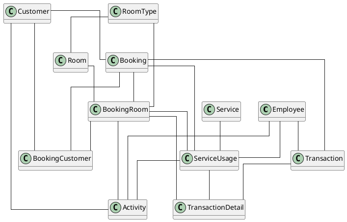

### 3.1.3 **Class diagram (analysis level)**

```plantuml


@startuml
skinparam linetype ortho
skinparam classAttributeIconSize 0

' ==================== ENUMS ====================
enum RoomStatus {
  AVAILABLE
  RESERVED
  OCCUPIED
  CLEANING
  MAINTENANCE
  OUT_OF_SERVICE
}

enum BookingStatus {
  PENDING
  CONFIRMED
  CHECKED_IN
  PARTIALLY_CHECKED_OUT
  CHECKED_OUT
  CANCELLED
}

enum ServiceUsageStatus {
  PENDING
  TRANSFERRED
  COMPLETED
  CANCELLED
}

enum TransactionStatus {
  PENDING
  COMPLETED
  FAILED
  REFUNDED
}

enum PaymentMethod {
  CASH
  CREDIT_CARD
  BANK_TRANSFER
  E_WALLET
}

enum TransactionType {
  DEPOSIT
  ROOM_CHARGE
  SERVICE_CHARGE
  REFUND
  ADJUSTMENT
}

enum ActivityType {
  CREATE_BOOKING
  UPDATE_BOOKING
  CREATE_BOOKING_ROOM
  UPDATE_BOOKING_ROOM
  CREATE_SERVICE_USAGE
  UPDATE_SERVICE_USAGE
  CREATE_TRANSACTION
  UPDATE_TRANSACTION
  CREATE_CUSTOMER
  CHECKED_IN
  CHECKED_OUT
}

' ==================== ENTITY CLASSES ====================
class Employee <<Entity>> {
  - id: String <<PK>>
  - name: String
  - username: String <<unique>>
  - password: String
  - role: String
  - updatedAt: DateTime
  --
  + createEmployee()
  + updateEmployeeInfo()
  + deleteEmployee()
  + getEmployeeByUsername()
}

class Customer <<Entity>> {
  - id: String <<PK>>
  - fullName: String
  - email: String
  - phone: String <<unique>>
  - idNumber: String
  - address: String
  - password: String
  - createdAt: DateTime
  - updatedAt: DateTime
  --
  + createCustomer()
  + updateCustomerInfo()
  + getCustomerByPhone()
  + searchCustomer()
}

class RoomType <<Entity>> {
  - id: String <<PK>>
  - name: String
  - capacity: Int
  - pricePerNight: Decimal
  - amenities: Json
  - createdAt: DateTime
  - updatedAt: DateTime
  --
  + createRoomType()
  + updateRoomType()
  + getRoomTypeById()
  + getAllRoomTypes()
}

class Room <<Entity>> {
  - id: String <<PK>>
  - roomNumber: String <<unique>>
  - floor: Int
  - status: RoomStatus
  - roomTypeId: String <<FK>>
  - createdAt: DateTime
  - updatedAt: DateTime
  --
  + createRoom()
  + updateRoomInfo()
  + updateRoomStatus()
  + getRoomById()
  + getAllRooms()
}

class Booking <<Control>> {
  - id: String <<PK>>
  - bookingCode: String <<unique>>
  - status: BookingStatus
  - primaryCustomerId: String <<FK>>
  - checkInDate: DateTime
  - checkOutDate: DateTime
  - totalGuests: Int
  - totalAmount: Decimal
  - depositRequired: Decimal
  - totalDeposit: Decimal
  - totalPaid: Decimal
  - balance: Decimal
  - createdAt: DateTime
  - updatedAt: DateTime
  --
  + createBooking()
  + updateBooking()
  + cancelBooking()
  + getBookingById()
}

class BookingRoom <<Control>> {
  - id: String <<PK>>
  - bookingId: String <<FK>>
  - roomId: String <<FK>>
  - roomTypeId: String <<FK>>
  - checkInDate: DateTime
  - checkOutDate: DateTime
  - actualCheckIn: DateTime
  - actualCheckOut: DateTime
  - pricePerNight: Decimal
  - depositAmount: Decimal
  - subtotalRoom: Decimal
  - subtotalService: Decimal
  - totalAmount: Decimal
  - totalPaid: Decimal
  - balance: Decimal
  - status: BookingStatus
  - createdAt: DateTime
  - updatedAt: DateTime
  --
  + checkIn()
  + checkOut()
  + updateBookingRoom()
}

class BookingCustomer <<Control>> {
  - id: String <<PK>>
  - bookingId: String <<FK>>
  - customerId: String <<FK>>
  - bookingRoomId: String <<FK>>
  - isPrimary: Boolean
  - createdAt: DateTime
  - updatedAt: DateTime
  --
  + addCustomerToBooking()
  + removeCustomerFromBooking()
}

class Service <<Entity>> {
  - id: String <<PK>>
  - name: String
  - price: Decimal
  - unit: String
  - isActive: Boolean
  - createdAt: DateTime
  - updatedAt: DateTime
  --
  + createService()
  + updateService()
  + getServiceById()
  + getAllServices()
}

class ServiceUsage <<Control>> {
  - id: String <<PK>>
  - bookingId: String <<FK>>
  - bookingRoomId: String <<FK>>
  - employeeId: String <<FK>>
  - serviceId: String <<FK>>
  - quantity: Int
  - unitPrice: Decimal
  - totalPrice: Decimal
  - totalPaid: Decimal
  - status: ServiceUsageStatus
  - createdAt: DateTime
  - updatedAt: DateTime
  --
  + createServiceUsage()
  + updateServiceUsage()
  + cancelServiceUsage()
  + updateServiceUsagePayment()
}

class Transaction <<Control>> {
  - id: String <<PK>>
  - bookingId: String <<FK>>
  - type: TransactionType
  - amount: Decimal
  - method: PaymentMethod
  - status: TransactionStatus
  - processedById: String <<FK>>
  - transactionRef: String
  - occurredAt: DateTime
  - description: String
  - createdAt: DateTime
  - updatedAt: DateTime
  --
  + createTransaction()
  + processFullBookingPayment()
  + processSplitRoomPayment()
  + processBookingServicePayment()
  + processGuestServicePayment()
}

class TransactionDetail <<Control>> {
  - id: String <<PK>>
  - transactionId: String <<FK>>
  - amount: Decimal
  - bookingRoomId: String <<FK>>
  - serviceUsageId: String <<FK>>
  - createdAt: DateTime
  --
  + createTransactionDetail()
}

class Activity <<Entity>> {
  - id: String <<PK>>
  - type: ActivityType
  - metadata: Json
  - description: String
  - serviceUsageId: String <<FK>>
  - bookingRoomId: String <<FK>>
  - customerId: String <<FK>>
  - employeeId: String <<FK>>
  - createdAt: DateTime
  - updatedAt: DateTime
  --
  + createActivity()
  + createCheckInActivity()
  + createCheckOutActivity()
  + createTransactionActivity()
}

' ==================== RELATIONSHIPS ====================

' Employee relationships
Employee "1" -- "0..*" Transaction : processes >
Employee "1" -- "0..*" ServiceUsage : serves >
Employee "1" -- "0..*" Activity : performs >

' Customer relationships
Customer "1" -- "0..*" Booking : makes >
Customer "1" -- "0..*" BookingCustomer : participates >
Customer "1" -- "0..*" Activity : triggers >

' RoomType relationships
RoomType "1" -- "0..*" Room : categorizes >
RoomType "1" -- "0..*" BookingRoom : pricing >

' Room relationships
Room "0..*" -- "1" RoomType
Room "1" -- "0..*" BookingRoom : assigned to >

' Booking relationships
Booking "0..*" -- "1" Customer : primaryCustomer
Booking "1" -- "1..*" BookingRoom : contains >
Booking "1" -- "0..*" BookingCustomer : includes >
Booking "1" -- "0..*" Transaction : payments >
Booking "1" -- "0..*" ServiceUsage : services >

' BookingRoom relationships
BookingRoom "0..*" -- "1" Booking
BookingRoom "0..*" -- "1" Room
BookingRoom "0..*" -- "1" RoomType
BookingRoom "1" -- "0..*" BookingCustomer : guests >
BookingRoom "1" -- "0..*" ServiceUsage : usages >
BookingRoom "1" -- "0..*" TransactionDetail : payments >
BookingRoom "1" -- "0..*" Activity : logs >

' Service relationships
Service "1" -- "0..*" ServiceUsage : used in >

' ServiceUsage relationships
ServiceUsage "0..*" -- "0..1" Booking
ServiceUsage "0..*" -- "0..1" BookingRoom
ServiceUsage "0..*" -- "1" Service
ServiceUsage "0..*" -- "1" Employee
ServiceUsage "1" -- "0..*" TransactionDetail : payments >
ServiceUsage "1" -- "0..*" Activity : logs >

' Transaction relationships
Transaction "0..*" -- "0..1" Booking
Transaction "0..*" -- "0..1" Employee : processedBy
Transaction "1" -- "0..*" TransactionDetail : details >

' TransactionDetail relationships
TransactionDetail "0..*" -- "0..1" Transaction
TransactionDetail "0..*" -- "0..1" BookingRoom
TransactionDetail "0..*" -- "0..1" ServiceUsage

@enduml
```

### 3.1.4 **Danh sách các lớp và các mối quan hệ**

| STT | Class              | Type (Entity/Control) | Ghi chú                                                     |
| --- | ------------------ | --------------------- | ----------------------------------------------------------- |
| 1   | Employee           | Entity                | Quản lý thông tin nhân viên hệ thống                        |
| 2   | Customer           | Entity                | Quản lý thông tin khách hàng                                |
| 3   | RoomType           | Entity                | Quản lý loại phòng và giá cơ bản                            |
| 4   | Room               | Entity                | Quản lý phòng và trạng thái phòng                           |
| 5   | Booking            | Control               | Quản lý đặt phòng, tổng hợp tài chính                       |
| 6   | BookingRoom        | Control               | Chi tiết đặt phòng theo từng phòng cụ thể                   |
| 7   | BookingCustomer    | Control               | Liên kết khách hàng với booking/phòng                       |
| 8   | Service            | Entity                | Quản lý danh mục dịch vụ                                    |
| 9   | ServiceUsage       | Control               | Quản lý sử dụng dịch vụ (theo booking/phòng/khách vãng lai) |
| 10  | Transaction        | Control               | Quản lý giao dịch thanh toán                                |
| 11  | TransactionDetail  | Control               | Chi tiết phân bổ thanh toán cho phòng/dịch vụ               |
| 12  | Activity           | Entity                | Nhật ký hoạt động hệ thống                                  |
| 13  | RoomStatus         | Entity (Enum)         | Trạng thái phòng                                            |
| 14  | BookingStatus      | Entity (Enum)         | Trạng thái đặt phòng                                        |
| 15  | ServiceUsageStatus | Entity (Enum)         | Trạng thái sử dụng dịch vụ                                  |
| 16  | TransactionStatus  | Entity (Enum)         | Trạng thái giao dịch                                        |
| 17  | PaymentMethod      | Entity (Enum)         | Phương thức thanh toán                                      |
| 18  | TransactionType    | Entity (Enum)         | Loại giao dịch                                              |
| 19  | ActivityType       | Entity (Enum)         | Loại hoạt động                                              |

### 3.1.5 **Chi tiết các lớp**

#### **Lớp Employee (Entity)**

**Kế thừa:** Không

**Thuộc tính:**

| STT | Tên thuộc tính | Loại     | Ràng buộc          | Ý nghĩa/ghi chú                                   |
| --- | -------------- | -------- | ------------------ | ------------------------------------------------- |
| 1   | id             | String   | private,\<\<PK\>\> | Mã định danh nhân viên (CUID)                     |
| 2   | name           | String   | private            | Họ tên nhân viên                                  |
| 3   | username       | String   | private, unique    | Tên đăng nhập (duy nhất)                          |
| 4   | password       | String   | private            | Mật khẩu đã mã hóa (bcrypt)                       |
| 5   | role           | String   | private            | Vai trò: ADMIN, RECEPTIONIST, HOUSEKEEPING, STAFF |
| 6   | updatedAt      | DateTime | private            | Thời điểm cập nhật cuối                           |

**Trách nhiệm (Methods):**

| STT | Tên phương thức         | Mô tả                                 |
| --- | ----------------------- | ------------------------------------- |
| 1   | createEmployee()        | Tạo nhân viên mới với mật khẩu mã hóa |
| 2   | updateEmployeeInfo()    | Cập nhật thông tin nhân viên          |
| 3   | deleteEmployee()        | Xóa nhân viên khỏi hệ thống           |
| 4   | getEmployeeByUsername() | Tìm nhân viên theo tên đăng nhập      |
| 5   | getAllEmployees()       | Lấy danh sách nhân viên có phân trang |

---

#### **Lớp Customer (Entity)**

**Kế thừa:** Không

**Thuộc tính:**

| STT | Tên thuộc tính | Loại     | Ràng buộc          | Ý nghĩa/ghi chú                             |
| --- | -------------- | -------- | ------------------ | ------------------------------------------- |
| 1   | id             | String   | private,\<\<PK\>\> | Mã định danh khách hàng (CUID)              |
| 2   | fullName       | String   | private            | Họ tên đầy đủ                               |
| 3   | email          | String   | private, optional  | Email liên hệ                               |
| 4   | phone          | String   | private, unique    | Số điện thoại (duy nhất, dùng để đăng nhập) |
| 5   | idNumber       | String   | private, optional  | Số CMND/CCCD                                |
| 6   | address        | String   | private, optional  | Địa chỉ                                     |
| 7   | password       | String   | private            | Mật khẩu đã mã hóa                          |
| 8   | createdAt      | DateTime | private            | Thời điểm tạo                               |
| 9   | updatedAt      | DateTime | private            | Thời điểm cập nhật cuối                     |

**Trách nhiệm (Methods):**

| STT | Tên phương thức      | Mô tả                                   |
| --- | -------------------- | --------------------------------------- |
| 1   | createCustomer()     | Đăng ký khách hàng mới                  |
| 2   | updateCustomerInfo() | Cập nhật thông tin khách hàng           |
| 3   | getCustomerByPhone() | Tìm khách hàng theo số điện thoại       |
| 4   | searchCustomer()     | Tìm kiếm khách hàng theo nhiều tiêu chí |
| 5   | getAllCustomers()    | Lấy danh sách khách hàng có phân trang  |

---

#### **Lớp RoomType (Entity)**

**Kế thừa:** Không

**Thuộc tính:**

| STT | Tên thuộc tính | Loại     | Ràng buộc          | Ý nghĩa/ghi chú                            |
| --- | -------------- | -------- | ------------------ | ------------------------------------------ |
| 1   | id             | String   | private,\<\<PK\>\> | Mã định danh loại phòng (CUID)             |
| 2   | name           | String   | private            | Tên loại phòng (VD: Standard, Deluxe, VIP) |
| 3   | capacity       | Int      | private            | Sức chứa tối đa (số người)                 |
| 4   | pricePerNight  | Decimal  | private            | Giá phòng mỗi đêm                          |
| 5   | amenities      | Json     | private, optional  | Danh sách tiện nghi (JSON)                 |
| 6   | createdAt      | DateTime | private            | Thời điểm tạo                              |
| 7   | updatedAt      | DateTime | private            | Thời điểm cập nhật cuối                    |

**Trách nhiệm (Methods):**

| STT | Tên phương thức   | Mô tả                                  |
| --- | ----------------- | -------------------------------------- |
| 1   | createRoomType()  | Thêm loại phòng mới                    |
| 2   | updateRoomType()  | Cập nhật thông tin loại phòng          |
| 3   | getRoomTypeById() | Lấy chi tiết loại phòng theo ID        |
| 4   | getAllRoomTypes() | Lấy danh sách loại phòng có phân trang |

---

#### **Lớp Room (Entity)**

**Kế thừa:** Không

**Thuộc tính:**

| STT | Tên thuộc tính | Loại       | Ràng buộc          | Ý nghĩa/ghi chú           |
| --- | -------------- | ---------- | ------------------ | ------------------------- |
| 1   | id             | String     | private,\<\<PK\>\> | Mã định danh phòng (CUID) |
| 2   | roomNumber     | String     | private, unique    | Số phòng (duy nhất)       |
| 3   | floor          | Int        | private            | Tầng                      |
| 4   | status         | RoomStatus | private            | Trạng thái phòng (Enum)   |
| 5   | roomTypeId     | String     | private,\<\<FK\>\> | Khóa ngoại tới RoomType   |
| 6   | createdAt      | DateTime   | private            | Thời điểm tạo             |
| 7   | updatedAt      | DateTime   | private            | Thời điểm cập nhật cuối   |

**Trách nhiệm (Methods):**

| STT | Tên phương thức    | Mô tả                                    |
| --- | ------------------ | ---------------------------------------- |
| 1   | createRoom()       | Thêm phòng mới vào hệ thống              |
| 2   | updateRoomInfo()   | Cập nhật thông tin phòng                 |
| 3   | updateRoomStatus() | Cập nhật trạng thái phòng                |
| 4   | getRoomById()      | Lấy chi tiết phòng theo ID               |
| 5   | getAllRooms()      | Lấy danh sách phòng có lọc và phân trang |

---

#### **Lớp Booking (Control)**

**Kế thừa:** Không

**Thuộc tính:**

| STT | Tên thuộc tính    | Loại          | Ràng buộc          | Ý nghĩa/ghi chú                      |
| --- | ----------------- | ------------- | ------------------ | ------------------------------------ |
| 1   | id                | String        | private,\<\<PK\>\> | Mã định danh đặt phòng (CUID)        |
| 2   | bookingCode       | String        | private, unique    | Mã đặt phòng (VD: BK1703123456ABC)   |
| 3   | status            | BookingStatus | private            | Trạng thái đặt phòng (Enum)          |
| 4   | primaryCustomerId | String        | private,\<\<FK\>\> | Khách hàng chính (người đặt)         |
| 5   | checkInDate       | DateTime      | private            | Ngày nhận phòng dự kiến              |
| 6   | checkOutDate      | DateTime      | private            | Ngày trả phòng dự kiến               |
| 7   | totalGuests       | Int           | private            | Tổng số khách                        |
| 8   | totalAmount       | Decimal       | private            | Tổng tiền (tổng hợp từ BookingRooms) |
| 9   | depositRequired   | Decimal       | private            | Số tiền cọc yêu cầu                  |
| 10  | totalDeposit      | Decimal       | private            | Tổng tiền cọc đã nhận                |
| 11  | totalPaid         | Decimal       | private            | Tổng tiền đã thanh toán              |
| 12  | balance           | Decimal       | private            | Số tiền còn lại cần thanh toán       |
| 13  | createdAt         | DateTime      | private            | Thời điểm tạo                        |
| 14  | updatedAt         | DateTime      | private            | Thời điểm cập nhật cuối              |

**Trách nhiệm (Methods):**

| STT | Tên phương thức  | Mô tả                                     |
| --- | ---------------- | ----------------------------------------- |
| 1   | createBooking()  | Tạo đặt phòng mới với tự động phân phòng  |
| 2   | checkIn()        | Thực hiện check-in cho các phòng đã chọn  |
| 3   | checkOut()       | Thực hiện check-out cho các phòng đã chọn |
| 4   | cancelBooking()  | Hủy đặt phòng                             |
| 5   | getBookingById() | Lấy chi tiết đặt phòng theo ID            |

---

#### **Lớp BookingRoom (Control)**

**Kế thừa:** Không

**Thuộc tính:**

| STT | Tên thuộc tính  | Loại          | Ràng buộc          | Ý nghĩa/ghi chú                |
| --- | --------------- | ------------- | ------------------ | ------------------------------ |
| 1   | id              | String        | private,\<\<PK\>\> | Mã định danh (CUID)            |
| 2   | bookingId       | String        | private,\<\<FK\>\> | Khóa ngoại tới Booking         |
| 3   | roomId          | String        | private,\<\<FK\>\> | Khóa ngoại tới Room            |
| 4   | roomTypeId      | String        | private,\<\<FK\>\> | Khóa ngoại tới RoomType        |
| 5   | checkInDate     | DateTime      | private            | Ngày nhận phòng dự kiến        |
| 6   | checkOutDate    | DateTime      | private            | Ngày trả phòng dự kiến         |
| 7   | actualCheckIn   | DateTime      | private, optional  | Thời điểm check-in thực tế     |
| 8   | actualCheckOut  | DateTime      | private, optional  | Thời điểm check-out thực tế    |
| 9   | pricePerNight   | Decimal       | private            | Giá phòng mỗi đêm (snapshot)   |
| 10  | depositAmount   | Decimal       | private            | Số tiền cọc cho phòng này      |
| 11  | subtotalRoom    | Decimal       | private            | Tổng tiền phòng                |
| 12  | subtotalService | Decimal       | private            | Tổng tiền dịch vụ              |
| 13  | totalAmount     | Decimal       | private            | Tổng cộng (phòng + dịch vụ)    |
| 14  | totalPaid       | Decimal       | private            | Tổng đã thanh toán             |
| 15  | balance         | Decimal       | private            | Số tiền còn lại                |
| 16  | status          | BookingStatus | private            | Trạng thái phòng trong booking |
| 17  | createdAt       | DateTime      | private            | Thời điểm tạo                  |
| 18  | updatedAt       | DateTime      | private            | Thời điểm cập nhật cuối        |

**Trách nhiệm (Methods):**

| STT | Tên phương thức     | Mô tả                             |
| --- | ------------------- | --------------------------------- |
| 1   | checkIn()           | Check-in cho phòng cụ thể         |
| 2   | checkOut()          | Check-out cho phòng cụ thể        |
| 3   | updateBookingRoom() | Cập nhật thông tin chi tiết phòng |
| 4   | calculateTotals()   | Tính toán lại tổng tiền           |

---

#### **Lớp BookingCustomer (Control)**

**Kế thừa:** Không (Lớp liên kết giữa Booking, Customer và BookingRoom)

**Thuộc tính:**

| STT | Tên thuộc tính | Loại     | Ràng buộc                    | Ý nghĩa/ghi chú               |
| --- | -------------- | -------- | ---------------------------- | ----------------------------- |
| 1   | id             | String   | private,\<\<PK\>\>           | Mã định danh (CUID)           |
| 2   | bookingId      | String   | private,\<\<FK\>\>           | Khóa ngoại tới Booking        |
| 3   | customerId     | String   | private,\<\<FK\>\>           | Khóa ngoại tới Customer       |
| 4   | bookingRoomId  | String   | private,\<\<FK\>\>, optional | Khóa ngoại tới BookingRoom    |
| 5   | isPrimary      | Boolean  | private                      | Là khách hàng chính hay không |
| 6   | createdAt      | DateTime | private                      | Thời điểm tạo                 |
| 7   | updatedAt      | DateTime | private                      | Thời điểm cập nhật cuối       |

**Ràng buộc:** Unique constraint trên (bookingId, customerId)

**Trách nhiệm (Methods):**

| STT | Tên phương thức             | Mô tả                             |
| --- | --------------------------- | --------------------------------- |
| 1   | addCustomerToBooking()      | Thêm khách hàng vào booking/phòng |
| 2   | removeCustomerFromBooking() | Xóa khách hàng khỏi booking/phòng |

---

#### **Lớp Service (Entity)**

**Kế thừa:** Không

**Thuộc tính:**

| STT | Tên thuộc tính | Loại     | Ràng buộc          | Ý nghĩa/ghi chú               |
| --- | -------------- | -------- | ------------------ | ----------------------------- |
| 1   | id             | String   | private,\<\<PK\>\> | Mã định danh dịch vụ (CUID)   |
| 2   | name           | String   | private            | Tên dịch vụ                   |
| 3   | price          | Decimal  | private            | Đơn giá dịch vụ               |
| 4   | unit           | String   | private            | Đơn vị tính (mặc định: "lần") |
| 5   | isActive       | Boolean  | private            | Trạng thái hoạt động          |
| 6   | createdAt      | DateTime | private            | Thời điểm tạo                 |
| 7   | updatedAt      | DateTime | private            | Thời điểm cập nhật cuối       |

**Trách nhiệm (Methods):**

| STT | Tên phương thức  | Mô tả                                      |
| --- | ---------------- | ------------------------------------------ |
| 1   | createService()  | Thêm dịch vụ mới                           |
| 2   | updateService()  | Cập nhật thông tin dịch vụ                 |
| 3   | getServiceById() | Lấy chi tiết dịch vụ theo ID               |
| 4   | getAllServices() | Lấy danh sách dịch vụ có lọc và phân trang |

---

#### **Lớp ServiceUsage (Control)**

**Kế thừa:** Không

**Thuộc tính:**

| STT | Tên thuộc tính | Loại               | Ràng buộc                    | Ý nghĩa/ghi chú                             |
| --- | -------------- | ------------------ | ---------------------------- | ------------------------------------------- |
| 1   | id             | String             | private,\<\<PK\>\>           | Mã định danh (CUID)                         |
| 2   | bookingId      | String             | private,\<\<FK\>\>, optional | Khóa ngoại tới Booking (optional cho guest) |
| 3   | bookingRoomId  | String             | private,\<\<FK\>\>, optional | Khóa ngoại tới BookingRoom                  |
| 4   | employeeId     | String             | private,\<\<FK\>\>           | Nhân viên phục vụ                           |
| 5   | serviceId      | String             | private,\<\<FK\>\>           | Khóa ngoại tới Service                      |
| 6   | quantity       | Int                | private                      | Số lượng sử dụng                            |
| 7   | unitPrice      | Decimal            | private                      | Đơn giá (snapshot từ Service)               |
| 8   | totalPrice     | Decimal            | private                      | Thành tiền (unitPrice × quantity)           |
| 9   | totalPaid      | Decimal            | private                      | Số tiền đã thanh toán                       |
| 10  | status         | ServiceUsageStatus | private                      | Trạng thái sử dụng dịch vụ (Enum)           |
| 11  | createdAt      | DateTime           | private                      | Thời điểm tạo                               |
| 12  | updatedAt      | DateTime           | private                      | Thời điểm cập nhật cuối                     |

**Ghi chú:** Hệ thống hỗ trợ 3 kịch bản sử dụng dịch vụ:

- **Booking-level service:** Có bookingId, không có bookingRoomId
- **Room-specific service:** Có cả bookingId và bookingRoomId
- **Guest service:** Không có bookingId và bookingRoomId (khách vãng lai)

**Trách nhiệm (Methods):**

| STT | Tên phương thức             | Mô tả                             |
| --- | --------------------------- | --------------------------------- |
| 1   | createServiceUsage()        | Tạo bản ghi sử dụng dịch vụ       |
| 2   | updateServiceUsage()        | Cập nhật số lượng hoặc trạng thái |
| 3   | cancelServiceUsage()        | Hủy sử dụng dịch vụ               |
| 4   | updateServiceUsagePayment() | Cập nhật số tiền đã thanh toán    |

---

#### **Lớp Transaction (Control)**

**Kế thừa:** Không

**Thuộc tính:**

| STT | Tên thuộc tính | Loại              | Ràng buộc                    | Ý nghĩa/ghi chú               |
| --- | -------------- | :---------------- | ---------------------------- | ----------------------------- |
| 1   | id             | String            | private,\<\<PK\>\>           | Mã định danh giao dịch (CUID) |
| 2   | bookingId      | String            | private,\<\<FK\>\>, optional | Khóa ngoại tới Booking        |
| 3   | type           | TransactionType   | private                      | Loại giao dịch (Enum)         |
| 4   | amount         | Decimal           | private                      | Số tiền giao dịch             |
| 5   | method         | PaymentMethod     | private, optional            | Phương thức thanh toán (Enum) |
| 6   | status         | TransactionStatus | private                      | Trạng thái giao dịch (Enum)   |
| 7   | processedById  | String            | private,\<\<FK\>\>, optional | Nhân viên xử lý               |
| 8   | transactionRef | String            | private, optional            | Mã tham chiếu bên ngoài       |
| 9   | occurredAt     | DateTime          | private                      | Thời điểm giao dịch           |
| 10  | description    | String            | private, optional            | Mô tả giao dịch               |
| 11  | createdAt      | DateTime          | private                      | Thời điểm tạo                 |
| 12  | updatedAt      | DateTime          | private                      | Thời điểm cập nhật cuối       |

**Ghi chú:** Hệ thống hỗ trợ 4 kịch bản thanh toán:

1. **Full booking payment:** Thanh toán toàn bộ booking
2. **Split room payment:** Thanh toán theo phòng được chọn
3. **Booking service payment:** Thanh toán dịch vụ trong booking
4. **Guest service payment:** Thanh toán dịch vụ khách vãng lai (chỉ tạo TransactionDetail)

**Trách nhiệm (Methods):**

| STT | Tên phương thức                | Mô tả                                           |
| --- | ------------------------------ | ----------------------------------------------- |
| 1   | createTransaction()            | Entry point tạo giao dịch (route theo kịch bản) |
| 2   | processFullBookingPayment()    | Xử lý thanh toán toàn bộ booking                |
| 3   | processSplitRoomPayment()      | Xử lý thanh toán theo phòng                     |
| 4   | processBookingServicePayment() | Xử lý thanh toán dịch vụ booking                |
| 5   | processGuestServicePayment()   | Xử lý thanh toán dịch vụ khách vãng lai         |

---

#### **Lớp TransactionDetail (Control)**

**Kế thừa:** Không (Lớp phân bổ thanh toán)

**Thuộc tính:**

| STT | Tên thuộc tính | Loại     | Ràng buộc                    | Ý nghĩa/ghi chú                             |
| --- | -------------- | -------- | ---------------------------- | ------------------------------------------- |
| 1   | id             | String   | private,\<\<PK\>\>           | Mã định danh (CUID)                         |
| 2   | transactionId  | String   | private,\<\<FK\>\>, optional | Khóa ngoại tới Transaction (null cho guest) |
| 3   | amount         | Decimal  | private                      | Số tiền phân bổ cho khoản mục này           |
| 4   | bookingRoomId  | String   | private,\<\<FK\>\>, optional | Nếu thanh toán tiền phòng                   |
| 5   | serviceUsageId | String   | private,\<\<FK\>\>, optional | Nếu thanh toán dịch vụ                      |
| 6   | createdAt      | DateTime | private                      | Thời điểm tạo                               |

**Ghi chú:** Mỗi TransactionDetail chỉ liên kết với MỘT trong hai: bookingRoomId HOẶC serviceUsageId

**Trách nhiệm (Methods):**

| STT | Tên phương thức           | Mô tả                           |
| --- | ------------------------- | ------------------------------- |
| 1   | createTransactionDetail() | Tạo chi tiết phân bổ thanh toán |

---

#### **Lớp Activity (Entity)**

**Kế thừa:** Không

**Thuộc tính:**

| STT | Tên thuộc tính | Loại         | Ràng buộc                    | Ý nghĩa/ghi chú           |
| --- | -------------- | ------------ | ---------------------------- | ------------------------- |
| 1   | id             | String       | private,\<\<PK\>\>           | Mã định danh (CUID)       |
| 2   | type           | ActivityType | private                      | Loại hoạt động (Enum)     |
| 3   | metadata       | Json         | private, optional            | Dữ liệu bổ sung (JSON)    |
| 4   | description    | String       | private                      | Mô tả hoạt động           |
| 5   | serviceUsageId | String       | private,\<\<FK\>\>, optional | Liên kết tới ServiceUsage |
| 6   | bookingRoomId  | String       | private,\<\<FK\>\>, optional | Liên kết tới BookingRoom  |
| 7   | customerId     | String       | private,\<\<FK\>\>, optional | Liên kết tới Customer     |
| 8   | employeeId     | String       | private,\<\<FK\>\>, optional | Liên kết tới Employee     |
| 9   | createdAt      | DateTime     | private                      | Thời điểm tạo             |
| 10  | updatedAt      | DateTime     | private                      | Thời điểm cập nhật cuối   |

**Trách nhiệm (Methods):**

| STT | Tên phương thức             | Mô tả                          |
| --- | --------------------------- | ------------------------------ |
| 1   | createActivity()            | Tạo bản ghi hoạt động          |
| 2   | createCheckInActivity()     | Tạo hoạt động check-in         |
| 3   | createCheckOutActivity()    | Tạo hoạt động check-out        |
| 4   | createTransactionActivity() | Tạo hoạt động giao dịch        |
| 5   | getActivities()             | Lấy danh sách hoạt động có lọc |

---

#### **Lớp RoomStatus (Entity - Enum)**

**Các giá trị:**

| Giá trị        | Ý nghĩa                        |
| -------------- | ------------------------------ |
| AVAILABLE      | Phòng trống, sẵn sàng cho thuê |
| RESERVED       | Phòng đã được đặt trước        |
| OCCUPIED       | Phòng đang có khách ở          |
| CLEANING       | Phòng đang được dọn dẹp        |
| MAINTENANCE    | Phòng đang bảo trì             |
| OUT_OF_SERVICE | Phòng ngừng hoạt động          |

---

#### **Lớp BookingStatus (Entity - Enum)**

**Các giá trị:**

| Giá trị               | Ý nghĩa                                   |
| --------------------- | ----------------------------------------- |
| PENDING               | Chờ xác nhận (chưa đặt cọc)               |
| CONFIRMED             | Đã xác nhận (đã đặt cọc)                  |
| CHECKED_IN            | Đã nhận phòng                             |
| PARTIALLY_CHECKED_OUT | Một số phòng đã trả (booking nhiều phòng) |
| CHECKED_OUT           | Đã trả phòng hoàn toàn                    |
| CANCELLED             | Đã hủy                                    |

---

#### **Lớp ServiceUsageStatus (Entity - Enum)**

**Các giá trị:**

| Giá trị     | Ý nghĩa                          |
| ----------- | -------------------------------- |
| PENDING     | Dịch vụ đã yêu cầu, chờ phục vụ  |
| TRANSFERRED | Dịch vụ đã chuyển giao cho khách |
| COMPLETED   | Dịch vụ đã hoàn thành            |
| CANCELLED   | Dịch vụ đã hủy                   |

---

#### **Lớp TransactionStatus (Entity - Enum)**

**Các giá trị:**

| Giá trị   | Ý nghĩa                  |
| --------- | ------------------------ |
| PENDING   | Giao dịch đang chờ xử lý |
| COMPLETED | Giao dịch đã hoàn thành  |
| FAILED    | Giao dịch thất bại       |
| REFUNDED  | Giao dịch đã hoàn tiền   |

---

#### **Lớp PaymentMethod (Entity - Enum)**

**Các giá trị:**

| Giá trị       | Ý nghĩa                |
| ------------- | ---------------------- |
| CASH          | Tiền mặt               |
| CREDIT_CARD   | Thẻ tín dụng           |
| BANK_TRANSFER | Chuyển khoản ngân hàng |
| E_WALLET      | Ví điện tử             |

---

#### **Lớp TransactionType (Entity - Enum)**

**Các giá trị:**

| Giá trị        | Ý nghĩa                 |
| -------------- | ----------------------- |
| DEPOSIT        | Đặt cọc                 |
| ROOM_CHARGE    | Thanh toán tiền phòng   |
| SERVICE_CHARGE | Thanh toán tiền dịch vụ |
| REFUND         | Hoàn tiền               |
| ADJUSTMENT     | Điều chỉnh              |

---

#### **Lớp ActivityType (Entity - Enum)**

**Các giá trị:**

| Giá trị              | Ý nghĩa                  |
| -------------------- | ------------------------ |
| CREATE_BOOKING       | Tạo đặt phòng mới        |
| UPDATE_BOOKING       | Cập nhật đặt phòng       |
| CREATE_BOOKING_ROOM  | Thêm phòng vào đặt phòng |
| UPDATE_BOOKING_ROOM  | Cập nhật chi tiết phòng  |
| CREATE_SERVICE_USAGE | Tạo sử dụng dịch vụ      |
| UPDATE_SERVICE_USAGE | Cập nhật sử dụng dịch vụ |
| CREATE_TRANSACTION   | Tạo giao dịch mới        |
| UPDATE_TRANSACTION   | Cập nhật giao dịch       |
| CREATE_CUSTOMER      | Tạo khách hàng mới       |
| CHECKED_IN           | Check-in                 |
| CHECKED_OUT          | Check-out                |

## 3.2 **Sơ đồ trạng thái**

### 3.2.1 **Sơ đồ trạng thái cho lớp Room (Phòng)**

Lớp **Room** quản lý trạng thái vật lý của phòng trong khách sạn, phản ánh tình trạng sử dụng thực tế.

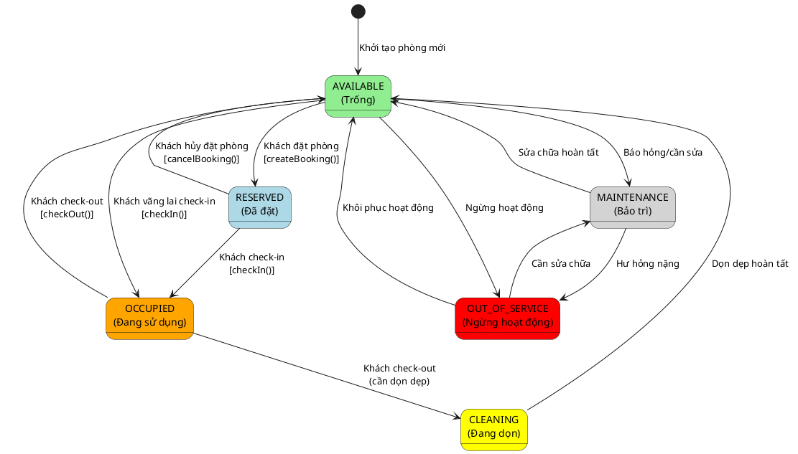

**Danh sách các trạng thái:**

| STT | Trạng thái     | Ý nghĩa                                       |
| --- | -------------- | --------------------------------------------- |
| 1   | AVAILABLE      | Phòng trống, sẵn sàng cho thuê hoặc đặt trước |
| 2   | RESERVED       | Phòng đã được đặt trước, chờ khách đến nhận   |
| 3   | OCCUPIED       | Phòng đang có khách ở (đã check-in)           |
| 4   | CLEANING       | Phòng đang được dọn dẹp sau khi khách trả     |
| 5   | MAINTENANCE    | Phòng đang trong quá trình bảo trì, sửa chữa  |
| 6   | OUT_OF_SERVICE | Phòng ngừng hoạt động hoàn toàn               |

**Bảng mô tả các biến cố và hành động:**

| Trạng thái bắt đầu | Biến cố (Event)                   | Hành động (Action)                                    | Trạng thái kết thúc |
| ------------------ | --------------------------------- | ----------------------------------------------------- | ------------------- |
| (Mới)              | Thêm phòng mới vào hệ thống       | `createRoom()` - Tạo phòng với status mặc định        | AVAILABLE           |
| AVAILABLE          | Khách đặt phòng thành công        | `createBooking()` - Cập nhật room status              | RESERVED            |
| AVAILABLE          | Khách vãng lai check-in trực tiếp | `checkIn()` - Cập nhật room status sang OCCUPIED      | OCCUPIED            |
| AVAILABLE          | Phát hiện hư hỏng cần sửa chữa    | Cập nhật thủ công qua `updateRoomStatus()`            | MAINTENANCE         |
| AVAILABLE          | Ngừng hoạt động phòng             | Cập nhật thủ công qua `updateRoomStatus()`            | OUT_OF_SERVICE      |
| RESERVED           | Khách đến check-in                | `checkIn()` - Ghi nhận actualCheckIn, cập nhật room   | OCCUPIED            |
| RESERVED           | Khách/Nhân viên hủy đặt phòng     | `cancelBooking()` - Giải phóng phòng                  | AVAILABLE           |
| OCCUPIED           | Khách check-out                   | `checkOut()` - Ghi nhận actualCheckOut, cập nhật room | AVAILABLE           |
| OCCUPIED           | Khách check-out (cần dọn)         | `checkOut()` - Chuyển sang CLEANING nếu cần           | CLEANING            |
| CLEANING           | Nhân viên dọn xong                | Cập nhật thủ công qua `updateRoomStatus()`            | AVAILABLE           |
| MAINTENANCE        | Sửa chữa hoàn tất                 | Cập nhật thủ công qua `updateRoomStatus()`            | AVAILABLE           |
| MAINTENANCE        | Hư hỏng nặng, không thể sửa       | Cập nhật thủ công qua `updateRoomStatus()`            | OUT_OF_SERVICE      |
| OUT_OF_SERVICE     | Khôi phục hoạt động               | Cập nhật thủ công qua `updateRoomStatus()`            | AVAILABLE           |

---

### 3.2.2 **Sơ đồ trạng thái cho lớp Booking (Đặt phòng)**

Lớp **Booking** quản lý vòng đời của một đơn đặt phòng từ khi tạo cho đến khi hoàn tất hoặc hủy. Hệ thống hỗ trợ đặt nhiều phòng trong một booking.

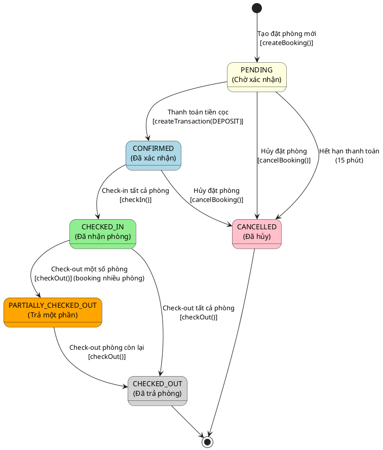

**Danh sách các trạng thái:**

| STT | Trạng thái            | Ý nghĩa                                                         |
| --- | --------------------- | --------------------------------------------------------------- |
| 1   | PENDING               | Đặt phòng đã tạo, chờ thanh toán tiền cọc (có thời hạn 15 phút) |
| 2   | CONFIRMED             | Đã thanh toán cọc, chờ khách đến nhận phòng                     |
| 3   | CHECKED_IN            | Tất cả phòng trong booking đã được check-in                     |
| 4   | PARTIALLY_CHECKED_OUT | Một số phòng đã check-out (áp dụng cho booking nhiều phòng)     |
| 5   | CHECKED_OUT           | Tất cả phòng đã check-out, booking hoàn tất                     |
| 6   | CANCELLED             | Đặt phòng đã bị hủy                                             |

**Bảng mô tả các biến cố và hành động:**

| Trạng thái bắt đầu    | Biến cố (Event)                     | Hành động (Action)                                                 | Trạng thái kết thúc   |
| --------------------- | ----------------------------------- | ------------------------------------------------------------------ | --------------------- |
| (Mới)                 | Khách/Nhân viên tạo đặt phòng       | `createBooking()` - Tạo booking, phân phòng tự động, đặt expiresAt | PENDING               |
| PENDING               | Khách thanh toán tiền cọc           | `createTransaction(DEPOSIT)` - Ghi nhận cọc, cập nhật booking      | CONFIRMED             |
| PENDING               | Hết hạn thanh toán (15 phút)        | Hệ thống tự động hủy, giải phóng phòng                             | CANCELLED             |
| PENDING               | Khách/Nhân viên hủy đặt phòng       | `cancelBooking()` - Cập nhật status, giải phóng phòng              | CANCELLED             |
| CONFIRMED             | Khách đến check-in tất cả phòng     | `checkIn()` - Ghi nhận actualCheckIn cho tất cả BookingRoom        | CHECKED_IN            |
| CONFIRMED             | Khách/Nhân viên hủy đặt phòng       | `cancelBooking()` - Xử lý hoàn cọc (nếu có), giải phóng phòng      | CANCELLED             |
| CHECKED_IN            | Check-out một số phòng (multi-room) | `checkOut()` - Chỉ check-out các phòng được chọn                   | PARTIALLY_CHECKED_OUT |
| CHECKED_IN            | Check-out tất cả phòng              | `checkOut()` - Check-out toàn bộ, cập nhật Room sang AVAILABLE     | CHECKED_OUT           |
| PARTIALLY_CHECKED_OUT | Check-out các phòng còn lại         | `checkOut()` - Check-out phòng cuối cùng                           | CHECKED_OUT           |

**Ghi chú đặc biệt:**

- Trạng thái PARTIALLY_CHECKED_OUT chỉ xuất hiện khi booking có nhiều phòng và check-out từng phần
- Mỗi BookingRoom trong booking có trạng thái riêng, đồng bộ với trạng thái tổng của Booking

---

### 3.2.3 **Sơ đồ trạng thái cho lớp BookingRoom (Chi tiết đặt phòng)**

Lớp **BookingRoom** quản lý trạng thái của từng phòng cụ thể trong một đơn đặt phòng. Trạng thái của BookingRoom độc lập nhưng ảnh hưởng đến trạng thái tổng của Booking.

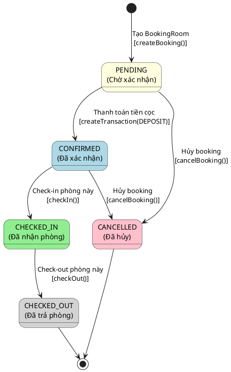

**Danh sách các trạng thái:**

| STT | Trạng thái  | Ý nghĩa                                         |
| --- | ----------- | ----------------------------------------------- |
| 1   | PENDING     | Phòng trong booking chờ xác nhận (chưa đặt cọc) |
| 2   | CONFIRMED   | Phòng đã được xác nhận, chờ check-in            |
| 3   | CHECKED_IN  | Khách đã nhận phòng này                         |
| 4   | CHECKED_OUT | Khách đã trả phòng này                          |
| 5   | CANCELLED   | Phòng trong booking đã bị hủy                   |

**Bảng mô tả các biến cố và hành động:**

| Trạng thái bắt đầu | Biến cố (Event)           | Hành động (Action)                                                | Trạng thái kết thúc |
| ------------------ | ------------------------- | ----------------------------------------------------------------- | ------------------- |
| (Mới)              | Tạo booking với phòng     | `createBooking()` - Tạo BookingRoom với status PENDING            | PENDING             |
| PENDING            | Thanh toán cọc thành công | `createTransaction(DEPOSIT)` - Cập nhật tất cả BookingRoom        | CONFIRMED           |
| PENDING            | Hủy booking               | `cancelBooking()` - Cập nhật status sang CANCELLED                | CANCELLED           |
| CONFIRMED          | Check-in phòng cụ thể     | `checkIn()` - Ghi actualCheckIn, cập nhật Room sang OCCUPIED      | CHECKED_IN          |
| CONFIRMED          | Hủy booking               | `cancelBooking()` - Cập nhật status, cập nhật Room sang AVAILABLE | CANCELLED           |
| CHECKED_IN         | Check-out phòng cụ thể    | `checkOut()` - Ghi actualCheckOut, cập nhật Room sang AVAILABLE   | CHECKED_OUT         |

**Mối quan hệ với Booking:**

- Khi tất cả BookingRoom chuyển sang CHECKED_IN → Booking chuyển sang CHECKED_IN
- Khi một số BookingRoom chuyển sang CHECKED_OUT (còn lại CHECKED_IN) → Booking chuyển sang PARTIALLY_CHECKED_OUT
- Khi tất cả BookingRoom chuyển sang CHECKED_OUT → Booking chuyển sang CHECKED_OUT

---

### 3.2.4 **Sơ đồ trạng thái cho lớp ServiceUsage (Sử dụng dịch vụ)**

Lớp **ServiceUsage** quản lý vòng đời của một lần sử dụng dịch vụ, từ khi yêu cầu đến khi hoàn thành hoặc hủy.

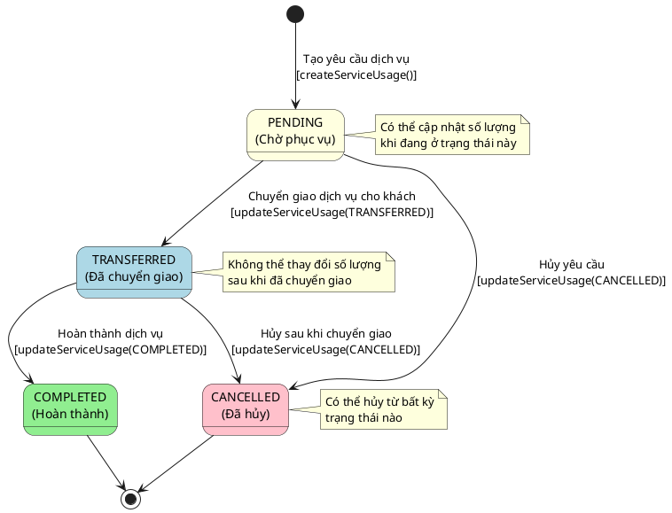

**Danh sách các trạng thái:**

| STT | Trạng thái  | Ý nghĩa                                                       |
| --- | ----------- | ------------------------------------------------------------- |
| 1   | PENDING     | Dịch vụ đã được yêu cầu, đang chờ nhân viên phục vụ           |
| 2   | TRANSFERRED | Dịch vụ đã được chuyển giao cho khách (VD: đồ ăn đã mang lên) |
| 3   | COMPLETED   | Dịch vụ đã hoàn thành và thanh toán xong                      |
| 4   | CANCELLED   | Dịch vụ đã bị hủy                                             |

**Bảng mô tả các biến cố và hành động:**

| Trạng thái bắt đầu | Biến cố (Event)                    | Hành động (Action)                                              | Trạng thái kết thúc |
| ------------------ | ---------------------------------- | --------------------------------------------------------------- | ------------------- |
| (Mới)              | Nhân viên tạo yêu cầu dịch vụ      | `createServiceUsage()` - Tạo với status PENDING                 | PENDING             |
| PENDING            | Nhân viên cập nhật số lượng        | `updateServiceUsage()` - Cập nhật quantity, tính lại totalPrice | PENDING             |
| PENDING            | Nhân viên chuyển giao cho khách    | `updateServiceUsage(TRANSFERRED)` - Khóa số lượng               | TRANSFERRED         |
| PENDING            | Hủy yêu cầu dịch vụ                | `updateServiceUsage(CANCELLED)` - Đặt totalPrice = 0            | CANCELLED           |
| TRANSFERRED        | Hoàn thành dịch vụ (đã thanh toán) | `updateServiceUsage(COMPLETED)` - Đánh dấu hoàn thành           | COMPLETED           |
| TRANSFERRED        | Hủy sau khi chuyển giao            | `updateServiceUsage(CANCELLED)` - Đặt totalPrice = 0            | CANCELLED           |

**Quy tắc chuyển đổi trạng thái:**

| Từ trạng thái | Có thể chuyển sang     | Không thể chuyển sang |
| ------------- | ---------------------- | --------------------- |
| PENDING       | TRANSFERRED, CANCELLED | COMPLETED             |
| TRANSFERRED   | COMPLETED, CANCELLED   | PENDING               |
| COMPLETED     | (Không thể thay đổi)   | Tất cả                |
| CANCELLED     | (Không thể thay đổi)   | Tất cả                |

**Ràng buộc nghiệp vụ:**

- Chỉ có thể cập nhật `quantity` khi status là PENDING
- Có thể hủy (CANCELLED) từ bất kỳ trạng thái nào (trừ COMPLETED và CANCELLED)
- Khi hủy, `totalPrice` được đặt về 0

---

### 3.2.5 **Sơ đồ trạng thái cho lớp Transaction (Giao dịch)**

Lớp **Transaction** quản lý trạng thái của các giao dịch thanh toán trong hệ thống.

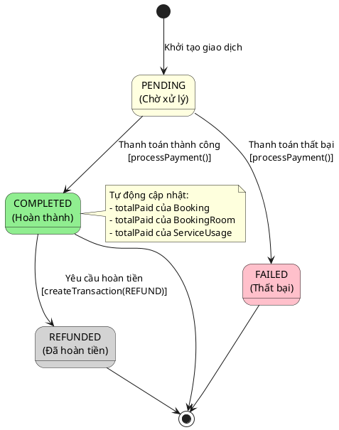

**Danh sách các trạng thái:**

| STT | Trạng thái | Ý nghĩa                            |
| --- | ---------- | ---------------------------------- |
| 1   | PENDING    | Giao dịch đang chờ xử lý           |
| 2   | COMPLETED  | Giao dịch đã hoàn thành thành công |
| 3   | FAILED     | Giao dịch thất bại                 |
| 4   | REFUNDED   | Giao dịch đã được hoàn tiền        |

**Bảng mô tả các biến cố và hành động:**

| Trạng thái bắt đầu | Biến cố (Event)             | Hành động (Action)                                              | Trạng thái kết thúc |
| ------------------ | --------------------------- | --------------------------------------------------------------- | ------------------- |
| (Mới)              | Khởi tạo giao dịch          | `createTransaction()` - Tạo transaction với status tùy scenario | PENDING/COMPLETED   |
| PENDING            | Xử lý thanh toán thành công | Cập nhật status, phân bổ tiền qua TransactionDetail             | COMPLETED           |
| PENDING            | Xử lý thanh toán thất bại   | Cập nhật status sang FAILED                                     | FAILED              |
| COMPLETED          | Yêu cầu hoàn tiền           | `createTransaction(REFUND)` - Tạo giao dịch hoàn tiền mới       | REFUNDED            |

**Ghi chú:**

- Trong hệ thống hiện tại, hầu hết giao dịch được tạo với status COMPLETED ngay lập tức (thanh toán trực tiếp)
- TransactionDetail được tạo để phân bổ số tiền cho BookingRoom hoặc ServiceUsage cụ thể
- Khi Transaction COMPLETED, hệ thống tự động cập nhật `totalPaid` và `balance` của các entity liên quan

## 3.3 Mô hình động ( dynamic model )

### 3.3.1 Sơ đồ sequence cho Use Case "Check-in nhận phòng"

```plantuml

@startuml

title Hotel Booking Management - Employee Use Cases

actor Employee
participant "API Gateway" as API
participant "Booking\nController" as Controller
participant "Booking\nService" as Service
participant "Prisma\nClient" as Prisma
database "Database" as DB

== Use Case 1: Check-In Guests ==

Employee -> API: PATCH /employee-api/v1/bookings/check-in\n{bookingId, bookingRoomId, guests[]}
activate API
API -> API: Validate Request\n(bookingValidation.checkIn)
API -> Controller: checkIn(req, res)
activate Controller
Controller -> Service: checkIn(input)
activate Service

Service -> Prisma: findUnique(bookingId)\n+ include bookingRooms
activate Prisma
Prisma -> DB: SELECT booking, booking_rooms
DB --> Prisma: Booking data
Prisma --> Service: booking
deactivate Prisma

alt Booking not found
    Service --> Controller: throw ApiError(404, "Booking not found")
    Controller --> API: Error response
    API --> Employee: 404 Not Found
end

alt Booking status is not CONFIRMED
    Service --> Controller: throw ApiError(400, "Status must be CONFIRMED")
    Controller --> API: Error response
    API --> Employee: 400 Bad Request
end

Service -> Service: Validate booking room exists
Service -> Service: Verify at least one primary guest

Service -> Prisma: findMany(customers)\nwhere: {id in customerIds}
activate Prisma
Prisma -> DB: SELECT customers
DB --> Prisma: Customer records
Prisma --> Service: customers[]
deactivate Prisma

alt Customers not found
    Service --> Controller: throw ApiError(404, "Customers not found")
    Controller --> API: Error response
    API --> Employee: 404 Not Found
end

Service -> Prisma: BEGIN TRANSACTION
activate Prisma

Prisma -> DB: UPDATE booking_room\nSET actualCheckIn = now,\n    status = 'CHECKED_IN'
DB --> Prisma: Updated booking_room

Prisma -> DB: UPDATE room\nSET status = 'OCCUPIED'
DB --> Prisma: Updated room

Prisma -> DB: UPDATE booking\nSET status = 'CHECKED_IN'
DB --> Prisma: Updated booking

Prisma -> DB: INSERT INTO booking_customer\n(bookingId, customerId, isPrimary...)
DB --> Prisma: Booking customers linked

Prisma -> DB: INSERT INTO booking_history\n(action='CHECK_IN', changes...)
DB --> Prisma: Audit trail created

Prisma -> DB: COMMIT
DB --> Prisma: Transaction committed
Prisma --> Service: {booking, bookingRoom}
deactivate Prisma

Service --> Controller: Check-in result
deactivate Service
Controller --> API: sendData(res, result)
deactivate Controller
API --> Employee: 200 OK\n{data: {booking, bookingRoom}}
deactivate API

== Use Case 2: Create Transaction ==

Employee -> API: POST /employee-api/v1/bookings/transaction\n{bookingId, transactionType, amount, method...}
activate API
API -> API: Validate Request\n(bookingValidation.createTransaction)
API -> Controller: createTransaction(req, res)
activate Controller
Controller -> Service: createTransaction(input)
activate Service

Service -> Prisma: findUnique(bookingId)\n+ include bookingRooms, transactions
activate Prisma
Prisma -> DB: SELECT booking with related data
DB --> Prisma: Booking data
Prisma --> Service: booking
deactivate Prisma

alt Booking not found
    Service --> Controller: throw ApiError(404, "Booking not found")
    Controller --> API: Error response
    API --> Employee: 404 Not Found
end

Service -> Service: validateTransaction()\n- Check transaction type rules\n- Validate amounts\n- Verify booking status

alt Validation fails
    Service --> Controller: throw ApiError(400, "Validation error")
    Controller --> API: Error response
    API --> Employee: 400 Bad Request
end

Service -> Prisma: BEGIN TRANSACTION
activate Prisma

Prisma -> DB: INSERT INTO transaction\n(bookingId, type, amount, method...)
DB --> Prisma: Created transaction

Service -> Service: applyTransactionLogic()\n- Update totalDeposit/totalPaid\n- Recalculate balance\n- Update booking status\n  (PENDING → CONFIRMED if deposit met)

Prisma -> DB: UPDATE booking\nSET totalDeposit, totalPaid,\n    balance, status
DB --> Prisma: Updated booking

Prisma -> DB: COMMIT
DB --> Prisma: Transaction committed
Prisma --> Service: {transaction, booking}
deactivate Prisma

Service --> Controller: Transaction result
deactivate Service
Controller --> API: sendData(res, result, 201)
deactivate Controller
API --> Employee: 201 Created\n{data: {transaction, booking}}
deactivate API

== Use Case 3: Get Booking Details ==

Employee -> API: GET /employee-api/v1/bookings/{id}
activate API
API -> Controller: getBooking(req, res)
activate Controller
Controller -> Service: getBookingById(bookingId)
activate Service

Service -> Prisma: findUnique(bookingId)\n+ include all relations
activate Prisma
Prisma -> DB: SELECT booking\nJOIN booking_rooms\nJOIN customers\nJOIN transactions\nJOIN histories
DB --> Prisma: Complete booking data
Prisma --> Service: booking with full details
deactivate Prisma

alt Booking not found
    Service --> Controller: throw ApiError(404, "Booking not found")
    Controller --> API: Error response
    API --> Employee: 404 Not Found
end

Service --> Controller: booking
deactivate Service
Controller --> API: sendData(res, booking)
deactivate Controller
API --> Employee: 200 OK\n{data: booking}
deactivate API

@enduml


```

### 3.3.2 Sơ đồ sequence cho Use Case đặt phòng

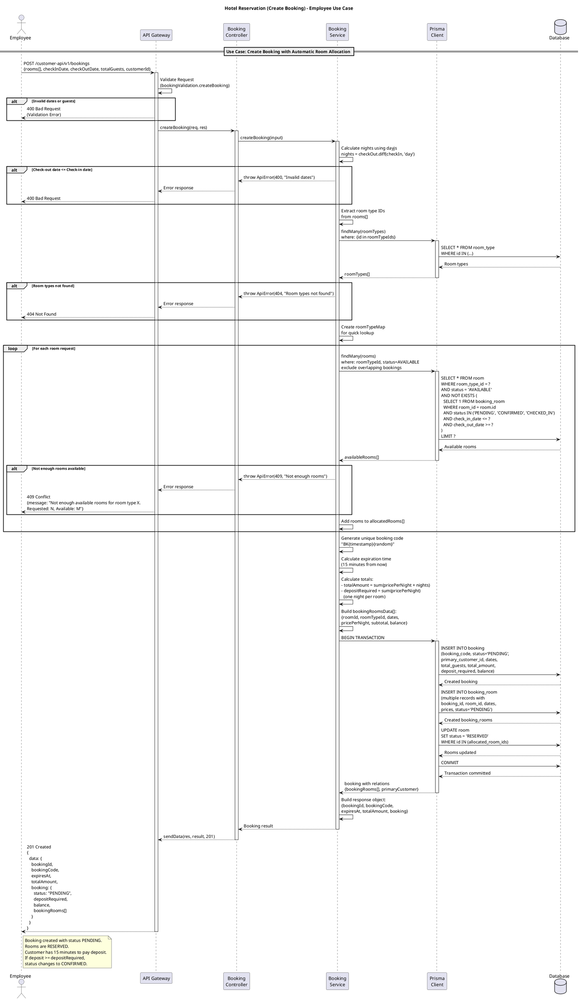

### 3.3.3 Sơ đồ sequence cho Use Case "Checkout thanh toán"

```plantuml
  @startuml

  title Hotel Check-Out Process - Room Master System

  actor Employee as emp
  participant "Employee\nController" as ctrl
  participant "Booking\nService" as bookingSvc
  participant "Transaction\nService" as txnSvc
  participant "Room\nService" as roomSvc
  participant "Database\n(Prisma)" as db

  == Initiate Check-Out ==

  emp -> ctrl: POST /bookings/check-out\n{bookingId, bookingRoomId}
  activate ctrl

  ctrl -> ctrl: Validate request\n(auth, permissions)

  ctrl -> bookingSvc: getBookingById(bookingId)
  activate bookingSvc
  bookingSvc -> db: findUnique(bookingId,\ninclude: bookingRooms,\ntransactions, serviceUsages)
  activate db
  db --> bookingSvc: booking with details
  deactivate db

  alt Booking not found
      bookingSvc --> ctrl: throw NotFoundError
      ctrl --> emp: 404 Not Found
  end

  alt Booking status not CHECKED_IN or PARTIALLY_CHECKED_OUT
      bookingSvc --> ctrl: throw BadRequestError\n"Cannot check out from this status"
      ctrl --> emp: 400 Bad Request
  end
  deactivate bookingSvc

  ctrl -> bookingSvc: validateBookingRoom(bookingRoomId, bookingId)
  activate bookingSvc
  bookingSvc -> db: findFirst(bookingRoomId,\nwhere: {id, bookingId})
  activate db
  db --> bookingSvc: bookingRoom
  deactivate db

  alt BookingRoom not found
      bookingSvc --> ctrl: throw NotFoundError
      ctrl --> emp: 404 Not Found
  end
  deactivate bookingSvc

  == Calculate Final Bill ==

  ctrl -> bookingSvc: calculateFinalBill(bookingRoomId)
  activate bookingSvc

  note over bookingSvc,db
    Calculate total charges:
    - Room charges (pricePerNight × nights)
    - Service usage charges
    - Existing balance
  end note

  bookingSvc -> db: serviceUsage.findMany({\n  where: {bookingRoomId},\n  include: {service}\n})
  activate db
  db --> bookingSvc: serviceUsages[]
  deactivate db

  bookingSvc -> db: transaction.aggregate({\n  where: {bookingRoomId},\n  _sum: {amount}\n})
  activate db
  db --> bookingSvc: total payments
  deactivate db

  bookingSvc -> bookingSvc: Calculate:\ntotalCharges = roomCharges + serviceCharges\ntotalPaid = sum of payments\nbalanceDue = totalCharges - totalPaid

  bookingSvc --> ctrl: billSummary {\n  totalCharges,\n  totalPaid,\n  balanceDue,\n  serviceCharges[],\n  roomCharges\n}
  deactivate bookingSvc

  alt Balance Due > 0
      ctrl --> emp: 200 OK\n{billSummary, requiresPayment: true}

      note over emp
        Employee processes final payment
        from customer
      end note

      emp -> ctrl: POST /transactions\n{bookingId, bookingRoomId,\ntype: ROOM_CHARGE,\namount: balanceDue,\nmethod, details[]}
      activate ctrl

      ctrl -> txnSvc: createTransaction(data)
      activate txnSvc

      txnSvc -> db: transaction.create({\n  bookingId,\n  bookingRoomId,\n  type: ROOM_CHARGE,\n  amount,\n  method,\n  status: COMPLETED,\n  processedById: employeeId,\n  details: {\n    create: [...]\n  }\n})
      activate db
      db --> txnSvc: transaction
      deactivate db

      txnSvc -> db: bookingRoom.update({\n  totalPaid += amount,\n  balance = 0\n})
      activate db
      db --> txnSvc: updated bookingRoom
      deactivate db

      txnSvc -> db: booking.update({\n  totalPaid += amount,\n  balance = totalAmount - totalPaid\n})
      activate db
      db --> txnSvc: updated booking
      deactivate db

      txnSvc --> ctrl: transaction
      deactivate txnSvc

      ctrl --> emp: 201 Created\n{transaction}
      deactivate ctrl

      emp -> ctrl: POST /bookings/check-out\n{bookingId, bookingRoomId}
      activate ctrl
  end

  == Process Check-Out ==

  ctrl -> bookingSvc: checkOutRoom(bookingId, bookingRoomId, employeeId)
  activate bookingSvc

  bookingSvc -> db: bookingRoom.findUnique(bookingRoomId)
  activate db
  db --> bookingSvc: bookingRoom
  deactivate db

  alt Balance Due > 0
      bookingSvc --> ctrl: throw BadRequestError\n"Outstanding balance must be paid"
      ctrl --> emp: 400 Bad Request
  end

  note over bookingSvc,db
    Perform check-out in transaction
    to ensure atomicity
  end note

  bookingSvc -> db: BEGIN TRANSACTION
  activate db

  bookingSvc -> db: bookingRoom.update({\n  id: bookingRoomId,\n  actualCheckOut: now(),\n  status: CHECKED_OUT\n})
  db --> bookingSvc: updated bookingRoom

  bookingSvc -> db: room.update({\n  id: roomId,\n  status: CLEANING\n})
  db --> bookingSvc: updated room

  bookingSvc -> db: bookingRoom.findMany({\n  where: {\n    bookingId,\n    status: {not: CHECKED_OUT}\n  }\n})
  db --> bookingSvc: remainingRooms[]

  alt All rooms checked out
      bookingSvc -> db: booking.update({\n  id: bookingId,\n  status: CHECKED_OUT\n})
      db --> bookingSvc: updated booking (CHECKED_OUT)
  else Some rooms still occupied
      bookingSvc -> db: booking.update({\n  id: bookingId,\n  status: PARTIALLY_CHECKED_OUT\n})
      db --> bookingSvc: updated booking (PARTIALLY_CHECKED_OUT)
  end

  bookingSvc -> db: bookingHistory.create({\n  bookingId,\n  employeeId,\n  action: "CHECK_OUT",\n  changes: {\n    bookingRoomId,\n    actualCheckOut: now(),\n    roomStatus: CLEANING,\n    finalBalance: 0\n  }\n})
  db --> bookingSvc: history record

  bookingSvc -> db: COMMIT TRANSACTION
  db --> bookingSvc: transaction committed
  deactivate db

  bookingSvc --> ctrl: checkOutResult {\n  booking,\n  bookingRoom,\n  allRoomsCheckedOut: boolean\n}
  deactivate bookingSvc

  ctrl --> emp: 200 OK\n{checkOutResult}
  deactivate ctrl

  == Post Check-Out Notification ==

  note over emp,db
    Optional: System can send
    - Receipt/invoice to customer
    - Housekeeping notification
    - Update room availability
  end note

  alt Generate Receipt
      emp -> ctrl: GET /bookings/{bookingId}/receipt
      activate ctrl

      ctrl -> bookingSvc: generateReceipt(bookingId)
      activate bookingSvc

      bookingSvc -> db: Get full booking details\nwith all transactions,\nservice usages, payments
      activate db
      db --> bookingSvc: complete booking data
      deactivate db

      bookingSvc -> bookingSvc: Format receipt with:\n- Customer details\n- Room charges breakdown\n- Service charges\n- Payment history\n- Final balance

      bookingSvc --> ctrl: receipt data
      deactivate bookingSvc

      ctrl --> emp: 200 OK\n{receipt}
      deactivate ctrl
  end

  @enduml


```

### 3.3.4 Sơ đồ sequence cho Use Case "Sử dụng dịch vụ"

```plantuml

@startuml

title Service Usage Flow - Hotel Management System

actor Employee as emp
participant "Employee\nController" as ctrl
participant "ServiceUsage\nService" as svc
participant "Booking\nService" as booking
participant "Service\nService" as serviceSvc
participant "Database\n(Prisma)" as db

== Add Service to Booking ==

emp -> ctrl: POST /bookings/{bookingId}/services\n{serviceId, quantity, bookingRoomId?}
activate ctrl

ctrl -> ctrl: Validate request\n(auth, permissions)

ctrl -> booking: getBookingById(bookingId)
activate booking
booking -> db: findUnique(bookingId)
activate db
db --> booking: booking
deactivate db

alt Booking not found
    booking --> ctrl: throw NotFoundError
    ctrl --> emp: 404 Not Found
else Booking not CONFIRMED or CHECKED_IN
    booking --> ctrl: throw BadRequestError
    ctrl --> emp: 400 Bad Request
end
deactivate booking

ctrl -> serviceSvc: getServiceById(serviceId)
activate serviceSvc
serviceSvc -> db: findUnique(serviceId)
activate db
db --> serviceSvc: service
deactivate db

alt Service not found
    serviceSvc --> ctrl: throw NotFoundError
    ctrl --> emp: 404 Not Found
else Service not active
    serviceSvc --> ctrl: throw BadRequestError
    ctrl --> emp: 400 Bad Request
end
deactivate serviceSvc

alt bookingRoomId provided
    ctrl -> booking: validateBookingRoom(bookingId, bookingRoomId)
    activate booking
    booking -> db: findFirst(bookingRoomId, bookingId)
    activate db
    db --> booking: bookingRoom
    deactivate db

    alt BookingRoom not found or not belongs to booking
        booking --> ctrl: throw BadRequestError
        ctrl --> emp: 400 Bad Request
    end
    deactivate booking
end

ctrl -> svc: createServiceUsage(data)
activate svc

svc -> svc: Calculate prices\ntotalPrice = unitPrice * quantity

svc -> db: serviceUsage.create({\n  bookingId,\n  bookingRoomId?,\n  serviceId,\n  quantity,\n  unitPrice,\n  totalPrice\n})
activate db
db --> svc: serviceUsage
deactivate db

svc -> db: booking.update({\n  totalAmount += totalPrice\n})
activate db
db --> svc: updated booking
deactivate db

svc --> ctrl: serviceUsage
deactivate svc

ctrl --> emp: 201 Created\n{serviceUsage}
deactivate ctrl

== Get Service Usages for Booking ==

emp -> ctrl: GET /bookings/{bookingId}/services
activate ctrl

ctrl -> booking: getBookingById(bookingId)
activate booking
booking -> db: findUnique(bookingId)
activate db
db --> booking: booking
deactivate db
booking --> ctrl: booking
deactivate booking

ctrl -> svc: getServiceUsagesByBooking(bookingId, filters?)
activate svc

svc -> db: serviceUsage.findMany({\n  where: {bookingId},\n  include: {service, bookingRoom}\n})
activate db
db --> svc: serviceUsages[]
deactivate db

svc --> ctrl: serviceUsages[]
deactivate svc

ctrl --> emp: 200 OK\n{serviceUsages[]}
deactivate ctrl

== Update Service Usage ==

emp -> ctrl: PATCH /service-usages/{usageId}\n{quantity}
activate ctrl

ctrl -> ctrl: Validate request\n(auth, permissions)

ctrl -> svc: getServiceUsageById(usageId)
activate svc
svc -> db: findUnique(usageId)
activate db
db --> svc: serviceUsage
deactivate db

alt ServiceUsage not found
    svc --> ctrl: throw NotFoundError
    ctrl --> emp: 404 Not Found
end
deactivate svc

ctrl -> svc: updateServiceUsage(usageId, {quantity})
activate svc

svc -> svc: Calculate price difference\npriceDiff = (newQuantity - oldQuantity) * unitPrice

svc -> db: serviceUsage.update({\n  quantity,\n  totalPrice = unitPrice * quantity\n})
activate db
db --> svc: updated serviceUsage
deactivate db

svc -> db: booking.update({\n  totalAmount += priceDiff\n})
activate db
db --> svc: updated booking
deactivate db

svc --> ctrl: updated serviceUsage
deactivate svc

ctrl --> emp: 200 OK\n{serviceUsage}
deactivate ctrl

== Delete Service Usage ==

emp -> ctrl: DELETE /service-usages/{usageId}
activate ctrl

ctrl -> ctrl: Validate request\n(auth, permissions)

ctrl -> svc: getServiceUsageById(usageId)
activate svc
svc -> db: findUnique(usageId)
activate db
db --> svc: serviceUsage
deactivate db

alt ServiceUsage not found
    svc --> ctrl: throw NotFoundError
    ctrl --> emp: 404 Not Found
end
deactivate svc

ctrl -> svc: checkIfPaid(usageId)
activate svc
svc -> db: transactionDetail.count({\n  where: {serviceUsageId}\n})
activate db
db --> svc: count
deactivate db

alt Service usage already paid
    svc --> ctrl: throw BadRequestError\n"Cannot delete paid service"
    ctrl --> emp: 400 Bad Request
end
deactivate svc

ctrl -> svc: deleteServiceUsage(usageId)
activate svc

svc -> db: booking.update({\n  totalAmount -= serviceUsage.totalPrice\n})
activate db
db --> svc: updated booking
deactivate db

svc -> db: serviceUsage.delete({id: usageId})
activate db
db --> svc: deleted
deactivate db

svc --> ctrl: success
deactivate svc

ctrl --> emp: 204 No Content
deactivate ctrl

== Payment for Service Usage ==

note over emp,db
  Service usages are included in transaction details
  when processing payments for a booking
end note

emp -> ctrl: POST /transactions\n{bookingId, amount, method, details[]}
activate ctrl

ctrl -> svc: createTransaction(data)
activate svc

svc -> db: transaction.create({\n  bookingId,\n  amount,\n  method,\n  details: {\n    create: [{\n      serviceUsageId,\n      amount\n    }]\n  }\n})
activate db
db --> svc: transaction
deactivate db

svc -> db: booking.update({\n  balance += amount\n})
activate db
db --> svc: updated booking
deactivate db

svc --> ctrl: transaction
deactivate svc

ctrl --> emp: 201 Created\n{transaction}
deactivate ctrl

@enduml


```
