# Chương 5 Thiết kế dữ liệu

## 5.1 Logic diagram

```plantuml
@startuml
hide circle


' ==================== ENUMS ====================

enum ActivityType {
  CREATE_BOOKING
  UPDATE_BOOKING
  CREATE_BOOKING_ROOM
  UPDATE_BOOKING_ROOM
  CREATE_SERVICE_USAGE
  UPDATE_SERVICE_USAGE
  CREATE_TRANSACTION
  UPDATE_TRANSACTION
  CREATE_CUSTOMER
  CHECKED_IN
  CHECKED_OUT
  CREATE_PROMOTION
  UPDATE_PROMOTION
  CLAIM_PROMOTION
}

enum ServiceUsageStatus {
  PENDING
  TRANSFERRED
  COMPLETED
  CANCELLED
}

enum BookingStatus {
  PENDING
  CONFIRMED
  CHECKED_IN
  PARTIALLY_CHECKED_OUT
  CHECKED_OUT
  CANCELLED
}

enum RoomStatus {
  AVAILABLE
  RESERVED
  OCCUPIED
  CLEANING
  MAINTENANCE
  OUT_OF_SERVICE
}

enum TransactionStatus {
  PENDING
  COMPLETED
  FAILED
  REFUNDED
}

enum PaymentMethod {
  CASH
  CREDIT_CARD
  BANK_TRANSFER
  E_WALLET
}

enum TransactionType {
  DEPOSIT
  ROOM_CHARGE
  SERVICE_CHARGE
  REFUND
  ADJUSTMENT
}

enum PromotionScope {
  ROOM
  SERVICE
  ALL
}

enum PromotionType {
  PERCENTAGE
  FIXED_AMOUNT
}

enum CustomerPromotionStatus {
  AVAILABLE
  USED
  EXPIRED
}

' ==================== MODELS ====================

entity "Employee" as Employee {
  *id : String <<PK>>
  --
  *name : String
  *username : String
  *password : String
  *role : String
  *updatedAt : DateTime
}

entity "Customer" as Customer {
  *id : String <<PK>>
  --
  *fullName : String
  email : String
  *phone : String
  idNumber : String
  address : String
  *password : String
  *createdAt : DateTime
  *updatedAt : DateTime
}

entity "RoomType" as RoomType {
  *id : String <<PK>>
  --
  *name : String
  *capacity : Int
  *pricePerNight : Decimal
  amenities : Json
  *createdAt : DateTime
  *updatedAt : DateTime
}

entity "Room" as Room {
  *id : String <<PK>>
  --
  *roomNumber : String
  *floor : Int
  *status : RoomStatus
  *roomTypeId : String <<FK>>
  *createdAt : DateTime
  *updatedAt : DateTime
}

entity "Booking" as Booking {
  *id : String <<PK>>
  --
  *bookingCode : String
  *status : BookingStatus
  *primaryCustomerId : String <<FK>>
  *checkInDate : DateTime
  *checkOutDate : DateTime
  *totalGuests : Int
  *totalAmount : Decimal
  *depositRequired : Decimal
  *totalDeposit : Decimal
  *totalPaid : Decimal
  *balance : Decimal
  *createdAt : DateTime
  *updatedAt : DateTime
}

entity "BookingRoom" as BookingRoom {
  *id : String <<PK>>
  --
  *bookingId : String <<FK>>
  *roomId : String <<FK>>
  *roomTypeId : String <<FK>>
  *checkInDate : DateTime
  *checkOutDate : DateTime
  actualCheckIn : DateTime
  actualCheckOut : DateTime
  *pricePerNight : Decimal
  *depositAmount : Decimal
  *subtotalRoom : Decimal
  *subtotalService : Decimal
  *totalAmount : Decimal
  *totalPaid : Decimal
  *balance : Decimal
  *status : BookingStatus
  *createdAt : DateTime
  *updatedAt : DateTime
}

entity "BookingCustomer" as BookingCustomer {
  *id : String <<PK>>
  --
  *bookingId : String <<FK>>
  *customerId : String <<FK>>
  bookingRoomId : String <<FK>>
  *isPrimary : Boolean
  *createdAt : DateTime
  *updatedAt : DateTime
}

entity "Transaction" as Transaction {
  *id : String <<PK>>
  --
  bookingId : String <<FK>>
  *type : TransactionType
  *baseAmount : Decimal
  *discountAmount : Decimal
  *amount : Decimal
  method : PaymentMethod
  *status : TransactionStatus
  processedById : String <<FK>>
  transactionRef : String
  *occurredAt : DateTime
  description : String
  *createdAt : DateTime
  *updatedAt : DateTime
}

entity "TransactionDetail" as TransactionDetail {
  *id : String <<PK>>
  --
  transactionId : String <<FK>>
  *baseAmount : Decimal
  *discountAmount : Decimal
  *amount : Decimal
  bookingRoomId : String <<FK>>
  serviceUsageId : String <<FK>>
  *createdAt : DateTime
}

entity "Service" as Service {
  *id : String <<PK>>
  --
  *name : String
  *price : Decimal
  *unit : String
  *isActive : Boolean
  *createdAt : DateTime
  *updatedAt : DateTime
}

entity "ServiceUsage" as ServiceUsage {
  *id : String <<PK>>
  --
  bookingId : String <<FK>>
  bookingRoomId : String <<FK>>
  *employeeId : String <<FK>>
  *serviceId : String <<FK>>
  *quantity : Int
  *unitPrice : Decimal
  *totalPrice : Decimal
  *totalPaid : Decimal
  *status : ServiceUsageStatus
  *createdAt : DateTime
  *updatedAt : DateTime
}

entity "Activity" as Activity {
  *id : String <<PK>>
  --
  *type : ActivityType
  metadata : Json
  *description : String
  serviceUsageId : String <<FK>>
  bookingRoomId : String <<FK>>
  customerId : String <<FK>>
  employeeId : String <<FK>>
  *createdAt : DateTime
  *updatedAt : DateTime
}

entity "Promotion" as Promotion {
  *id : String <<PK>>
  --
  *code : String
  description : String
  *type : PromotionType
  *scope : PromotionScope
  *value : Decimal
  maxDiscount : Decimal
  *minBookingAmount : Decimal
  *startDate : DateTime
  *endDate : DateTime
  totalQty : Int
  remainingQty : Int
  *perCustomerLimit : Int
  *isActive : Boolean
  *createdAt : DateTime
  *updatedAt : DateTime
  disabledAt : DateTime
}

entity "CustomerPromotion" as CustomerPromotion {
  *id : String <<PK>>
  --
  *customerId : String <<FK>>
  *promotionId : String <<FK>>
  *status : CustomerPromotionStatus
  *claimedAt : DateTime
  usedAt : DateTime
  transactionDetailId : String <<FK>>
  *createdAt : DateTime
  *updatedAt : DateTime
}

entity "UsedPromotion" as UsedPromotion {
  *id : String <<PK>>
  --
  *promotionId : String <<FK>>
  *discountAmount : Decimal
  *transactionDetailId : String <<FK>>
  transactionId : String <<FK>>
  *createdAt : DateTime
  *updatedAt : DateTime
}

' ==================== RELATIONSHIPS ====================

' Employee
Employee ||..o{ Transaction : "processedBy"
Employee ||..o{ ServiceUsage : "serviceUsages"
Employee ||..o{ Activity : "activities"

' Customer
Customer ||..o{ Booking : "bookings"
Customer ||..o{ BookingCustomer : "bookingCustomers"
Customer ||..o{ Activity : "activities"
Customer ||..o{ CustomerPromotion : "customerPromotions"

' RoomType
RoomType ||..o{ Room : "rooms"
RoomType ||..o{ BookingRoom : "bookingRooms"

' Room
Room ||..o{ BookingRoom : "bookingRooms"

' Booking
Booking ||..o{ BookingRoom : "bookingRooms"
Booking ||..o{ BookingCustomer : "bookingCustomers"
Booking ||..o{ Transaction : "transactions"
Booking ||..o{ ServiceUsage : "serviceUsages"

' BookingRoom
BookingRoom ||..o{ BookingCustomer : "bookingCustomers"
BookingRoom ||..o{ ServiceUsage : "serviceUsages"
BookingRoom ||..o{ TransactionDetail : "transactionDetails"
BookingRoom ||..o{ Activity : "activities"

' BookingCustomer (Link Table) - No outgoing relations needed if covered by parents

' Transaction
Transaction ||..o{ TransactionDetail : "details"
Transaction ||..o{ UsedPromotion : "usedPromotions"

' TransactionDetail
TransactionDetail ||..o{ CustomerPromotion : "customerPromotions"
TransactionDetail ||..o{ UsedPromotion : "usedPromotions"

' Service
Service ||..o{ ServiceUsage : "serviceUsages"

' ServiceUsage
ServiceUsage ||..o{ TransactionDetail : "transactionDetails"
ServiceUsage ||..o{ Activity : "activities"

' Promotion
Promotion ||..o{ CustomerPromotion : "customerPromotions"
Promotion ||..o{ UsedPromotion : "usedPromotions"

' Relationships for FKs (Many-to-One visualization)
' These link the "Many" side back to the "One" side where not covered above

BookingCustomer }|..|| Booking
BookingCustomer }|..|| Customer
BookingCustomer }|..o| BookingRoom

TransactionDetail }|..o| ServiceUsage
TransactionDetail }|..o| BookingRoom

CustomerPromotion }|..o| TransactionDetail
UsedPromotion }|..|| TransactionDetail

@enduml
```

## 5.2 Description in detail for data types in logic diagram

### Employee (Nhân viên)

| STT | Tên thuộc tính | Kiểu dữ liệu | Ràng buộc                 | Ý nghĩa/ghi chú                             |
| --- | -------------- | ------------ | ------------------------- | ------------------------------------------- |
| 1   | id             | String       | PRIMARY KEY, NOT NULL     | Mã định danh duy nhất của nhân viên (CUID)  |
| 2   | name           | String       | NOT NULL                  | Họ và tên nhân viên                         |
| 3   | username       | String       | NOT NULL, UNIQUE          | Tên đăng nhập                               |
| 4   | password       | String       | NOT NULL                  | Mật khẩu đã mã hóa                          |
| 5   | role           | String       | NOT NULL, DEFAULT 'STAFF' | Vai trò (ADMIN, RECEPTIONIST, HOUSEKEEPING) |
| 6   | updatedAt      | DateTime     | NOT NULL, AUTO UPDATE     | Thời điểm cập nhật cuối cùng                |

### Customer (Khách hàng)

| STT | Tên thuộc tính | Kiểu dữ liệu | Ràng buộc                 | Ý nghĩa/ghi chú                             |
| --- | -------------- | ------------ | ------------------------- | ------------------------------------------- |
| 1   | id             | String       | PRIMARY KEY, NOT NULL     | Mã định danh duy nhất của khách hàng (CUID) |
| 2   | fullName       | String       | NOT NULL                  | Họ và tên đầy đủ                            |
| 3   | email          | String       | NULL                      | Địa chỉ email                               |
| 4   | phone          | String       | NOT NULL, UNIQUE, INDEXED | Số điện thoại                               |
| 5   | idNumber       | String       | NULL                      | Số CMND/CCCD                                |
| 6   | address        | String       | NULL, TEXT                | Địa chỉ liên lạc                            |
| 7   | password       | String       | NOT NULL                  | Mật khẩu đã mã hóa                          |
| 8   | createdAt      | DateTime     | NOT NULL, DEFAULT NOW     | Thời điểm tạo                               |
| 9   | updatedAt      | DateTime     | NOT NULL, AUTO UPDATE     | Thời điểm cập nhật cuối cùng                |

### RoomType (Loại phòng)

| STT | Tên thuộc tính | Kiểu dữ liệu  | Ràng buộc             | Ý nghĩa/ghi chú                              |
| --- | -------------- | ------------- | --------------------- | -------------------------------------------- |
| 1   | id             | String        | PRIMARY KEY, NOT NULL | Mã định danh duy nhất của loại phòng (CUID)  |
| 2   | name           | String        | NOT NULL              | Tên loại phòng (VD: Standard, Deluxe, Suite) |
| 3   | capacity       | Int           | NOT NULL              | Sức chứa tối đa (số người)                   |
| 4   | pricePerNight  | Decimal(10,2) | NOT NULL              | Giá mỗi đêm                                  |
| 5   | amenities      | Json          | NULL                  | Danh sách tiện nghi (JSON format)            |
| 6   | createdAt      | DateTime      | NOT NULL, DEFAULT NOW | Thời điểm tạo                                |
| 7   | updatedAt      | DateTime      | NOT NULL, AUTO UPDATE | Thời điểm cập nhật cuối cùng                 |

### Room (Phòng)

| STT | Tên thuộc tính | Kiểu dữ liệu | Ràng buộc                            | Ý nghĩa/ghi chú                        |
| --- | -------------- | ------------ | ------------------------------------ | -------------------------------------- |
| 1   | id             | String       | PRIMARY KEY, NOT NULL                | Mã định danh duy nhất của phòng (CUID) |
| 2   | roomNumber     | String       | NOT NULL, UNIQUE                     | Số phòng                               |
| 3   | floor          | Int          | NOT NULL                             | Tầng                                   |
| 4   | status         | RoomStatus   | NOT NULL, DEFAULT AVAILABLE, INDEXED | Trạng thái phòng                       |
| 5   | roomTypeId     | String       | FOREIGN KEY, NOT NULL                | Tham chiếu đến RoomType                |
| 6   | createdAt      | DateTime     | NOT NULL, DEFAULT NOW                | Thời điểm tạo                          |
| 7   | updatedAt      | DateTime     | NOT NULL, AUTO UPDATE                | Thời điểm cập nhật cuối cùng           |

### Booking (Đơn đặt phòng)

| STT | Tên thuộc tính    | Kiểu dữ liệu  | Ràng buộc                          | Ý nghĩa/ghi chú                          |
| --- | ----------------- | ------------- | ---------------------------------- | ---------------------------------------- |
| 1   | id                | String        | PRIMARY KEY, NOT NULL              | Mã định danh duy nhất của booking (CUID) |
| 2   | bookingCode       | String        | NOT NULL, UNIQUE, INDEXED          | Mã đặt phòng                             |
| 3   | status            | BookingStatus | NOT NULL, DEFAULT PENDING, INDEXED | Trạng thái đơn đặt                       |
| 4   | primaryCustomerId | String        | FOREIGN KEY, NOT NULL              | Tham chiếu đến khách hàng chính          |
| 5   | checkInDate       | DateTime      | NOT NULL                           | Ngày nhận phòng dự kiến                  |
| 6   | checkOutDate      | DateTime      | NOT NULL                           | Ngày trả phòng dự kiến                   |
| 7   | totalGuests       | Int           | NOT NULL                           | Tổng số khách                            |
| 8   | totalAmount       | Decimal(10,2) | NOT NULL, DEFAULT 0                | Tổng số tiền (tổng hợp từ BookingRooms)  |
| 9   | depositRequired   | Decimal(10,2) | NOT NULL, DEFAULT 0                | Tiền đặt cọc yêu cầu                     |
| 10  | totalDeposit      | Decimal(10,2) | NOT NULL, DEFAULT 0                | Tổng tiền đã đặt cọc                     |
| 11  | totalPaid         | Decimal(10,2) | NOT NULL, DEFAULT 0                | Tổng tiền đã thanh toán                  |
| 12  | balance           | Decimal(10,2) | NOT NULL, DEFAULT 0                | Số dư còn lại                            |
| 13  | createdAt         | DateTime      | NOT NULL, DEFAULT NOW              | Thời điểm tạo                            |
| 14  | updatedAt         | DateTime      | NOT NULL, AUTO UPDATE              | Thời điểm cập nhật cuối cùng             |

### BookingRoom (Chi tiết phòng trong đơn đặt)

| STT | Tên thuộc tính  | Kiểu dữ liệu  | Ràng buộc                          | Ý nghĩa/ghi chú                |
| --- | --------------- | ------------- | ---------------------------------- | ------------------------------ |
| 1   | id              | String        | PRIMARY KEY, NOT NULL              | Mã định danh duy nhất (CUID)   |
| 2   | bookingId       | String        | FOREIGN KEY, NOT NULL              | Tham chiếu đến Booking         |
| 3   | roomId          | String        | FOREIGN KEY, NOT NULL              | Tham chiếu đến Room            |
| 4   | roomTypeId      | String        | FOREIGN KEY, NOT NULL              | Tham chiếu đến RoomType        |
| 5   | checkInDate     | DateTime      | NOT NULL                           | Ngày nhận phòng dự kiến        |
| 6   | checkOutDate    | DateTime      | NOT NULL                           | Ngày trả phòng dự kiến         |
| 7   | actualCheckIn   | DateTime      | NULL                               | Ngày nhận phòng thực tế        |
| 8   | actualCheckOut  | DateTime      | NULL                               | Ngày trả phòng thực tế         |
| 9   | pricePerNight   | Decimal(10,2) | NOT NULL                           | Giá mỗi đêm tại thời điểm đặt  |
| 10  | depositAmount   | Decimal(10,2) | NOT NULL, DEFAULT 0                | Số tiền đặt cọc                |
| 11  | subtotalRoom    | Decimal(10,2) | NOT NULL, DEFAULT 0                | Tổng tiền phòng                |
| 12  | subtotalService | Decimal(10,2) | NOT NULL, DEFAULT 0                | Tổng tiền dịch vụ              |
| 13  | totalAmount     | Decimal(10,2) | NOT NULL, DEFAULT 0                | Tổng cộng (phòng + dịch vụ)    |
| 14  | totalPaid       | Decimal(10,2) | NOT NULL, DEFAULT 0                | Tổng đã thanh toán             |
| 15  | balance         | Decimal(10,2) | NOT NULL, DEFAULT 0                | Số dư còn lại                  |
| 16  | status          | BookingStatus | NOT NULL, DEFAULT PENDING, INDEXED | Trạng thái phòng trong booking |
| 17  | createdAt       | DateTime      | NOT NULL, DEFAULT NOW              | Thời điểm tạo                  |
| 18  | updatedAt       | DateTime      | NOT NULL, AUTO UPDATE              | Thời điểm cập nhật cuối cùng   |

### BookingCustomer (Khách hàng trong đơn đặt)

| STT | Tên thuộc tính | Kiểu dữ liệu | Ràng buộc               | Ý nghĩa/ghi chú                                  |
| --- | -------------- | ------------ | ----------------------- | ------------------------------------------------ |
| 1   | id             | String       | PRIMARY KEY, NOT NULL   | Mã định danh duy nhất (CUID)                     |
| 2   | bookingId      | String       | FOREIGN KEY, NOT NULL   | Tham chiếu đến Booking                           |
| 3   | customerId     | String       | FOREIGN KEY, NOT NULL   | Tham chiếu đến Customer                          |
| 4   | bookingRoomId  | String       | FOREIGN KEY, NULL       | Tham chiếu đến BookingRoom (phòng của khách này) |
| 5   | isPrimary      | Boolean      | NOT NULL, DEFAULT FALSE | Có phải khách hàng chính không                   |
| 6   | createdAt      | DateTime     | NOT NULL, DEFAULT NOW   | Thời điểm tạo                                    |
| 7   | updatedAt      | DateTime     | NOT NULL, AUTO UPDATE   | Thời điểm cập nhật cuối cùng                     |

**Ràng buộc UNIQUE:** (bookingId, customerId)

### Transaction (Giao dịch thanh toán)

| STT | Tên thuộc tính | Kiểu dữ liệu      | Ràng buộc                 | Ý nghĩa/ghi chú                                                           |
| --- | -------------- | ----------------- | ------------------------- | ------------------------------------------------------------------------- |
| 1   | id             | String            | PRIMARY KEY, NOT NULL     | Mã định danh duy nhất (CUID)                                              |
| 2   | bookingId      | String            | FOREIGN KEY, NULL         | Tham chiếu đến Booking (NULL cho khách vãng lai)                          |
| 3   | type           | TransactionType   | NOT NULL                  | Loại giao dịch (DEPOSIT, ROOM_CHARGE, SERVICE_CHARGE, REFUND, ADJUSTMENT) |
| 4   | baseAmount     | Decimal(10,2)     | NOT NULL                  | Số tiền gốc trước giảm giá                                                |
| 5   | discountAmount | Decimal(10,2)     | NOT NULL                  | Số tiền giảm giá                                                          |
| 6   | amount         | Decimal(10,2)     | NOT NULL                  | Số tiền thực tế (baseAmount - discountAmount)                             |
| 7   | method         | PaymentMethod     | NULL                      | Phương thức thanh toán (CASH, CREDIT_CARD, BANK_TRANSFER, E_WALLET)       |
| 8   | status         | TransactionStatus | NOT NULL, DEFAULT PENDING | Trạng thái giao dịch                                                      |
| 9   | processedById  | String            | FOREIGN KEY, NULL         | Nhân viên xử lý                                                           |
| 10  | transactionRef | String            | NULL                      | Mã tham chiếu giao dịch                                                   |
| 11  | occurredAt     | DateTime          | NOT NULL, DEFAULT NOW     | Thời điểm xảy ra giao dịch                                                |
| 12  | description    | String            | NULL                      | Mô tả giao dịch                                                           |
| 13  | createdAt      | DateTime          | NOT NULL, DEFAULT NOW     | Thời điểm tạo                                                             |
| 14  | updatedAt      | DateTime          | NOT NULL, AUTO UPDATE     | Thời điểm cập nhật cuối cùng                                              |

### TransactionDetail (Chi tiết giao dịch)

| STT | Tên thuộc tính | Kiểu dữ liệu  | Ràng buộc             | Ý nghĩa/ghi chú                                        |
| --- | -------------- | ------------- | --------------------- | ------------------------------------------------------ |
| 1   | id             | String        | PRIMARY KEY, NOT NULL | Mã định danh duy nhất (CUID)                           |
| 2   | transactionId  | String        | FOREIGN KEY, NULL     | Tham chiếu đến Transaction (NULL cho khách vãng lai)   |
| 3   | baseAmount     | Decimal(10,2) | NOT NULL              | Số tiền gốc của khoản mục này                          |
| 4   | discountAmount | Decimal(10,2) | NOT NULL              | Số tiền giảm giá của khoản mục này                     |
| 5   | amount         | Decimal(10,2) | NOT NULL              | Số tiền thực tế của khoản mục này                      |
| 6   | bookingRoomId  | String        | FOREIGN KEY, NULL     | Tham chiếu đến BookingRoom (nếu thanh toán tiền phòng) |
| 7   | serviceUsageId | String        | FOREIGN KEY, NULL     | Tham chiếu đến ServiceUsage (nếu thanh toán dịch vụ)   |
| 8   | createdAt      | DateTime      | NOT NULL, DEFAULT NOW | Thời điểm tạo                                          |

### Service (Dịch vụ)

| STT | Tên thuộc tính | Kiểu dữ liệu  | Ràng buộc               | Ý nghĩa/ghi chú              |
| --- | -------------- | ------------- | ----------------------- | ---------------------------- |
| 1   | id             | String        | PRIMARY KEY, NOT NULL   | Mã định danh duy nhất (CUID) |
| 2   | name           | String        | NOT NULL                | Tên dịch vụ                  |
| 3   | price          | Decimal(10,2) | NOT NULL                | Đơn giá                      |
| 4   | unit           | String        | NOT NULL, DEFAULT 'lần' | Đơn vị tính                  |
| 5   | isActive       | Boolean       | NOT NULL, DEFAULT TRUE  | Trạng thái hoạt động         |
| 6   | createdAt      | DateTime      | NOT NULL, DEFAULT NOW   | Thời điểm tạo                |
| 7   | updatedAt      | DateTime      | NOT NULL, AUTO UPDATE   | Thời điểm cập nhật cuối cùng |

### ServiceUsage (Sử dụng dịch vụ)

| STT | Tên thuộc tính | Kiểu dữ liệu       | Ràng buộc                 | Ý nghĩa/ghi chú                                         |
| --- | -------------- | ------------------ | ------------------------- | ------------------------------------------------------- |
| 1   | id             | String             | PRIMARY KEY, NOT NULL     | Mã định danh duy nhất (CUID)                            |
| 2   | bookingId      | String             | FOREIGN KEY, NULL         | Tham chiếu đến Booking                                  |
| 3   | bookingRoomId  | String             | FOREIGN KEY, NULL         | Tham chiếu đến BookingRoom                              |
| 4   | employeeId     | String             | FOREIGN KEY, NOT NULL     | Nhân viên ghi nhận                                      |
| 5   | serviceId      | String             | FOREIGN KEY, NOT NULL     | Tham chiếu đến Service                                  |
| 6   | quantity       | Int                | NOT NULL, DEFAULT 1       | Số lượng                                                |
| 7   | unitPrice      | Decimal(10,2)      | NOT NULL                  | Đơn giá tại thời điểm sử dụng                           |
| 8   | totalPrice     | Decimal(10,2)      | NOT NULL                  | Tổng tiền (unitPrice × quantity)                        |
| 9   | totalPaid      | Decimal(10,2)      | NOT NULL, DEFAULT 0       | Số tiền đã thanh toán                                   |
| 10  | status         | ServiceUsageStatus | NOT NULL, DEFAULT PENDING | Trạng thái (PENDING, TRANSFERRED, COMPLETED, CANCELLED) |
| 11  | createdAt      | DateTime           | NOT NULL, DEFAULT NOW     | Thời điểm tạo                                           |
| 12  | updatedAt      | DateTime           | NOT NULL, AUTO UPDATE     | Thời điểm cập nhật cuối cùng                            |

**Lưu ý:** balance = totalPrice - totalPaid (trường tính toán, không lưu trữ)

### Activity (Nhật ký hoạt động)

| STT | Tên thuộc tính | Kiểu dữ liệu | Ràng buộc             | Ý nghĩa/ghi chú               |
| --- | -------------- | ------------ | --------------------- | ----------------------------- |
| 1   | id             | String       | PRIMARY KEY, NOT NULL | Mã định danh duy nhất (CUID)  |
| 2   | type           | ActivityType | NOT NULL              | Loại hoạt động                |
| 3   | metadata       | Json         | NULL                  | Dữ liệu bổ sung (JSON format) |
| 4   | description    | String       | NOT NULL, DEFAULT ''  | Mô tả hoạt động               |
| 5   | serviceUsageId | String       | FOREIGN KEY, NULL     | Tham chiếu đến ServiceUsage   |
| 6   | bookingRoomId  | String       | FOREIGN KEY, NULL     | Tham chiếu đến BookingRoom    |
| 7   | customerId     | String       | FOREIGN KEY, NULL     | Tham chiếu đến Customer       |
| 8   | employeeId     | String       | FOREIGN KEY, NULL     | Tham chiếu đến Employee       |
| 9   | createdAt      | DateTime     | NOT NULL, DEFAULT NOW | Thời điểm tạo                 |
| 10  | updatedAt      | DateTime     | NOT NULL, AUTO UPDATE | Thời điểm cập nhật cuối cùng  |

### Promotion (Chương trình khuyến mãi)

| STT | Tên thuộc tính   | Kiểu dữ liệu   | Ràng buộc              | Ý nghĩa/ghi chú                          |
| --- | ---------------- | -------------- | ---------------------- | ---------------------------------------- |
| 1   | id               | String         | PRIMARY KEY, NOT NULL  | Mã định danh duy nhất (CUID)             |
| 2   | code             | String         | NOT NULL, UNIQUE       | Mã khuyến mãi                            |
| 3   | description      | String         | NULL                   | Mô tả chương trình                       |
| 4   | type             | PromotionType  | NOT NULL               | Loại (PERCENTAGE, FIXED_AMOUNT)          |
| 5   | scope            | PromotionScope | NOT NULL, DEFAULT ALL  | Phạm vi áp dụng (ROOM, SERVICE, ALL)     |
| 6   | value            | Decimal(10,2)  | NOT NULL               | Giá trị giảm (% hoặc số tiền cố định)    |
| 7   | maxDiscount      | Decimal(10,2)  | NULL                   | Giảm tối đa (cho loại PERCENTAGE)        |
| 8   | minBookingAmount | Decimal(10,2)  | NOT NULL, DEFAULT 0    | Giá trị đơn hàng tối thiểu               |
| 9   | startDate        | DateTime       | NOT NULL               | Ngày bắt đầu                             |
| 10  | endDate          | DateTime       | NOT NULL               | Ngày kết thúc                            |
| 11  | totalQty         | Int            | NULL                   | Tổng số lượng (NULL = không giới hạn)    |
| 12  | remainingQty     | Int            | NULL                   | Số lượng còn lại (NULL = không giới hạn) |
| 13  | perCustomerLimit | Int            | NOT NULL, DEFAULT 1    | Giới hạn mỗi khách hàng                  |
| 14  | isActive         | Boolean        | NOT NULL, DEFAULT TRUE | Trạng thái hoạt động                     |
| 15  | createdAt        | DateTime       | NOT NULL, DEFAULT NOW  | Thời điểm tạo                            |
| 16  | updatedAt        | DateTime       | NOT NULL, AUTO UPDATE  | Thời điểm cập nhật cuối cùng             |
| 17  | disabledAt       | DateTime       | NULL                   | Thời điểm vô hiệu hóa                    |

### CustomerPromotion (Khuyến mãi của khách hàng)

| STT | Tên thuộc tính      | Kiểu dữ liệu            | Ràng buộc                   | Ý nghĩa/ghi chú                       |
| --- | ------------------- | ----------------------- | --------------------------- | ------------------------------------- |
| 1   | id                  | String                  | PRIMARY KEY, NOT NULL       | Mã định danh duy nhất (CUID)          |
| 2   | customerId          | String                  | FOREIGN KEY, NOT NULL       | Tham chiếu đến Customer               |
| 3   | promotionId         | String                  | FOREIGN KEY, NOT NULL       | Tham chiếu đến Promotion              |
| 4   | status              | CustomerPromotionStatus | NOT NULL, DEFAULT AVAILABLE | Trạng thái (AVAILABLE, USED, EXPIRED) |
| 5   | claimedAt           | DateTime                | NOT NULL, DEFAULT NOW       | Thời điểm nhận                        |
| 6   | usedAt              | DateTime                | NULL                        | Thời điểm sử dụng                     |
| 7   | transactionDetailId | String                  | FOREIGN KEY, NULL           | Tham chiếu đến TransactionDetail      |
| 8   | createdAt           | DateTime                | NOT NULL, DEFAULT NOW       | Thời điểm tạo                         |
| 9   | updatedAt           | DateTime                | NOT NULL, AUTO UPDATE       | Thời điểm cập nhật cuối cùng          |

### UsedPromotion (Khuyến mãi đã sử dụng)

| STT | Tên thuộc tính      | Kiểu dữ liệu  | Ràng buộc             | Ý nghĩa/ghi chú                  |
| --- | ------------------- | ------------- | --------------------- | -------------------------------- |
| 1   | id                  | String        | PRIMARY KEY, NOT NULL | Mã định danh duy nhất (CUID)     |
| 2   | promotionId         | String        | FOREIGN KEY, NOT NULL | Tham chiếu đến Promotion         |
| 3   | discountAmount      | Decimal(10,2) | NOT NULL              | Số tiền đã giảm                  |
| 4   | transactionDetailId | String        | FOREIGN KEY, NOT NULL | Tham chiếu đến TransactionDetail |
| 5   | transactionId       | String        | FOREIGN KEY, NULL     | Tham chiếu đến Transaction       |
| 6   | createdAt           | DateTime      | NOT NULL, DEFAULT NOW | Thời điểm tạo                    |
| 7   | updatedAt           | DateTime      | NOT NULL, AUTO UPDATE | Thời điểm cập nhật cuối cùng     |
